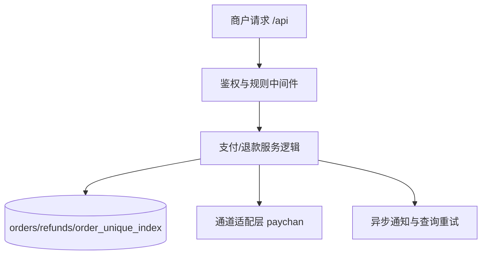

# Fission-AI/OpenSpec 复杂软件项目描述范式与经验总结

## 1. OpenSpec 核心理念

### 1.1 Spec-Driven Development (规范驱动开发)
OpenSpec 采用规范驱动开发模式，通过结构化的文档来定义、设计和验证软件系统。核心思想是：
- **先写规范，再写代码**：在实现之前明确需求、设计和验收标准
- **可执行的规范**：规范不仅是文档，还可以被工具验证和执行
- **版本化的变更管理**：每个功能变更都作为一个独立的"change"进行管理

### 1.2 分层架构
OpenSpec 采用分层的文档架构：
- **System Level**: 系统级概述和上下文
- **Domain Level**: 领域边界和核心能力
- **Change Level**: 具体的功能变更提案
- **Spec Level**: 详细的技术规范和业务规则

## 2. 文档结构范式

### 2.1 System Specification (系统规范)
**文件位置**: `openspec/specs/system.md`

**核心内容**:
- **Business Context (Why)**: 业务背景和目标
- **Functional Core (What)**: 核心功能能力
- **Tech Stack (How)**: 技术栈和架构
- **Project Conventions**: 项目约定和约束

**最佳实践**:
- 保持简洁，聚焦高层次概述
- 明确目标受众和核心问题
- 定义技术约束和重要假设

### 2.2 Domain Map (领域映射)
**文件位置**: `openspec/specs/domains.md`

**核心内容**:
- **Core Domains**: 核心业务领域
- **Supporting Domains**: 支撑性领域
- **Boundary Map**: 领域边界和集成点

**最佳实践**:
- 使用 Mermaid 图表可视化数据流
- 明确每个领域的职责和状态
- 定义领域间的耦合关系

### 2.3 Change Proposal (变更提案)
**文件位置**: `openspec/changes/<change-name>/proposal.md`

**核心内容**:
- **Why**: 变更的业务原因和背景
- **What Changes**: 具体的变更内容
- **Impact**: 影响范围和依赖
- **Non-Goals**: 明确不包含的内容

**最佳实践**:
- 聚焦单一职责，避免大而全的变更
- 明确 BREAKING 变更的影响
- 包含回滚计划和迁移策略

### 2.4 Design Document (设计文档)
**文件位置**: `openspec/changes/<change-name>/design.md`

**核心内容**:
- **Context**: 当前状态和问题
- **Goals/Non-Goals**: 设计目标和约束
- **Decisions**: 关键设计决策和理由
- **Alternatives Considered**: 考虑过的替代方案
- **Risks/Trade-offs**: 风险和权衡

**最佳实践**:
- 包含序列图等可视化设计
- 详细说明决策背后的思考过程
- 评估不同方案的优缺点

### 2.5 Technical Specification (技术规范)
**文件位置**: `openspec/changes/<change-name>/specs/<spec-name>/spec.md`

**核心内容**:
- **Purpose**: 规范的目的和范围
- **Domain Concepts**: 领域概念和术语
- **Requirements**: 具体的业务和技术需求
- **Scenarios**: Given/When/Then 格式的场景描述

**最佳实践**:
- 使用表格清晰定义数据模型
- 用 Given/When/Then 格式描述业务规则
- 包含正向和负向测试场景

### 2.6 Task List (任务清单)
**文件位置**: `openspec/changes/<change-name>/tasks.md`

**核心内容**:
- **Implementation**: 实现任务清单
- **Validation**: 验证和测试任务
- **Documentation**: 文档更新任务

**最佳实践**:
- 使用 checkbox 格式跟踪进度
- 包含具体的验证步骤和标准
- 确保所有任务都可验证和可完成

## 3. 工作流程范式

### 3.1 Change Lifecycle (变更生命周期)
1. **Discovery**: 发现需求或问题
2. **Proposal**: 创建变更提案
3. **Design**: 详细设计和决策
4. **Specification**: 编写技术规范
5. **Implementation**: 代码实现
6. **Validation**: 验证和测试
7. **Documentation**: 更新文档
8. **Archive**: 归档完成的变更

### 3.2 Directory Structure (目录结构)
```
openspec/
├── config.yaml          # OpenSpec 配置
├── specs/               # 系统级规范
│   ├── system.md        # 系统概述
│   ├── domains.md       # 领域映射
│   └── <domain>/        # 领域规范
├── changes/             # 功能变更
│   └── <change-name>/   # 具体变更
│       ├── .openspec.yaml  # 变更配置
│       ├── proposal.md     # 变更提案
│       ├── design.md       # 设计文档
│       ├── tasks.md        # 任务清单
│       └── specs/          # 技术规范
│           └── <spec-name>/
│               └── spec.md
└── schemas/             # 模式定义
    └── discovery/       # 发现模式
```

### 3.3 Configuration (配置管理)
**文件位置**: `openspec/config.yaml`

**核心配置**:
- **schema**: 指定使用的模式（如 spec-driven）
- **context**: 全局上下文信息
- **rules**: 文档编写规则和约束

**最佳实践**:
- 在 context 中定义全局约束（如语言、技术栈）
- 在 rules 中定义文档质量标准
- 保持配置简洁，避免过度约束

## 4. 内容编写经验

### 4.1 Business Rules 表达
使用 Given/When/Then 格式清晰表达业务规则：

```markdown
#### Scenario: 商户侧绑定代理——费率校验失败
- **GIVEN** 商户 `M`（`rate=200`）通过 `chan_merch` 关联通道 `C`（`rate=600`），已有代理费率合计 `300`
- **WHEN** 绑定新代理商 `A`，`rate=200`
- **THEN** 校验 `600 - 200 - 300 - 200 = -100 < 0`，拒绝
- **AND THEN** 返回 400 错误，包含各项费率明细
```

### 4.2 Data Model 定义
使用表格清晰定义数据模型：

```markdown
| 角色 | 表 | 说明 |
|------|-----|------|
| 代理商 | `agent` | 分润体系的核心角色，负责拓展商户或通道的中间人 |
| 商户 | `merch` | 接入支付平台的商家，发起支付请求 |
| 通道 | `chan` | 底层支付渠道/机构（微信支付、支付宝、银联等） |
| 机构商户 | `chan_merch` | 商户在具体通道侧的身份映射，桥接 `chan` 与 `merch` |
```

### 4.3 Visual Documentation (可视化文档)
使用 Mermaid 图表表达复杂流程：



### 4.4 Breaking Changes 管理
明确标识和管理 BREAKING 变更：

```markdown
- **确定服务商对外认证标识（BREAKING）**：
  - 服务商对外认证标识 SHALL 使用 `saas_no`（`saas` 表新增唯一字段 `saas_no`）。
- **对齐签名串字段名（BREAKING）**：
  - 请求头与签名串字段名 SHALL 使用 `x-auth-saas-no`（与 `saas_no` 一致）。
```

## 5. 质量保证实践

### 5.1 Validation Rules (验证规则)
在配置中定义文档质量规则：

```yaml
rules:
  proposal:
    - Include rollback plan
    - Identify affected teams
  specs:
    - Use Given/When/Then format for scenarios
  design:
    - Include sequence diagrams for complex flows
```

### 5.2 Test Coverage (测试覆盖)
确保规范有对应的测试覆盖：

- **Unit Tests**: 验证核心逻辑
- **Integration Tests**: 验证端到端流程
- **Golden Tests**: 验证输出格式和内容
- **OpenSpec Validation**: 使用 `openspec validate` 命令验证规范一致性

### 5.3 Migration Strategy (迁移策略)
为 BREAKING 变更提供迁移策略：

```markdown
### 迁移 / 兼容策略（评估项）
- 默认策略：按“BREAKING 变更”处理，仅支持 `x-auth-saas-no`（与对外文档一致）。
- 若已存在外部服务商按旧错误规则实现，可在 apply 阶段评估短期兼容：
  - 兼容期内：服务端同时计算两种签名（`x-auth-saas-no` 与旧字段名/旧错误字段名），任一匹配即通过
  - 兼容开关：以配置/环境变量控制是否启用兼容（默认关闭），并在文档中声明弃用窗口
```

## 6. 团队协作建议

### 6.1 Review Process (评审流程)
- **Proposal Review**: 业务可行性和影响范围
- **Design Review**: 技术方案和架构决策
- **Spec Review**: 业务规则和技术细节
- **Code Review**: 实现质量和测试覆盖

### 6.2 Knowledge Sharing (知识共享)
- **文档即代码**: 将规范文档纳入版本控制
- **变更历史**: 保留完整的变更历史和决策记录
- **新人引导**: 使用规范文档作为新人入职指南

### 6.3 Continuous Improvement (持续改进)
- **定期回顾**: 定期回顾规范的有效性和完整性
- **工具集成**: 集成自动化验证和生成工具
- **反馈循环**: 建立从实现到规范的反馈机制

## 7. 常见陷阱和解决方案

### 7.1 Over-Specification (过度规范)
**问题**: 规范过于详细，难以维护
**解决方案**: 
- 聚焦核心业务规则和接口契约
- 避免过度约束实现细节
- 保持规范的抽象层次适当

### 7.2 Under-Specification (规范不足)
**问题**: 规范过于模糊，无法指导实现
**解决方案**:
- 使用具体的场景和示例
- 明确定义边界条件和异常情况
- 提供可验证的验收标准

### 7.3 Documentation Drift (文档漂移)
**问题**: 代码实现与规范文档不一致
**解决方案**:
- 建立自动化验证机制
- 将规范验证纳入 CI/CD 流程
- 建立文档更新的强制流程

## 8. 总结

Fission-AI/OpenSpec 提供了一套完整的复杂软件项目描述范式，通过结构化的文档和工作流程，确保软件系统的可理解性、可维护性和可验证性。

**核心价值**:
- **清晰的沟通**: 为团队成员提供共同的理解基础
- **质量保证**: 通过可验证的规范确保实现质量
- **知识沉淀**: 将设计决策和业务规则持久化
- **变更管理**: 提供系统化的变更管理和追溯能力

**成功关键**:
- 坚持规范驱动的开发流程
- 保持文档与代码的一致性
- 建立有效的团队协作机制
- 持续改进和优化规范体系

通过遵循这些范式和经验，团队可以更有效地描述和管理复杂的软件项目，提高软件质量和团队效率。