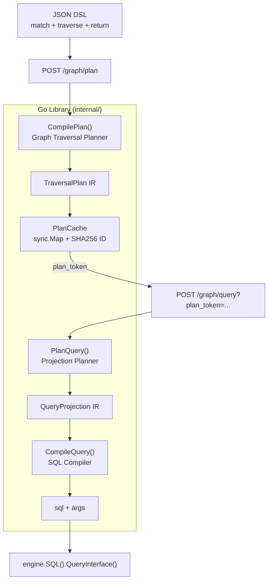

# feat: Semantic Graph Runtime V1 — Planner + SQL Compiler (Query)

## Overview

在 `golang/graph/` 从零实现 Semantic Graph Runtime V1 核心编译流水线：Graph Traversal Planner → Projection Planner (Query) → SQL Compiler，附带进程内 PlanCache 和薄 Echo HTTP 封装。V1 面向内部 Agent/微服务，仅支持 Query 投影模式，不含 Aggregate。

## Problem Frame

Agent 需要通过 JSON DSL 表达图语义遍历（含 exists/none 反连接），编译为参数化 SQL 并执行。设计文档（`query-dsl.md`、`query-planner.md`、`query-compiler.md`）和 brainstorm 需求已明确 V1 边界：library-first、内部服务、两轮 API、信任 DSL 字段名、硬资源限制。(see origin: `docs/brainstorms/2026-05-29-semantic-graph-runtime-v1-requirements.md`)

## Requirements Trace

- R1. Graph Traversal Planner → `internal/planner/`
- R2. Projection Planner (Query) → `internal/projection/`
- R3. SQL Compiler → `internal/compiler/`
- R4. 四种 require 语义 → Planner + Compiler 联合覆盖
- R5. PaginateDirect + PaginateRootFirst → Projection Planner + Compiler
- R6–R7. SHA256 plan ID + sync.Map cache → `internal/cache/`
- R8–R9. 两轮 HTTP API + library 可独立调用 → `route/`
- R10–R11. 信任字段名 + 参数化值 → Compiler predicate 层
- R12. 硬资源限制 → `internal/limits/`
- R13–R14. V1 校验规则 + snake_case 表名 → Planner + Projection

## Scope Boundaries

- 不含 Metric Planner / `/graph/aggregate` / COUNT API
- 不含单次调用便捷端点
- 不含认证层（网络边界隔离）
- 不含 Table Schema 字段存在性校验
- 不含 Redis 缓存、V2 existential/OR/many_to_many 特性
- 不含复合主键 PaginateRootFirst 支持

## Context & Research

### Relevant Code and Patterns

| 路径 | 用途 |
|------|------|
| `demo/biz/route.go` | Echo handler 薄封装 + `[]map[string]interface{}` 结果 |
| `demo/routes/demo/attach.go` | `Attach(group *echo.Group)` 路由挂载模式 |
| `lib/pkg/orm/db.go` | `MustSession(ctx)` 会话生命周期 |
| `lib/pkg/orm/engine.go` | Model registry 模式（init-then-read） |
| `lib/pkg/bean/bean.go` | `sync.RWMutex` + map registry 模式 |
| `lib/pkg/testutil/echotest.go` | HTTP 测试 `Post`/`BodyJson` |
| `demo/biz/testutil/reset.go` | `ResetTestOnce()` + 测试 DB |
| `demo/pkg/query/query.go` | operator 映射参考（不直接复用，协议不同） |
| `graph/docs/query-*.md` | IR 结构、编译规则、SQL 模板、校验表 |

### Institutional Learnings

- 无 `docs/solutions/` 记录
- `golang/CLAUDE.md`：测试 DB 重置使用 `/tmp/testonce/reset_test_db` once-file 机制；DDL 变更后需手动清理

### External References

- 设计文档即主要参考源；代码库已有 Echo v4.13.4 + Xorm v1.3.9 模式，无需额外框架调研
- `QueryInterface()` 在现有代码中未使用，但 Xorm API 文档支持；graph 将是首个采用者

## Key Technical Decisions

- **Package layout `internal/`**：Planner、Compiler、Cache 作为 internal 包，对外通过 `graph` 根包或 `route` 包暴露稳定 API (see origin)
- **RelationRegistry 用 Go 代码注册**：与 `ormEngine` model registry 和 `bean.RegisterNode` 一致；V1 硬编码 demo 域关系（`for_merch`、`has_order_daily`），不做 YAML 配置 (resolved during planning)
- **TableSchemaRegistry 启动时从 DBMetas 填充**：按 `query-planner.md` §4.11；复合 PK 表启动报错 (resolved during planning)
- **Raw SQL 字符串拼接**：设计文档已评估 Xorm Builder / squirrel / goqu，V1 选手写 SQL Compiler 纯函数；子查询/EXISTS 模板可控 (see `query-compiler.md` §11.2)
- **Predicate operator 映射独立实现**：在 `internal/compiler/predicate.go` 新建，参考 `lib/pkg/orm/query.go` 的 op→builder 映射逻辑但不抽取共享包 (resolved during planning)
- **资源限制默认值** (resolved during planning)：

  | 限制项 | 默认值 |
  |--------|--------|
  | max traverse 步数 | 10 |
  | max IN/not_in 数组大小 | 500 |
  | max LIMIT | 1000 |
  | default LIMIT（未指定时） | 200 |
  | 查询超时 | 30s（context deadline） |

- **PlanCache 上限**：max 10,000 entries；超出时拒绝新 Put 并返回 `ErrPlanCacheFull`（简单计数，V1 不做 LRU）(resolved during planning)
- **Plan ID 序列化**：使用 `encoding/json` + 自定义 canonical sort（traverse 顺序已固定；where 谓词按 field+op 排序）确保确定性 (resolved during planning)
- **加入 go.work**：graph 模块依赖 `github.com/lucky-byte/lib`，集成测试可复用 demo DDL

## Open Questions

### Resolved During Planning

- Relation Registry 配置方式 → Go 代码注册
- 硬限制具体数值 → 见上表
- PlanCache 淘汰 → max 10,000 entries，超出拒绝
- 复合 PK → InitTableSchemaRegistry 报错，PaginateRootFirst 不支持
- operator 共享包 → V1 不抽取，internal 独立实现

### Deferred to Implementation

- canonical JSON 对 `any` 类型 Value 的序列化边界 case（int vs float64）——实现时用 table-driven test 锁定
- PaginateRootFirst 复杂多 fan-out 路径的实际 SQL 形态——以设计文档 §8.4 示例为 golden test
- graph 模块是否嵌入 demo main 还是独立 dev main——实现时按集成测试便利性决定

## High-Level Technical Design

> *This illustrates the intended approach and is directional guidance for review, not implementation specification. The implementing agent should treat it as context, not code to reproduce.*



**编译流水线伪代码（方向性）：**

```
CompilePlan(match, traverse):
  validate resource limits (step count)
  phase1: resolve match → root binding + root predicates + root PK
  phase2: for each traverse step → alias binding + step IR
  phase3: build existential scopes from exists/none steps
  phase4: mark fan-out paths (one_to_many materialize)
  plan.ID = SHA256(canonical_json(match + traverse))
  return plan

PlanQuery(plan, return):
  validate select/order_by aliases (materialize only)
  decide PaginationStrategy from plan.HasFanOut
  return QueryProjection

CompileQuery(plan, projection):
  builder := newSQLBuilder()
  if projection.PaginateRootFirst:
    builder.buildRootFirstSubquery(plan)  // inner: root + non-fan-out + existential
    builder.buildOuterSelect(projection)   // outer: fan-out JOINs + LIMIT/OFFSET
  else:
    builder.buildDirect(plan, projection)
  return builder.SQL(), builder.Args()
```

## Implementation Units

- [ ] **Unit 1: 项目脚手架与 DSL/IR 类型定义**

**Goal:** 建立 graph 模块基础结构、依赖关系和全部数据结构定义。

**Requirements:** R1–R3 前置

**Dependencies:** 无

**Files:**
- Create: `internal/dsl/types.go` — GraphTraversalQuery, MatchClause, TraverseClause, WherePredicate, QueryReturnDef
- Create: `internal/ir/types.go` — TraversalPlan, AliasBinding, TraversalStep, ExistentialScope, QueryProjection, SelectItem, OrderByItem, PaginationStrategy
- Create: `internal/ir/scope.go` — ScopeType 常量 (Materialize, Existential)
- Create: `internal/errors/errors.go` — 全部 PlanError / CompilerError 类型和错误码
- Modify: `go.mod` — 添加 `github.com/lucky-byte/lib` 依赖
- Modify: `../go.work` — 加入 `./graph` 模块
- Test: `internal/dsl/types_test.go` — JSON 序列化/反序列化 round-trip

**Approach:**
- DSL struct tag 与 `query-dsl.md` JSON 一一对应
- IR struct 与 `query-planner.md` §4、`query-compiler.md` §3 一一对应
- 错误类型实现 `error` 接口，含 Code/Alias/Message 字段供 API 层 JSON 返回

**Patterns to follow:**
- `demo/biz/tables.go` 的 struct tag 风格
- `graph/docs/query-planner.md` §6.2 错误定义

**Test scenarios:**
- Happy path: 反序列化 `query-dsl.md` §6 第一个完整 DSL JSON → struct 字段正确
- Happy path: TraversalPlan IR 序列化为 JSON 再反序列化 → 等价
- Edge case: 空 traverse 数组 → struct 零值正确
- Error path: 缺少 match.type → Bind 不报错（校验在 Planner 层）

**Verification:**
- `go build ./...` 通过
- JSON round-trip test 绿色

---

- [ ] **Unit 2: Registry 层 — Relation + TableSchema**

**Goal:** 实现启动时可初始化的 Relation Registry 和 Table Schema Registry。

**Requirements:** R1, R14

**Dependencies:** Unit 1

**Files:**
- Create: `internal/registry/relation.go` — RelationSchema, RelationRegistry, demo 关系注册
- Create: `internal/registry/table.go` — TableSchema, InitTableSchemaRegistry(engine)
- Create: `registry.go` — 根包导出 Init(engine) 聚合初始化
- Test: `internal/registry/table_test.go`
- Test: `internal/registry/relation_test.go`

**Approach:**
- RelationRegistry 为 package-level `map[string]*RelationSchema`，V1 硬编码 `for_merch` + `has_order_daily`
- InitTableSchemaRegistry 遍历 DBMetas()，单 PK 写入 registry；复合 PK 返回 error
- 只读访问模式，请求路径不做 mutation

**Patterns to follow:**
- `lib/pkg/orm/engine.go` model registry init-then-read
- `graph/docs/query-dsl.md` §5 注册示例
- `graph/docs/query-planner.md` §4.11 InitTableSchemaRegistry

**Test scenarios:**
- Happy path: InitTableSchemaRegistry 对 SQLite 内存 DB（demo DDL）→ agent_rel/merch/order_daily 均有 PK
- Error path: 复合 PK 表 → InitTableSchemaRegistry 返回 error
- Happy path: RelationRegistry 包含 for_merch，cardinality 为 many_to_one
- Edge case: 查找不存在的 relation → ok=false

**Verification:**
- Registry 初始化测试通过
- demo 域 3 张表均可解析 PK

---

- [ ] **Unit 3: Graph Traversal Planner**

**Goal:** 实现 CompilePlan 四阶段编译，输出完整 TraversalPlan IR。

**Requirements:** R1, R4, R6, R13, R14

**Dependencies:** Unit 1, Unit 2

**Files:**
- Create: `internal/planner/planner.go` — CompilePlan 入口
- Create: `internal/planner/match.go` — Phase 1: Match Resolution
- Create: `internal/planner/traverse.go` — Phase 2: Traverse Step Processing
- Create: `internal/planner/existential.go` — Phase 3: Existential Scope Construction
- Create: `internal/planner/cardinality.go` — Phase 4: Cardinality Analysis + HasFanOut
- Create: `internal/planner/plan_id.go` — SHA256 canonical JSON ID 生成
- Create: `internal/planner/validate.go` — V1–V10 校验
- Create: `internal/limits/limits.go` — 资源限制检查
- Test: `internal/planner/planner_test.go`
- Test: `internal/planner/existential_test.go`
- Test: `internal/planner/plan_id_test.go`

**Approach:**
- 严格按 `query-planner.md` §5 四阶段顺序
- Plan ID：match+traverse JSON canonical encode → SHA256 hex
- 资源限制在 CompilePlan 入口检查 traverse 步数
- Existential alias 不可作为后续 traverse.from（V8）

**Execution note:** 以实现 `query-planner.md` §9 完整示例演练为 golden test 驱动。

**Patterns to follow:**
- `graph/docs/query-planner.md` §5 全流程 + §9 示例
- `graph/docs/query-planner.md` §6 校验表

**Test scenarios:**
- Happy path: §9 DSL → TraversalPlan 各字段与文档 §9.5 一致
- Happy path: require=none 步骤 → ExistentialScopes 含 NOT EXISTS 边界
- Happy path: require=exists 步骤 → ExistentialScopes 含 EXISTS 边界
- Happy path: one_to_many + require=always → IsFanOut=true, HasFanOut=true
- Error path: 重复 alias → ErrDuplicateAlias
- Error path: 从未定义 alias traverse → ErrUndefinedAlias
- Error path: 从 existential alias 继续 traverse → ErrTraverseFromExistential
- Error path: in 操作符空数组 → ErrEmptyInValues
- Error path: traverse 步数超过 max → 资源限制错误
- Edge case: 无 traverse（仅 match）→ 有效 plan，HasFanOut=false
- Integration: 同一 DSL 两次 CompilePlan → 相同 plan.ID

**Verification:**
- §9 示例 golden test 全字段断言通过
- 全部 V1–V10 校验各有至少一个失败测试

---

- [ ] **Unit 4: Projection Planner (Query 模式)**

**Goal:** 实现 PlanQuery，校验 return 定义并输出 QueryProjection IR。

**Requirements:** R2, R5

**Dependencies:** Unit 3

**Files:**
- Create: `internal/projection/query.go` — PlanQuery 入口
- Create: `internal/projection/pagination.go` — PaginateDirect vs PaginateRootFirst 决策
- Create: `internal/projection/validate.go` — P1–P5 校验
- Test: `internal/projection/query_test.go`
- Test: `internal/projection/pagination_test.go`

**Approach:**
- HasFanOut=false → PaginateDirect；HasFanOut=true → PaginateRootFirst
- select/order_by alias 必须为 ScopeMaterialize
- LIMIT 默认值 200，超过 max 1000 返回错误

**Patterns to follow:**
- `graph/docs/query-compiler.md` §4 Projection Planner 流程
- `graph/docs/query-compiler.md` §9.1 校验表

**Test scenarios:**
- Happy path: 合法 select + order_by → QueryProjection 正确
- Happy path: 无 fan-out plan → PaginationStrategy=PaginateDirect
- Happy path: 有 fan-out plan → PaginationStrategy=PaginateRootFirst
- Error path: select existential alias → ErrSelectFromExistential
- Error path: order_by existential alias → ErrOrderByExistential
- Error path: select fields 为空 → ErrEmptyFields
- Error path: LIMIT=2000 → 超出 max 限制错误
- Edge case: 未指定 limit → 默认 200

**Verification:**
- P1–P5 校验各有失败测试
- 分页策略决策与 plan.HasFanOut 一致

---

- [ ] **Unit 5: SQL Compiler**

**Goal:** 实现 CompileQuery 纯函数，生成参数化 SQL + args。

**Requirements:** R3, R4, R5, R11

**Dependencies:** Unit 4

**Files:**
- Create: `internal/compiler/compiler.go` — CompileQuery 入口
- Create: `internal/compiler/builder.go` — sqlBuilder 内部状态
- Create: `internal/compiler/join.go` — FROM + JOIN 生成
- Create: `internal/compiler/existential.go` — EXISTS/NOT EXISTS 子查询
- Create: `internal/compiler/predicate.go` — WHERE 谓词 → SQL 片段 + args
- Create: `internal/compiler/select.go` — SELECT 列
- Create: `internal/compiler/order.go` — ORDER BY
- Create: `internal/compiler/pagination.go` — LIMIT/OFFSET + PaginateRootFirst 子查询
- Test: `internal/compiler/compiler_test.go`
- Test: `internal/compiler/predicate_test.go`
- Test: `internal/compiler/pagination_test.go`

**Approach:**
- sqlBuilder 按 `query-compiler.md` §6.2 顺序调用：SELECT → FROM/JOIN → WHERE → EXISTS → ORDER BY → LIMIT
- 所有 Value 通过 `?` 占位符；Field/Alias/Table 来自 IR（信任 DSL）
- PaginateRootFirst：内层含 root + non-fan-out JOIN + existential + root predicates；外层 fan-out JOIN + SELECT + LIMIT
- in 空数组 → `1=0`；not_in 空数组 → `1=1`

**Execution note:** 以 `query-dsl.md` §6 第一个示例和 `query-compiler.md` §8 编译示例为 golden SQL test。

**Patterns to follow:**
- `graph/docs/query-compiler.md` §7 SQL 编译详细规则
- `lib/pkg/orm/query.go` operator 映射参考

**Test scenarios:**
- Happy path: §6 示例（NOT EXISTS + INNER JOIN）→ SQL 与文档等价（normalize whitespace 比较）
- Happy path: require=optional → LEFT JOIN 在 SQL 中
- Happy path: require=exists → EXISTS 子查询，alias 不在 SELECT
- Happy path: PaginateDirect → 单层 SELECT + LIMIT/OFFSET
- Happy path: PaginateRootFirst → 子查询结构，内层含 existential scope
- Happy path: in [1,2,3] → `IN (?, ?, ?)` + 3 args
- Edge case: in [] → `1=0`；not_in [] → `1=1`
- Error path: 不支持的 op → 明确错误

**Verification:**
- §6 golden SQL test 通过
- 四种 require 类型各有 SQL 结构断言
- args 顺序与 `?` 出现顺序一致

---

- [ ] **Unit 6: PlanCache + Runtime 执行层**

**Goal:** 实现 PlanCache、library 级 CompileAndQuery 编排、Xorm 执行。

**Requirements:** R6, R7, R9, R12

**Dependencies:** Unit 5

**Files:**
- Create: `internal/cache/cache.go` — PlanCache (sync.Map)
- Create: `graph.go` — 根包 API: CompilePlan, PlanQuery, CompileQuery, ExecuteQuery
- Create: `internal/runtime/execute.go` — ExecuteQuery(engine, sql, args) + context timeout
- Test: `internal/cache/cache_test.go`
- Test: `graph_test.go` — library 级端到端（CompilePlan → PlanQuery → CompileQuery → Execute）

**Approach:**
- PlanCache.Get/Put；Put 时检查 max 10,000 entries
- ExecuteQuery 使用 `engine.SQL(sql, args...).QueryInterface()` + context.WithTimeout(30s)
- 根包 graph.go 暴露稳定 public API，internal 细节不导出

**Patterns to follow:**
- `graph/docs/query-planner.md` §8.2 PlanCache
- `demo/biz/route.go` QueryInterface 结果处理

**Test scenarios:**
- Happy path: Put + Get 同一 plan → 命中
- Happy path: Get 不存在的 ID → ok=false
- Edge case: cache 满 → Put 返回 ErrPlanCacheFull
- Integration: 完整 DSL → ExecuteQuery 返回 []map[string]interface{} 非空（需 demo DDL 测试 DB）
- Integration: context 超时 → 返回 deadline exceeded 错误

**Verification:**
- library 级 E2E test 对 §6 示例返回预期列名

---

- [ ] **Unit 7: Echo HTTP 路由 + 集成测试**

**Goal:** 薄 HTTP 封装，暴露 POST /graph/plan 和 POST /graph/query。

**Requirements:** R8, R9

**Dependencies:** Unit 6

**Files:**
- Create: `route/handlers.go` — HandlePlan, HandleQuery
- Create: `route/attach.go` — AttachGraphRoutes(group *echo.Group)
- Create: `route/handlers_test.go` — HTTP 集成测试
- Create: `cmd/graphdev/main.go` — 可选 dev server（复用 demo DB 配置）

**Approach:**
- HandlePlan: Bind GraphTraversalQuery → CompilePlan → cache.Put → JSON {plan_token, plan}
- HandleQuery: QueryParam plan_token → cache.Get → Bind QueryReturnDef → PlanQuery → CompileQuery → ExecuteQuery → JSON {data}
- 错误映射：校验失败 400，plan 未找到 404，编译/执行失败 500
- AttachGraphRoutes 挂载到 `/graph` group

**Patterns to follow:**
- `demo/routes/demo/attach.go` Attach 模式
- `graph/docs/query-compiler.md` §10 handler 示例
- `lib/pkg/testutil/echotest.go` HTTP 测试

**Test scenarios:**
- Happy path: POST /graph/plan → 200 + plan_token
- Happy path: POST /graph/query?plan_token=xxx → 200 + data 数组
- Error path: 无效 DSL → 400 + error 字段
- Error path: 无效 plan_token → 404
- Integration: plan → query 两轮调用 §6 示例 → 返回数据含 agent_no, merch_id 列
- Integration: 同一 plan 两次 query 不同 return → 不同 SQL，相同 plan_token

**Verification:**
- HTTP 集成测试全绿
- 两轮 API 流程端到端可用

## System-Wide Impact

- **Interaction graph:** graph 模块为独立新模块，不修改 demo/lib 现有 handler；可选通过 `cmd/graphdev` 或 demo main 挂载 `/graph` routes
- **Error propagation:** Planner/Projection 校验错误 → HTTP 400；Compiler 内部错误 → HTTP 500；PlanCache miss → HTTP 404
- **State lifecycle risks:** PlanCache 无 TTL，进程重启丢失；plan_token 确定性，重启后相同 DSL 重新 plan 得到相同 token
- **API surface parity:** V1 仅 /graph/plan + /graph/query；不含 /graph/aggregate
- **Integration coverage:** Unit 7 HTTP test + Unit 6 library E2E 证明跨层流程；golden SQL test 证明编译正确性
- **Unchanged invariants:** demo/pkg/query URL DSL 和现有 CRUD 路由不受影响；graph 是并行的新查询抽象层

## Risks & Dependencies

| Risk | Mitigation |
|------|------------|
| Raw SQL 拼接维护成本高 | Golden SQL test 覆盖四种 require + 两种分页；Compiler 纯函数易测 |
| 字段名 SQL 注入（信任 DSL） | 文档标注安全边界；内部网络隔离 (see origin) |
| PlanCache 内存无界 | max 10,000 entries 硬上限 |
| QueryInterface 首次使用 | Unit 6 integration test 验证 Xorm API |
| composite PK 表 | InitTableSchemaRegistry 启动报错，明确 V1 不支持 |
| Plan ID 序列化不确定性 | canonical JSON + table-driven test 锁定边界 case |
| graph 未加入 go.work | Unit 1 显式修改 go.work |

## Documentation / Operational Notes

- 实现完成后无需更新设计文档（设计已是 spec）
- V1 不含运维监控；PlanCache 大小可通过日志观察
- 测试 DB DDL 变更后执行 `rm -f /tmp/testonce/reset_test_db`

## Sources & References

- **Origin document:** [docs/brainstorms/2026-05-29-semantic-graph-runtime-v1-requirements.md](../brainstorms/2026-05-29-semantic-graph-runtime-v1-requirements.md)
- **Design docs:** `docs/query-dsl.md`, `docs/query-planner.md`, `docs/query-compiler.md`
- **Review report:** `docs/review-report.md`
- **Repo patterns:** `demo/biz/route.go`, `lib/pkg/orm/`, `lib/pkg/testutil/`
