# feat: Semantic Graph Runtime V1.5 — Cycle Detection + Existential Inner Traversal + Branch Traversal

## Overview

基于 `design-new.md` 的分析，对 Semantic Graph Runtime 实施三项改进：

1. **V1 立即修复：环路检测** —— 防止 A→B→A 循环遍历导致 SQL 崩溃
2. **V1.5：取消 Existential Leaf 限制** —— 允许从 existential alias 继续遍历，子查询内部支持 JOIN
3. **V1.5：确认分支遍历支持** —— 验证当前代码天然支持多 step from 同一 alias，补充测试覆盖

V2 特性（OR 谓词、聚合存在性、全称量）不在本计划范围。

## Problem Frame

当前 Graph Traversal Runtime 存在三个问题：

1. **环路检测缺失**：如果 DSL 构造出 `A→B→A` 的遍历路径，Planner 不会报错，而是生成循环 JOIN 的无效 SQL。这是运行时崩溃风险。
2. **Existential Leaf 限制**：V1 禁止从 `require: exists/none` 的 alias 继续 traverse（`traverse.go:38-39`），导致复杂的存在性查询必须手动构造双重否定，Agent 使用成本高。
3. **分支遍历不确定性**：文档标注为"V1 语义限制"，但代码层面已天然支持——`processOneStep` 只校验 `from` alias 存在，不要求 `from` 唯一。需补充测试确认。

## Requirements Trace

- R1. Planner Phase 2 增加环路检测，对同一路径链上的表重复访问报 `ErrCyclicTraversal`
- R2. 允许从 existential alias (`ScopeExists`/`ScopeNotExists`) 继续 traverse，后续 step 归入同一 ExistentialScope
- R3. ExistentialScope 增加 `InnerSteps` 字段，记录 scope 内的非边界 JOIN 步骤
- R4. SQL Compiler 的 `writeExistentialScope` 支持子查询内部 JOIN（遍历 InnerSteps）
- R5. 验证并测试分支遍历：多个 step 的 `from` 指向同一 alias 时，生成正确的多 JOIN SQL
- R6. 向后兼容：现有 DSL 和 IR 不受影响，无破坏性变更

## Scope Boundaries

- 不含 V2 OR 谓词 / PredicateNode 递归结构
- 不含 V2 `agg_exists` / HAVING 子句
- 不含 V2 `require: all` / 全称量自动转换
- 不含 V3+ 递归 CTE 遍历
- 不含 `DepthInTable` 字段（环路检测报错即止，暂不支持同表二次访问的 alias 去重）
- 不修改现有 API 接口签名

## Context & Research

### Relevant Code and Patterns

| 文件 | 作用 |
|------|------|
| `internal/ir/types.go` | TraversalPlan, TraversalStep, ExistentialScope, ScopeType 定义 |
| `internal/ir/scope.go` | ScopeType / RequireType / PaginationStrategy 常量 |
| `internal/planner/traverse.go` | Phase 2: processOneStep —— 当前第 38 行禁止从 existential alias 遍历 |
| `internal/planner/existential.go` | Phase 3: buildExistentialScopes —— 当前只处理单 alias scope |
| `internal/planner/cardinality.go` | Phase 4: analyzeCardinality |
| `internal/planner/planner.go` | CompilePlan 入口，四阶段编排 |
| `internal/compiler/existential.go` | writeExistentialScope —— 当前只生成单表 FROM + WHERE |
| `internal/compiler/builder.go` | sqlBuilder 内部状态和辅助方法 |
| `internal/compiler/join.go` | writeJoin / buildJoinClauses / buildJoinClausesFanOut |
| `internal/compiler/compiler.go` | CompileQuery / buildPaginateDirect / buildPaginateRootFirst |
| `internal/errors/errors.go` | PlanError / sentinel errors |
| `internal/planner/planner_test.go` | 现有 golden test 和 error path 测试 |
| `internal/compiler/compiler_test.go` | SQL golden test |

### Key Code Observations

1. **环路检测点**：`processOneStep` 在校验完 `fromBinding` 和 `relation` 后，需增加一条检查：从 `fromAlias` 回溯到 root 的表链中，如果 `rel.ToTable` 已在物化路径中出现，报错。回溯方式：通过 `bindings[fromAlias].ParentAlias` 逐级上溯。

2. **Existential Leaf 取消点**：`traverse.go:38-39` 的 `ScopeType != ScopeMaterialize` 检查需要改为：允许从 existential alias 继续 traverse，但后续 step 的 ScopeIndex 和 ScopeType 继承父 scope。

3. **ExistentialScope.InnerSteps**：Phase 3 构建时，需要识别哪些 step 在 scope 内但不是 boundary step，将其加入 `InnerSteps`。

4. **Compiler existential JOIN**：`writeExistentialScope` 需要在 `SELECT 1 FROM {table}` 之后、`WHERE` 之前，遍历 `scope.InnerSteps` 生成 JOIN 子句。

5. **分支遍历**：`processOneStep` 的 `from` 校验仅要求 alias 存在于 bindings，不要求唯一。分支遍历天然可用——只是缺少测试覆盖。

### Institutional Learnings

- 无 `docs/solutions/` 记录
- `CLAUDE.md`：测试 DB 重置使用 `/tmp/testonce/reset_test_db` once-file 机制；DDL 变更后需手动清理

## Key Technical Decisions

- **环路检测策略**：报错而非自动去重。检测范围覆盖两条路径：(1) 物化路径上同表二次出现即报 `ErrCyclicTraversal`；(2) 同一 existential scope 内同表二次出现也报错——虽然 existential scope 不展开行，但同表在同一子查询的 FROM+JOIN 链中出现两次会产生无效 SQL（`FROM B ... INNER JOIN B ...` 无 alias 区分）。跨 scope 的同表访问允许。不引入 `DepthInTable` 字段。理由：V1.5 环路是异常而非正常用例，报错更安全 (see origin: design-new.md §3.1)
- **Existential 内部 step 的 ScopeType**：继承所属 ExistentialScope 的 Type，**必须覆盖 `scopeTypeForRequire` 的默认返回值**。当前 `scopeTypeForRequire(RequireAlways)` 返回 `ScopeMaterialize`（`traverse.go:85-94`），但 inner step 的 AliasBinding.ScopeType 必须设为父 scope 的类型（`ScopeExists`/`ScopeNotExists`），否则 `cardinality.go:16` 的 `binding.ScopeType == ScopeMaterialize` 检查会错误地将 inner step 标记为 IsFanOut=true，且 `builder.go:23` 的 `materializedSteps()` 会错误地将 inner step 包含在外层 JOIN 中。修改点：`traverse.go:70` 的 `ScopeType: scopeTypeForRequire(require)` 需要条件分支——当 `fromBinding.ScopeType` 非 `ScopeMaterialize` 时，使用 `fromBinding.ScopeType` 而非 `scopeTypeForRequire` 的返回值
- **Existential 内部 step 的 Require 限制**：scope 内部 step 的 `require` 只允许 `always`（INNER JOIN），不允许 `optional`/`exists`/`none`。理由：V1.5 实现成本控制——LEFT JOIN 在 EXISTS/NOT EXISTS 子查询内语义清晰（如"不存在有非空折扣的订单"可用 `NOT EXISTS (... LEFT JOIN disc ... WHERE disc.id IS NOT NULL)`），但 compiler 的 `writeExistentialScope` 需要额外处理 LEFT JOIN 生成和 NULL 谓词，增加实现复杂度；嵌套 existential scope 是 V2 特性。如果实际使用中 `optional` 需求强烈，V2 可优先放行
- **Existential 内部 step 与 IsFanOut**：scope 内的 step 一律 `IsFanOut=false`，因为 existential scope 不展开行，不影响 HasFanOut
- **分支遍历不引入新语法**：复用现有 `from` 引用机制，不增加 DSL 层面的任何变更

## Open Questions

### Resolved During Planning

- 环路检测范围 → 物化路径 + 同一 existential scope 内同表二次访问；跨 scope 的同表访问允许
- Existential 内部 step 的 require 限制 → 仅 `always`（INNER JOIN）
- DepthInTable → V1.5 不引入，环路报错即止

### Deferred to Implementation

- 多层嵌套 existential scope 的 alias 冲突（如 scope 内 outer alias 与 inner alias 同名）——V2 处理
- Existential 内部 step 的谓词与外部 WHERE 的交互边界——实现时通过集成测试确认
- canonical JSON 对新增 InnerSteps 字段的序列化影响——实现时用 table-driven test 锁定

## High-Level Technical Design

> *This illustrates the intended approach and is directional guidance for review, not implementation specification. The implementing agent should treat it as context, not code to reproduce.*

```mermaid
flowchart TD
    subgraph "V1 Fix: Cycle Detection"
        T["processOneStep()"]
        C["detectCycleInPath(fromAlias, targetTable, bindings)"]
        E["ErrCyclicTraversal"]
        T --> C -->|"cycle found"| E
    end

    subgraph "V1.5: Existential Inner Traversal"
        T2["processOneStep()"]
        CHECK{"fromBinding.ScopeType\n== ScopeMaterialize?"}
        FIND["findExistingScope(fromAlias)"]
        INHERIT["step inherits scope index + ScopeType"]
        ADD["add step.ToAlias to scope.ContainedAliases"]
        INNER["add step to scope.InnerSteps"]

        T2 --> CHECK
        CHECK -->|Yes| NORMAL["normal materialize path"]
        CHECK -->|No| FIND
        FIND --> INHERIT --> ADD --> INNER
    end

    subgraph "V1.5: Compiler Existential JOIN"
        WR["writeExistentialScope()"]
        FROM["FROM boundary_table"]
        JOINS["INNER JOIN inner_step tables"]
        WHERE["WHERE correlation + predicates"]

        WR --> FROM --> JOINS --> WHERE
    end
```



**环路检测伪代码（方向性）：**

```
detectCycleInPath(fromAlias, targetTable, bindings):
  // 检查1: 物化路径环路
  current = fromAlias
  while current != "":
    binding = bindings[current]
    if binding.Table == targetTable AND binding.ScopeType == ScopeMaterialize:
      return ErrCyclicTraversal
    current = binding.ParentAlias

  // 检查2: 同一 existential scope 内同表二次访问
  // 如果 fromAlias 在某个 existential scope 内，
  // 检查该 scope 已有的 ContainedAliases 中是否有同表
  // (此检查需在 Phase 3 scope 构建过程中进行，而非 Phase 2)
  return nil
```

**Existential Scope 扩展伪代码（方向性）：**

```
Phase 3: buildExistentialScopes (扩展版)
  scopeMap = {}  // alias → scopeIndex

  for each step:
    if step.FromAlias in scopeMap:
      // from alias 在某个 existential scope 内
      idx = scopeMap[step.FromAlias]
      scope = scopes[idx]
      step.ScopeIndex = idx
      step.ScopeType = scope.Type  // 继承
      scope.ContainedAliases = append(scope.ContainedAliases, step.ToAlias)
      scope.InnerSteps = append(scope.InnerSteps, step)
      scopeMap[step.ToAlias] = idx
    elif step.Require in (RequireExists, RequireNone):
      // 新建 scope
      scope = new ExistentialScope(...)
      scopes = append(scopes, scope)
      step.ScopeIndex = len(scopes) - 1
      scopeMap[step.ToAlias] = step.ScopeIndex
    else:
      step.ScopeIndex = -1
```

## Implementation Units

- [x] **Unit 1: 环路检测**

**Goal:** 在 Planner Phase 2 增加物化路径环路检测，防止循环遍历生成无效 SQL。

**Requirements:** R1

**Dependencies:** 无（基于现有代码修改）

**Files:**
- Modify: `internal/planner/traverse.go` — 增加 `detectCycleInPath` 函数，在 `processOneStep` 中调用
- Modify: `internal/errors/errors.go` — 增加 `ErrCyclicTraversal` sentinel error
- Test: `internal/planner/planner_test.go` — 增加环路检测测试

**Approach:**
- 在 `processOneStep` 中，校验完 relation 和 from table 匹配后，调用 `detectCycleInPath`
- `detectCycleInPath` 从 `fromAlias` 开始，通过 `bindings[alias].ParentAlias` 逐级回溯到 root
- 如果路径上任何物化 alias 的 Table 等于 `rel.ToTable`，报错
- existential scope 内的同表访问允许（因为不展开行，不构成实际循环）
- 限制：仅检测物化路径，不引入 DepthInTable

**Patterns to follow:**
- `internal/planner/validate.go` 的校验函数风格
- `internal/errors/errors.go` 的 PlanError 模式

**Test scenarios:**
- Happy path: A→B→C（不同表）→ 正常编译
- Happy path: A→B→C where B and C are same table but C is in existential scope → 允许
- Error path: A→B→A 直接环路 → `ErrCyclicTraversal`
- Error path: A→B→C→B 三步环路 → `ErrCyclicTraversal`
- Edge case: match 表与 traverse 目标表相同（如 agent_rel → merch → agent_rel）→ 报错
- Edge case: 同表在 existential scope 内但不在同一子查询 → 允许通过（跨 scope）
- Error path: 同一 existential scope 内同表二次访问（如 A→B(exists)→C(always)→B）→ `ErrCyclicTraversal`（子查询内 FROM B ... INNER JOIN B ... 无 alias 区分，生成无效 SQL）

**Verification:**
- 环路检测测试覆盖直接环路和间接环路
- 现有 golden test 仍通过（无破坏性变更）

---

- [x] **Unit 2: ExistentialScope IR 扩展**

**Goal:** 扩展 ExistentialScope 数据结构，支持 InnerSteps 和多 ContainedAliases。

**Requirements:** R3

**Dependencies:** Unit 1

**Files:**
- Modify: `internal/ir/types.go` — ExistentialScope 增加 `InnerSteps []*TraversalStep` 字段
- Test: `internal/ir/types_test.go`（如果不存在则创建）— 序列化 round-trip 验证

**Approach:**
- `InnerSteps` 记录 scope 内的非边界 JOIN 步骤（即从 existential alias 继续遍历的 always step）
- `ContainedAliases` 从恰好 1 个扩展为 1~N 个
- IR 扩展是纯加法，不破坏现有序列化

**Patterns to follow:**
- `internal/ir/types.go` 现有字段的 JSON tag 风格

**Test scenarios:**
- Happy path: ExistentialScope 含 InnerSteps 的 JSON 序列化/反序列化 → round-trip 通过
- Happy path: InnerSteps 为空时序列化 → 与现有格式兼容
- Edge case: 多个 InnerSteps 的 ContainedAliases 正确

**Verification:**
- IR 序列化测试通过
- 现有 planner/compiler 测试不受影响

---

- [x] **Unit 3: 取消 Existential Leaf 限制（Planner 层）**

**Goal:** 修改 Planner Phase 2 和 Phase 3，允许从 existential alias 继续 traverse，并将后续 step 归入同一 ExistentialScope。

**Requirements:** R2, R3

**Dependencies:** Unit 2

**Files:**
- Modify: `internal/planner/traverse.go` — 修改 `processOneStep`，允许 existential alias 作为 from，增加 scope 内 step 的 require 限制校验
- Modify: `internal/planner/existential.go` — 重写 `buildExistentialScopes`，支持 scope 内 step 归入和 InnerSteps 构建
- Modify: `internal/errors/errors.go` — 增加 `ErrExistentialInnerNotAlways` sentinel error
- Test: `internal/planner/planner_test.go` — 增加 existential 内遍历测试
- Test: `internal/planner/existential_test.go` — 增加 scope 内 JOIN 测试

**Approach:**
- `processOneStep` 修改：
  - 移除 `fromBinding.ScopeType != ScopeMaterialize` 的硬禁止
  - 当 `fromBinding.ScopeType` 为 `ScopeExists`/`ScopeNotExists` 时：
    - **AliasBinding.ScopeType 必须覆盖 `scopeTypeForRequire` 的返回值**：设为 `fromBinding.ScopeType` 而非 `scopeTypeForRequire(require)`。当前 `scopeTypeForRequire(RequireAlways)` 返回 `ScopeMaterialize`，若不覆盖则 inner step 会被错误地当作物化步骤处理（IsFanOut 误标、materializedSteps 误包含）
    - step 的 require 仅允许 `always`（INNER JOIN），其他值报 `ErrExistentialInnerNotAlways`
- `buildExistentialScopes` 重写：
  - 维护 `scopeMap map[string]int`（alias → scopeIndex）
  - 遍历 steps 时，如果 `step.FromAlias` 在 scopeMap 中，将该 step 归入对应 scope
  - 更新 scope 的 ContainedAliases 和 InnerSteps
- cardinality 分析不变：scope 内 step 的 IsFanOut 始终为 false

**Patterns to follow:**
- `internal/planner/existential.go` 现有 scope 构建逻辑
- `query-planner.md` §5.3 V2 扩展算法

**Test scenarios:**
- Happy path: `m → od(none) → d(always)` → plan 含 1 个 ExistentialScope，ContaintedAliases=[od, d]，InnerSteps=[d step]
- Happy path: scope 内 step 的 ScopeType 继承 → d 的 ScopeType == ScopeNotExists
- Happy path: scope 内 step 不影响 HasFanOut → plan.HasFanOut == false
- Error path: scope 内 step 的 require=optional → `ErrExistentialInnerNotAlways`
- Error path: scope 内 step 的 require=exists → `ErrExistentialInnerNotAlways`
- Edge case: `m → od(exists) → d(always)` → ScopeType 继承为 ScopeExists
- Edge case: existential alias 仍不可出现在 return.select 中 → `ErrSelectFromExistential`
- Integration: 现有 `TestCompilePlanTraverseFromExistential` 测试需更新（之前期望报错，现在应允许并验证 scope 结构）

**Verification:**
- 现有 `TestCompilePlanTraverseFromExistential` 测试行为更新（从"期望报错"改为"期望成功并验证 scope"）
- 新增 existential inner traversal 测试全绿

---

- [x] **Unit 4: SQL Compiler 支持 Existential Scope 内部 JOIN**

**Goal:** 修改 `writeExistentialScope`，支持子查询内部 JOIN（遍历 InnerSteps）。

**Requirements:** R4

**Dependencies:** Unit 3

**Files:**
- Modify: `internal/compiler/existential.go` — `writeExistentialScope` 增加 InnerSteps JOIN 生成
- Test: `internal/compiler/compiler_test.go` — 增加 existential inner JOIN 的 SQL golden test

**Approach:**
- `writeExistentialScope` 修改，SQL 生成严格按以下顺序（args 按同序追加）：
  1. `SELECT 1 FROM {boundary_table} {boundary_alias}`
  2. 遍历 `scope.InnerSteps`，对每个 step 调用 `writeJoin` 生成 `INNER JOIN {table} {alias} ON ...`
  3. `WHERE {correlation_condition}`
  4. boundary step 的 Predicates（按 step 中定义顺序）
  5. InnerSteps 的 Predicates（按 InnerSteps 数组顺序，每个 step 内部按定义顺序）
- 不需要修改 `buildPaginateDirect` 或 `buildPaginateRootFirst`——existential clauses 的调用位置不变

**Patterns to follow:**
- `internal/compiler/join.go` 的 `writeJoin` 方法
- `internal/compiler/existential.go` 现有的子查询生成模式

**Test scenarios:**
- Happy path: `m → od(none) → d(always)` → SQL 包含 `NOT EXISTS (SELECT 1 FROM order_daily od INNER JOIN order_detail d ON ... WHERE ...)`
- Happy path: 无 InnerSteps 的 scope → SQL 与现有格式一致（向后兼容）
- Happy path: 多个 InnerSteps → 多个 INNER JOIN 在子查询内
- Happy path: InnerSteps 的 predicates 出现在子查询 WHERE 中
- Integration: PaginateRootFirst + existential inner JOIN → 内层子查询的 existential 子句也包含 JOIN
- Integration: PaginateRootFirst + 内外层均有谓词 → 验证 args 排序与 SQL 占位符顺序一致（检查 `compiler.go:79` 的 args 拼接逻辑）
- Edge case: InnerSteps 为空 → 不生成额外 JOIN

**Verification:**
- existential inner JOIN 的 SQL golden test 通过
- 现有 compiler golden test 不受影响

---

- [x] **Unit 5: 分支遍历测试验证**

**Goal:** 验证当前代码天然支持分支遍历（多个 step 的 from 指向同一 alias），补充完整的测试覆盖。

**Requirements:** R5

**Dependencies:** 无（可并行于其他 Unit）

**Files:**
- Test: `internal/planner/planner_test.go` — 增加分支遍历 planner 测试
- Test: `internal/compiler/compiler_test.go` — 增加分支遍历 SQL golden test

**Approach:**
- 构造 DSL：`rel → m(always), m → od(always), m → st(none)` — 从 m 同时展开两条边
- 验证 TraversalPlan：Steps 含 3 个元素，m 是 step1 和 step2 的 FromAlias
- 验证 SQL：包含 `INNER JOIN merch m` + `INNER JOIN order_daily od` + `NOT EXISTS settle st`
- 验证 projection：select 中可引用 rel, m, od，不可引用 st（existential）
- 验证 PaginateRootFirst：当 od 是 1:N 物化时，HasFanOut=true

**Patterns to follow:**
- `internal/planner/planner_test.go` 的 golden test 模式
- `internal/compiler/compiler_test.go` 的 normalizeSQL 比较模式

**Test scenarios:**
- Happy path: 分支遍历 planner → plan.Steps 长度正确，alias bindings 完整
- Happy path: 分支遍历 SQL → 包含多个 JOIN 和 NOT EXISTS
- Happy path: 两个 step from 同一 alias，一个 always 一个 none → 一个 INNER JOIN + 一个 NOT EXISTS
- Happy path: 两个 step from 同一 alias，都是 always → 两个 INNER JOIN
- Happy path: select 引用非 existential 的分支 alias → 正常
- Error path: select 引用 existential 的分支 alias → `ErrSelectFromExistential`
- Edge case: 分支遍历 + HasFanOut → PaginateRootFirst 策略正确
- Integration: 分支遍历 + existential inner traversal 交互：`m → od(none) → d(always)` AND `m → st(always)` — 验证物化分支的 one_to_many step 正确设置 HasFanOut，existential 分支的 inner steps 仅出现在 NOT EXISTS 子查询内，compiler 的 materializedSteps() 正确排除 existential inner steps

**Verification:**
- 分支遍历 planner + compiler 测试全绿
- 无需修改任何生产代码（纯测试覆盖）

---

- [x] **Unit 6: 文档与现有测试更新**

**Goal:** 更新设计文档标注，修复因语义变更需要调整的现有测试。

**Requirements:** R6

**Dependencies:** Unit 3, Unit 4

**Files:**
- Modify: `docs/query-dsl.md` — 移除 §7.5 "分支遍历"限制标注；更新 "Existential Leaf" 限制说明
- Modify: `docs/query-planner.md` — 更新 §5.3 Phase 3 算法描述；移除 §5.2 Phase 2 中的 Existential Leaf 禁止规则；更新 §12 V1/V2 边界表
- Modify: `docs/query-compiler.md` — 更新 §7.6 EXISTS/NOT EXISTS 子查询生成规则，包含 InnerSteps JOIN
- Modify: `internal/planner/planner_test.go` — `TestCompilePlanTraverseFromExistential` 从"期望报错"改为"期望成功 + 验证 scope 结构"

**Approach:**
- 文档更新反映语义扩展：分支遍历不再是限制，existential leaf 可继续遍历
- 现有测试 `TestCompilePlanTraverseFromExistential` 当前期望从 existential alias 遍历报错，修改后应允许并验证
- 保持文档的 V1/V1.5/V2 边界清晰

**Patterns to follow:**
- 现有文档的 markdown 格式和结构

**Test scenarios:**
- 文档中不再标注"分支遍历"为 V1 限制
- 文档中标注 existential inner traversal 为 V1.5 特性
- 修改后的 `TestCompilePlanTraverseFromExistential` 测试通过

**Verification:**
- 全部测试 `go test ./...` 通过
- 文档与代码行为一致

## System-Wide Impact

- **Interaction graph:** Planner → IR → Compiler 的流水线不变，仅扩展 IR 字段和 Compiler 生成逻辑
- **Error propagation:** 新增两个错误码 `ErrCyclicTraversal`、`ErrExistentialInnerNotAlways`，通过现有 PlanError 机制传播
- **State lifecycle risks:** 无新状态生命周期风险；PlanCache 中缓存的 TraversalPlan IR 新增 InnerSteps 字段，旧 plan 反序列化时 InnerSteps 为空（向后兼容）
- **API surface parity:** 无 API 接口变更；HTTP handler 层不受影响
- **Integration coverage:** Unit 4 的 compiler_test 和 Unit 5 的 branch traversal test 覆盖跨层集成
- **Unchanged invariants:** 现有四种 require 语义不变；PaginateDirect/PaginateRootFirst 策略不变；Projection Planner 校验规则不变

## Risks & Dependencies

| Risk | Mitigation |
|------|------------|
| Existential inner JOIN alias 冲突 | scope 内 step 的 alias 全局唯一性校验已在 Phase 2 覆盖；scope 内 JOIN 使用 step 自身的 alias |
| 现有测试 `TestCompilePlanTraverseFromExistential` 行为变更 | Unit 6 显式修改该测试，从"期望报错"改为"期望成功" |
| 环路检测误报（同表在 existential scope 内合法出现） | detectCycleInPath 只检查物化路径上的同表，跳过 existential scope 内的 alias |
| InnerSteps 序列化兼容性 | InnerSteps 为 nil/空时 JSON 序列化行为与现有格式一致（omitempty） |
| 分支遍历 + fan-out 交互 | 分支遍历的每个 step 独立做 cardinality 分析，现有逻辑无需修改 |
| Plan ID 不含 planner 版本 | PlanCache 在进程重启后清空（sync.Map），不存在跨版本缓存污染风险；若未来引入 Redis 缓存，需在 plan ID 中加入 planner 版本常量 |
| PaginateRootFirst args 排序潜在 bug | 经代码分析确认当前逻辑正确：inner builder 按 SQL 文本顺序生成 args（WHERE → EXISTS → ORDER BY → LIMIT/OFFSET），outer builder 按 SQL 文本顺序生成 args（JOIN → ORDER BY），`append(ib.args, b.args...)` 保持顺序一致。existential inner steps 的 predicates 仅在子查询内生成，不会泄漏到外层。Unit 4 增加专门的 args 排序验证测试作为防御性保障 |

## Documentation / Operational Notes

- 实现完成后更新 `design-new.md` 中的 checkbox
- 测试 DB DDL 变更后执行 `rm -f /tmp/testonce/reset_test_db`
- V1.5 特性标注：existential inner traversal、branch traversal 已确认支持

## Sources & References

- **Origin document:** [docs/design-new.md](../design-new.md)
- **Design docs:** `docs/query-dsl.md`, `docs/query-planner.md`, `docs/query-compiler.md`
- **Existing plan:** `docs/plans/2026-05-29-001-feat-semantic-graph-runtime-v1-plan.md`
