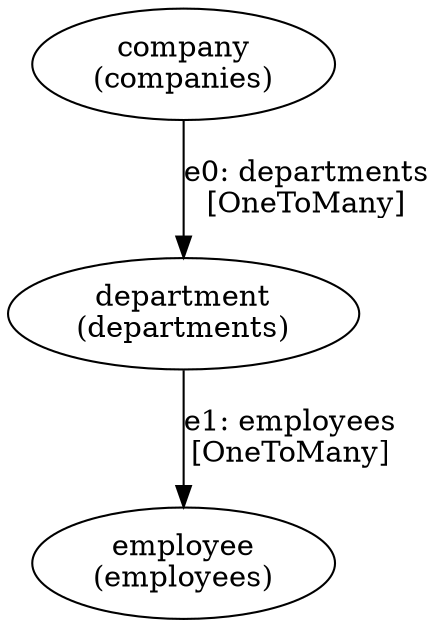

# Graph Traversal Planner + Traversal IR 详细设计

## 1. 定位与职责

Graph Traversal Planner 是 Query Engine 三阶段流水线的**第一阶段**：

```
Query DSL → [Traversal Planner] → Traversal IR → [Projection/Metric Planner] → Logical Plan → [SQL Compiler] → SQL
```

**核心职责**：

- 接收 Query DSL 对象，将路径表达式（如 `company.department.employee`）展开为显式的图遍历序列
- 为每条遍历边绑定目标 RelationSchema，完成关系类型的静态解析
- 管理别名绑定（Alias → NodeID），供后续阶段引用
- 应用路径过滤条件（path filter）到对应的遍历边上
- 输出 Traversal IR —— 一个与存储引擎无关的中间表示

**不负责**：

- 度量计算（count/sum/avg）→ Metric Planner
- 字段投影与表达式求值 → Projection Planner
- SQL 生成 → SQL Compiler

---

## 2. 核心数据结构

### 2.1 TraversalIR

```go
// TraversalIR 是 Traversal Planner 的输出，也是后续阶段的输入
type TraversalIR struct {
    // 根节点，代表查询的起始实体集合
    Root *TraversalNode

    // 别名绑定表：alias → nodeID
    // 例如 {"c": "n0", "d": "n1", "e": "n2"}
    Aliases map[string]NodeID

    // 所有遍历边的有序列表（BFS 序）
    Edges []*TraversalEdge

    // 全局过滤条件（不属于特定路径边）
    // 例如根节点的 where 条件
    GlobalFilters []FilterExpr
}
```

### 2.2 TraversalNode

```go
type NodeID string // 例如 "n0", "n1", "n2"

// TraversalNode 代表遍历路径中的一个实体节点
type TraversalNode struct {
    ID   NodeID
    Name string // 实体名，如 "company", "department"

    // 该节点对应的表名（从 RelationSchema 推导）
    TableName string

    // 该节点上的局部过滤条件
    Filters []FilterExpr

    // 从根节点到达此节点的入边（Root 节点为 nil）
    InEdge *TraversalEdge

    // 从此节点出发的出边列表
    OutEdges []*TraversalEdge
}
```

### 2.3 TraversalEdge

```go
// EdgeDirection 表示遍历方向
type EdgeDirection int

const (
    EdgeForward  EdgeDirection = iota // 正向：从父到子（如 company → department）
    EdgeReverse                        // 反向：从子到父（如 department → company）
)

// TraversalEdge 代表两个节点间的一次关系遍历
type TraversalEdge struct {
    ID       string // 边标识，如 "e0", "e1"
    From     NodeID
    To       NodeID

    // 绑定的关系定义
    Relation *RelationSchema

    // 遍历方向：决定 JOIN 时用哪一端做驱动
    Direction EdgeDirection

    // 该边上的路径过滤条件（Query DSL 中的 path filter）
    Filters []FilterExpr

    // 遍历基数（从 RelationSchema 推导）
    // OneToOne / OneToMany / ManyToOne / ManyToMany
    Cardinality Cardinality
}
```

### 2.4 RelationSchema

```go
// RelationSchema 描述实体间的关联关系（注册表项）
type RelationSchema struct {
    Name     string // 关系名，如 "company_departments"

    // 左侧实体
    LeftEntity  string // "company"
    LeftTable   string // "companies"
    LeftKey     string // "id"

    // 右侧实体
    RightEntity string // "department"
    RightTable  string // "departments"
    RightKey    string // "company_id"

    // 关系类型
    Type RelationType // HasMany / BelongsTo / ManyToMany
}

type RelationType int

const (
    HasMany   RelationType = iota // 一对多：company has_many departments
    BelongsTo                      // 多对一：department belongs_to company
    ManyToMany                     // 多对多：通过中间表
)
```

### 2.5 Cardinality

```go
type Cardinality int

const (
    OneToOne   Cardinality = iota // 正向 BelongsTo
    OneToMany                     // 正向 HasMany
    ManyToOne                     // 反向 BelongsTo
    ManyToMany                    // 双端 ManyToMany
)
```

### 2.6 FilterExpr

```go
// FilterExpr 过滤条件表达式（后续阶段共享）
type FilterExpr struct {
    Field    string       // 字段名，如 "status"
    Op       FilterOp     // 操作符
    Value    interface{}  // 比较值
    NodeID   NodeID       // 条件所属节点（用于消除歧义）
}

type FilterOp string

const (
    OpEq    FilterOp = "eq"
    OpNeq   FilterOp = "neq"
    OpGt    FilterOp = "gt"
    OpGte   FilterOp = "gte"
    OpLt    FilterOp = "lt"
    OpLte   FilterOp = "lte"
    OpIn    FilterOp = "in"
    OpNotIn FilterOp = "not_in"
    OpLike  FilterOp = "like"
    OpIsNull FilterOp = "is_null"
)
```

---

## 3. Planner 工作流程

### 3.1 总体流程

```
┌──────────────────────────────────────────────────────────┐
│                    Traversal Planner                     │
│                                                          │
│  QueryDSL                                                │
│    │                                                     │
│    ├─ 1. Build Root Node (from base entity)              │
│    │                                                     │
│    ├─ 2. Expand Path (BFS walk path segments)            │
│    │     ├─ Resolve relation for each segment            │
│    │     ├─ Create TraversalNode + TraversalEdge         │
│    │     └─ Bind alias if declared                       │
│    │                                                     │
│    ├─ 3. Apply Filters (path filters + global filters)   │
│    │                                                     │
│    ├─ 4. Validate (orphan aliases, dead paths, cycles)   │
│    │                                                     │
│    └─ 5. Emit TraversalIR                                │
│                                                          │
└──────────────────────────────────────────────────────────┘
```

### 3.2 详细步骤

#### Step 1: Build Root Node

从 `Query.Root.Entity` 创建根遍历节点。

```go
func (p *Planner) buildRoot(q *QueryDSL) *TraversalNode {
    root := &TraversalNode{
        ID:        "n0",
        Name:      q.Root.Entity,
        TableName: p.schema.TableFor(q.Root.Entity),
    }
    if q.Root.Alias != "" {
        p.aliases[q.Root.Alias] = root.ID
    }
    return root
}
```

#### Step 2: Expand Path

对 `Query.Root.Paths` 中每一段路径，执行 BFS 展开：

1. 从当前节点出发，查找匹配的 `RelationSchema`
2. 创建目标 `TraversalNode` 和连接的 `TraversalEdge`
3. 绑定别名（如果有）
4. 将边追加到有序边列表

**关系解析规则**：

```
当前节点: "company" (n0)
路径段:   "departments"
查找:     RelationSchema where LeftEntity=="company" && Name=="departments"
         或 RelationSchema where RightEntity=="department" && 可以反向遍历
```

当存在多条匹配关系时，优先选择方向与路径名一致的关系；如果仍有歧义，报错要求用户显式指定。

**多路径合并**：

当 Query DSL 定义了多条路径共享前缀时（如 `company.departments.employees` 和 `company.departments.projects`），BFS 展开会自动合并共享前缀节点：

```
路径1: company → departments → employees
路径2: company → departments → projects

展开结果:
  n0(company) ─e0─→ n1(departments) ─e1─→ n2(employees)
                                  └─e2─→ n3(projects)
```

#### Step 3: Apply Filters

将 Query DSL 中的过滤条件分配到 Traversal IR 对应位置：

| 过滤条件来源 | 附加位置 |
|---|---|
| `root.where` | Root Node 的 `Filters` |
| `paths[i].where` (path filter) | 对应 TraversalEdge 的 `Filters` |
| `paths[i].segments[j].where` | 对应目标 TraversalNode 的 `Filters` |

**歧义消解**：当多个节点有同名字段时，FilterExpr 中的 `NodeID` 用于标明条件归属。

#### Step 4: Validate

检查：

- 所有别名引用的节点是否存在于遍历树中
- 不存在无法到达的孤立节点
- 不存在环（有向无环图保证）
- 关系方向与基数一致性

#### Step 5: Emit TraversalIR

组装并返回完整的 TraversalIR 对象。

---

## 4. 关系注册表 (RelationRegistry)

### 4.1 数据结构

```go
// RelationRegistry 维护所有实体关系的注册表
type RelationRegistry struct {
    // 按实体名索引：entity → 其关联的所有 RelationSchema
    byEntity map[string][]*RelationSchema

    // 按关系名索引：relationName → RelationSchema
    byName map[string]*RelationSchema
}
```

### 4.2 注册方式

```go
// Register 注册一个实体关系
func (r *RelationRegistry) Register(schema *RelationSchema) {
    r.byEntity[schema.LeftEntity] = append(r.byEntity[schema.LeftEntity], schema)
    r.byEntity[schema.RightEntity] = append(r.byEntity[schema.RightEntity], schema)
    r.byName[schema.Name] = schema
}
```

### 4.3 查找关系

```go
// Resolve 从 fromEntity 出发，查找名为 relationName 的关系
func (r *RelationRegistry) Resolve(fromEntity, relationName string) (*ResolvedRelation, error) {
    relations, ok := r.byEntity[fromEntity]
    if !ok {
        return nil, fmt.Errorf("entity %q not found", fromEntity)
    }

    for _, rel := range relations {
        if rel.Name == relationName {
            return &ResolvedRelation{
                Schema:    rel,
                Direction: EdgeForward,
            }, nil
        }
        // 支持反向查找：relationName 可能是反向关系的别名
        // 例如 fromEntity="department", relationName="company"
        // 匹配到 BelongsTo 关系
    }

    return nil, fmt.Errorf("relation %q not found on entity %q", relationName, fromEntity)
}
```

### 4.4 注册示例

```go
registry := NewRelationRegistry()

// company has_many departments
registry.Register(&RelationSchema{
    Name:        "departments",
    LeftEntity:  "company",
    LeftTable:   "companies",
    LeftKey:     "id",
    RightEntity: "department",
    RightTable:  "departments",
    RightKey:    "company_id",
    Type:        HasMany,
})

// department belongs_to company
registry.Register(&RelationSchema{
    Name:        "company",
    LeftEntity:  "department",
    LeftTable:   "departments",
    LeftKey:     "company_id",
    RightEntity: "company",
    RightTable:  "companies",
    RightKey:    "id",
    Type:        BelongsTo,
})

// employee belongs_to department (通过 department_id)
registry.Register(&RelationSchema{
    Name:        "department",
    LeftEntity:  "employee",
    LeftTable:   "employees",
    LeftKey:     "department_id",
    RightEntity: "department",
    RightTable:  "departments",
    RightKey:    "id",
    Type:        BelongsTo,
})

// department has_many employees
registry.Register(&RelationSchema{
    Name:        "employees",
    LeftEntity:  "department",
    LeftTable:   "departments",
    LeftKey:     "id",
    RightEntity: "employee",
    RightTable:  "employees",
    RightKey:    "department_id",
    Type:        HasMany,
})
```

---

## 5. 完整示例

### 5.1 输入：Query DSL

```yaml
root:
  entity: company
  alias: c
  where:
    - {field: status, op: eq, value: "active"}
  paths:
    - segments:
        - name: departments
          alias: d
          where:
            - {field: budget, op: gt, value: 100000}
        - name: employees
          alias: e
          where:
            - {field: role, op: eq, value: "engineer"}
```

### 5.2 执行过程

```
Step 1: Build Root
  n0 = {ID: "n0", Name: "company", Table: "companies"}
  aliases = {"c": "n0"}
  root.Filters = [{field: "status", op: "eq", value: "active"}]

Step 2: Expand Path
  段 "departments":
    Resolve("company", "departments") → HasMany relation
    n1 = {ID: "n1", Name: "department", Table: "departments"}
    e0 = {From: "n0", To: "n1", Relation: ..., Direction: Forward, Cardinality: OneToMany}
    aliases["d"] = "n1"

  段 "employees":
    Resolve("department", "employees") → HasMany relation
    n2 = {ID: "n2", Name: "employee", Table: "employees"}
    e1 = {From: "n1", To: "n2", Relation: ..., Direction: Forward, Cardinality: OneToMany}
    aliases["e"] = "n2"

Step 3: Apply Filters
  n1.Filters = [{field: "budget", op: "gt", value: 100000}]
  n2.Filters = [{field: "role", op: "eq", value: "engineer"}]

Step 4: Validate
  ✓ 所有别名 c/d/e 均绑定到有效节点
  ✓ 无环、无孤立节点
  ✓ 基数一致

Step 5: Emit TraversalIR
```

### 5.3 输出：TraversalIR

```
TraversalIR {
  Root: n0 (company / companies)
  Aliases: {"c": "n0", "d": "n1", "e": "n2"}
  Edges: [e0, e1]
  GlobalFilters: []
}

n0 (company)
  Filters: [status = "active"]
  │
  └─e0[OneToMany]─→ n1 (department)
                      Filters: [budget > 100000]
                      │
                      └─e1[OneToMany]─→ n2 (employee)
                                          Filters: [role = "engineer"]
```

---

## 6. 多路径与共享前缀

### 6.1 场景

```yaml
root:
  entity: company
  paths:
    - segments:
        - name: departments
        - name: employees
    - segments:
        - name: departments
        - name: projects
```

### 6.2 Traversal IR 输出

```
n0 (company)
  ├─e0[OneToMany]─→ n1 (department)
  │                   ├─e1[OneToMany]─→ n2 (employee)
  │                   └─e2[OneToMany]─→ n3 (project)
```

**关键设计**：两条路径共享 `n1(department)` 节点和 `e0` 边。Planner 在 BFS 展开时检测到 `company→departments` 已存在，直接复用 `n1`，仅追加新分支 `e2→n3`。

### 6.3 节点去重逻辑

```go
// expandSegment 尝试从 fromNode 沿 relationName 展开一段
// 如果 fromNode 已有同名出边，则复用目标节点
func (p *Planner) expandSegment(fromNode *TraversalNode, segment PathSegment) (*TraversalNode, error) {
    // 检查是否已存在同名出边
    for _, edge := range fromNode.OutEdges {
        if edge.Relation.Name == segment.Name {
            return p.nodes[edge.To], nil // 复用已有节点
        }
    }

    // 新建节点和边
    resolved, err := p.registry.Resolve(fromNode.Name, segment.Name)
    if err != nil {
        return nil, err
    }

    toNode := p.newNode(resolved.TargetEntity())
    edge := p.newEdge(fromNode, toNode, resolved)

    fromNode.OutEdges = append(fromNode.OutEdges, edge)
    toNode.InEdge = edge

    return toNode, nil
}
```

---

## 7. 反向遍历

### 7.1 场景

从 employee 出发，反向遍历到 department：

```yaml
root:
  entity: employee
  alias: e
  paths:
    - segments:
        - name: department
          alias: d
```

### 7.2 关系解析

```
Resolve("employee", "department")
  → 找到 RelationSchema: {Name: "department", LeftEntity: "employee", Type: BelongsTo}
  → Direction: EdgeForward（从 employee 的角度看，department 是正向关联）
  → Cardinality: ManyToOne
```

### 7.3 Traversal IR

```
n0 (employee)
  └─e0[ManyToOne]─→ n1 (department)
```

后续 SQL Compiler 阶段，ManyToOne 基数将生成：

```sql
FROM employees e0
JOIN departments d1 ON e0.department_id = d1.id
```

---

## 8. 错误处理

### 8.1 错误类型

| 错误类型 | 触发条件 | 示例 |
|---|---|---|
| `ErrEntityNotFound` | 根实体未在注册表中 | `entity "foo" not registered` |
| `ErrRelationNotFound` | 路径段无匹配关系 | `relation "bar" not found on entity "company"` |
| `ErrAmbiguousRelation` | 多条匹配关系且无法消歧 | `multiple relations named "members" on "team"` |
| `ErrCyclicPath` | 路径形成环 | `company → departments → company (cycle detected)` |
| `ErrInvalidAlias` | 别名重复或冲突 | `alias "d" already bound to node n1` |

### 8.2 错误构造

```go
type PlannerError struct {
    Code     string // 错误码，如 "RELATION_NOT_FOUND"
    Message  string // 人类可读消息
    Entity   string // 相关实体名
    Relation string // 相关关系名
    Segment  int    // 路径段索引（从 0 开始）
}

func (e *PlannerError) Error() string {
    return fmt.Sprintf("[%s] %s", e.Code, e.Message)
}
```

---

## 9. 遍历树可视化（Debug）

为方便调试，TraversalIR 提供 `DOT` 格式输出：

```go
func (ir *TraversalIR) ToDOT() string
```

示例输出：



---

## 10. 与后续阶段的接口契约

Traversal IR 是三个阶段的共享数据结构，必须满足以下约束：

| 约束 | 说明 |
|---|---|
| 每个节点有唯一的 NodeID | 后续阶段通过 NodeID 引用节点，不可重复 |
| 每条边有唯一 ID | SQL Compiler 按边生成 JOIN，边 ID 作为 JOIN 别名后缀 |
| Aliases 表完整 | Projection/Metric Planner 通过别名引用字段 |
| 过滤条件已归位 | SQL Compiler 直接将 FilterExpr 转换为 WHERE 子句 |
| 基数信息已填充 | Projection Planner 据此判断是否需要子查询去重 |
| 方向信息已确定 | SQL Compiler 据此决定 JOIN 条件的左右表顺序 |

---

## 11. 文件组织

```
graph/
├── docs/
│   ├── query-dsl.md         # 第1步：Query DSL 规范
│   ├── query-planner.md     # 第2步：本文档
│   └── query-compiler.md    # 第3步：Projection/Metric Planner + SQL Compiler
├── internal/
│   └── traversal/
│       ├── planner.go           # TraversalPlanner 主逻辑
│       ├── planner_test.go      # 单元测试
│       ├── ir.go                # TraversalIR, TraversalNode, TraversalEdge 定义
│       ├── registry.go          # RelationRegistry 注册与查找
│       ├── registry_test.go
│       ├── filter.go            # FilterExpr 定义
│       ├── cardinality.go       # Cardinality 推导逻辑
│       ├── errors.go            # PlannerError 定义
│       └── dot.go               # ToDOT() 调试输出
```
