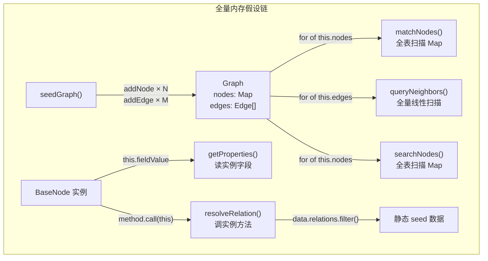
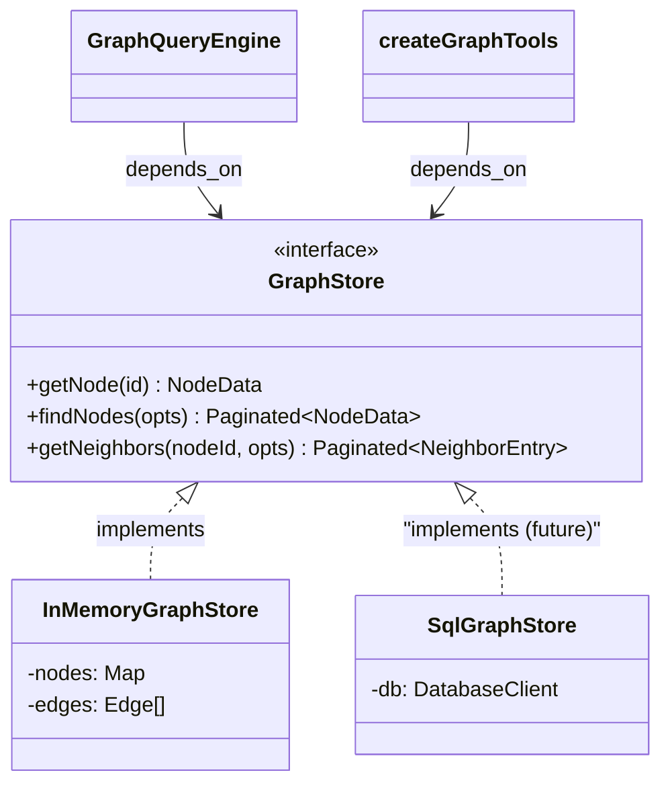

# Graph 层完整改造：存储抽象 + 工具接口修复

两个问题，同一个根因。分开诊断，一次改。

---

## Part A：存储层 — seedGraph 全量预加载假设

### A.1 问题诊断：5 个硬编码内存依赖



- **位置 1** — `Graph` 是具体类（`nodes: Map`, `edges: Edge[]`），不是接口
- **位置 2** — `matchNodes()` 全表扫描 `this.graph.nodes`（[query-engine.ts](src/v6/runtime/query-engine.ts) L155）
- **位置 3** — `queryNeighbors()` 线性扫描全部边 O(E)（[graph.ts](src/v6/runtime/graph.ts) L207）
- **位置 4** — `BaseNode.getProperties()` 读实例字段，必须先 `new Reader(row)`
- **位置 5** — `@agentRelation` 方法体 `import { data } from './seed'`，本体定义耦合测试数据

### A.2 根本矛盾

```
BaseNode = 本体定义 + 数据 + 行为（三合一）
```

应拆为：

- **本体定义**（装饰器 → Registry）：不变
- **数据**（属性值、边）：由 `GraphStore` 接口提供（`NodeData` 纯 DTO）
- **行为**（方法执行）：通过 `MethodRegistry` 按 typeName 查找调用

### A.3 改造：引入 `GraphStore` 接口



关键：`GraphStore` 方法返回 `Promise<NodeData>`（纯数据 DTO）而非 `BaseNode`（类实例），且方法接受 `where`/`fields` 参数让后端做过滤。

---

## Part B：工具接口 — N+1 问题和信息断层

### B.1 逐工具审计

#### `search_nodes` — 问题最大

当前输入/输出：

```typescript
// 输入
{ query?: string, type?: string, relatedTo?: string, limit?, offset? }

// 输出（每条记录）
{ nodeId: string, type: string }  // 只有 ID，没有属性！
```

缺陷清单：

- **N+1 问题**：返回只有 ID，Agent 必须再 N 次 `inspect_node` 才能看到属性
- **无 where 过滤**：`search_nodes({ type: "Reader" })` 在百万 Reader 时就是全表扫描的 API 包装。分页返回 20 个光秃秃的 ID，Agent 拿到没用
- **`query` 参数无用**：ID 子字符串匹配依赖可读 ID，真实系统 UUID 下直接废掉
- **`relatedTo` 与 `query_neighbors` 重复**：两个工具做同一件事

#### `query_neighbors` — 同样返回太瘦

```typescript
// 输出（每条记录）
{ nodeId: string, type: string, relation: string, direction: 'out'|'in' }
// 还是只有 ID，没有属性，没有 where 过滤
```

典型的被迫流程：`query_neighbors` 拿到 3 个邻居 ID → 3 次 `inspect_node` 看属性。

#### `inspect_node` — outEdges/inEdges 无分页

```typescript
data.outEdges = graph.getOutEdges(nodeId)  // 全量返回！
```

一个 Library 管理 10 万本书时，`outEdges.managed_by` = 10 万个 ID 数组，直接撑爆 context。而 `query_neighbors` 有分页，同一份数据走不同路径，一个保护一个不保护。

#### `graph_query` — 已修复，无问题

MATCH 有 where，TRAVERSE 有 where，RETURN 有 fields/aggregate。接口设计合理。

### B.2 当前信息梯度断裂

```
search_nodes:    能发现节点（只返回 ID）→ 看不到属性 → 不能过滤
query_neighbors: 能发现邻居（只返回 ID）→ 看不到属性 → 不能过滤
inspect_node:    能看属性 → 但必须先知道 ID  → outEdges 无分页
graph_query:     全都有 → 但对简单查询太重
```

前三个工具各管一块，每块不完整，逼 Agent 做 N+1。

---

## Part C：统一改造方案

### C.1 `GraphStore` 接口设计（存储层 + 工具层共用）

```typescript
interface GraphStore {
  // 按 ID 取单个节点（完整属性）
  getNode(id: string): Promise<NodeData | undefined>

  // 按类型 + 条件搜索节点（带属性投影）
  findNodes(opts: {
    type: string                    // 必填（无类型的全局搜索在大图上无意义）
    where?: PropertyFilter[]        // 属性过滤（可下推到数据库）
    fields?: string[]               // 属性投影（减少传输量）
    limit?: number
    offset?: number
  }): Promise<Paginated<NodeData>>

  // 按节点 + 关系查邻居（带属性过滤和投影）
  getNeighbors(nodeId: string, opts: {
    relation?: string
    direction?: 'out' | 'in' | 'both'
    targetType?: string
    where?: PropertyFilter[]        // 目标节点属性过滤
    fields?: string[]               // 目标节点属性投影
    limit?: number
    offset?: number
  }): Promise<Paginated<NeighborData>>

  // 边摘要（不返回全部 ID，只返回 count）
  getEdgeSummary(nodeId: string): Promise<EdgeSummary[]>
}

type NodeData = {
  id: string
  type: string
  properties: Record<string, unknown>
}

type NeighborData = {
  nodeId: string
  type: string
  relation: string
  direction: 'out' | 'in'
  properties?: Record<string, unknown>  // 有 fields 时带回
}

type EdgeSummary = {
  relation: string
  direction: 'out' | 'in'
  targetType: string
  count: number                         // 只返回数量，不返回 ID 列表
}
```

**关键设计决策：**

- `findNodes` 的 `type` 必填 — 无类型搜索 = 全表扫描，在接口层就禁止
- `where` + `fields` 下推到 store — 不管内存还是 SQL 都能在源头过滤
- `getEdgeSummary` 替代 `getOutEdges`/`getInEdges` — 只返回 `{ relation, count }`，不返回 10 万个 ID

### C.2 工具接口改造

#### `search_nodes` 改造后

```typescript
inputSchema: z.object({
  type: z.string().describe('节点类型（必填）'),
  where: z.array(PropertyFilterSchema).optional(),
  fields: z.array(z.string()).optional().describe('要返回的属性，省略则只返回 ID+type'),
  limit: z.number().optional(),
  offset: z.number().optional(),
})
```

- `type` 从可选变**必填**
- 删掉 `query`（ID 子字符串匹配无用）
- 删掉 `relatedTo`（和 `query_neighbors` 重复）
- 新增 `where`（属性过滤，直接传给 `store.findNodes`）
- 新增 `fields`（属性投影，按需带回属性）

改造后效果：

```json
// 之前：2 步
search_nodes({ type: "Reader" })                    → 拿到 4 个 ID（无属性）
inspect_node("xiao_ming", ["properties"])           → 看属性

// 之后：1 步
search_nodes({ type: "Reader", where: [{ property: "membershipLevel", op: "eq", value: "gold" }], fields: ["name"] })
→ [{ nodeId: "xiao_ming", type: "Reader", properties: { name: "小明" } }, ...]
```

#### `query_neighbors` 改造后

```typescript
inputSchema: z.object({
  nodeId: z.string(),
  relation: z.string().optional(),
  direction: z.enum(['out', 'in', 'both']).optional(),
  targetType: z.string().optional(),
  where: z.array(PropertyFilterSchema).optional(),
  fields: z.array(z.string()).optional(),
  limit: z.number().optional(),
  offset: z.number().optional(),
})
```

改造后效果：

```json
// 之前：4 步
query_neighbors("xiao_ming", { relation: "borrows" })  → 3 个 ID
inspect_node("book_tb1")                                → 看属性
inspect_node("book_tb2")                                → 看属性
inspect_node("book_tb3")                                → 看属性

// 之后：1 步
query_neighbors("xiao_ming", { relation: "borrows", where: [{ property: "daysOnShelf", op: "lt", value: 7 }], fields: ["title", "daysOnShelf"] })
→ [{ nodeId: "book_hp3", type: "Book", relation: "borrows", properties: { title: "...", daysOnShelf: 5 } }]
```

#### `inspect_node` 改造后

`outEdges` / `inEdges` 从返回全部 ID 改为**返回边摘要**（调用 `store.getEdgeSummary`）：

```json
// 之前
{ "outEdges": { "borrows": ["book_tb1", "book_tb2"], "reserves": ["book_hp3", ...] } }
// 10 万本书时这里就爆了

// 之后
{ "edgeSummary": [
    { "relation": "borrows", "direction": "out", "targetType": "Book", "count": 2 },
    { "relation": "reserves", "direction": "out", "targetType": "Book", "count": 1 }
  ]
}
// Agent 看到 count 后用 query_neighbors 翻页获取详情
```

#### `graph_query` — 不变

接口已合理。内部改为调用 `GraphStore` 接口方法。

### C.3 改造后的信息梯度

```
search_nodes:     按类型+条件发现节点 → 可选带回属性 → 有 where 过滤
query_neighbors:  按邻居+条件遍历    → 可选带回属性 → 有 where 过滤
inspect_node:     按 ID 看完整属性   → 边只返回摘要（relation + count）
graph_query:      多跳 + 聚合        → 完整数据

四个工具能力连续覆盖，没有信息断层，Agent 不需要 N+1。
```

---

## Part D：影响范围和实施步骤

### 影响范围

- [runtime/graph-store.ts](src/v6/runtime/graph-store.ts) — **新增**，`GraphStore` 接口 + `NodeData` / `NeighborData` / `EdgeSummary` 类型
- [runtime/graph.ts](src/v6/runtime/graph.ts) — `Graph` → `InMemoryGraphStore implements GraphStore`；`BaseNode` 精简为纯注册类
- [runtime/query-engine.ts](src/v6/runtime/query-engine.ts) — 依赖 `GraphStore`；`matchNodes` 调 `store.findNodes()`；全 async
- [agent/tools/graph.ts](src/v6/agent/tools/graph.ts) — `createGraphTools` 入参 `GraphStore`；`search_nodes` / `query_neighbors` / `inspect_node` 接口改造
- [runtime/query-types.ts](src/v6/runtime/query-types.ts) — `PropertyFilterSchema` 已有，可被 store 和 tools 共用
- [runtime/decorator.ts](src/v6/runtime/decorator.ts) — `@agentRelation` 只做 schema 注册，resolver 可选
- [tests/1-graph/library/ontology.ts](src/v6/tests/1-graph/library/ontology.ts) — `@agentRelation` 方法体去掉 `data.relations` 引用
- [tests/1-graph/library/seed.ts](src/v6/tests/1-graph/library/seed.ts) — `seedGraph()` 返回 `InMemoryGraphStore`
- [tests/1-graph/library/graph-query.test.ts](src/v6/tests/1-graph/library/graph-query.test.ts) — 适配新接口

### 实施步骤

1. 新建 `runtime/graph-store.ts`：定义 `GraphStore` 接口 + 所有 DTO 类型
2. 重构 `runtime/graph.ts`：`Graph` → `InMemoryGraphStore implements GraphStore`，`findNodes` 内置 where/fields
3. 改造 `agent/tools/graph.ts`：三个工具增加 `where`/`fields`，`inspect_node` 的 outEdges 改为 edgeSummary
4. 改造 `runtime/query-engine.ts`：依赖 `GraphStore` 接口，全 async
5. 简化 `@agentRelation`：schema 声明保留，resolver 可选
6. 更新 seed 和测试
7. （后续）实现 `SqlGraphStore`
