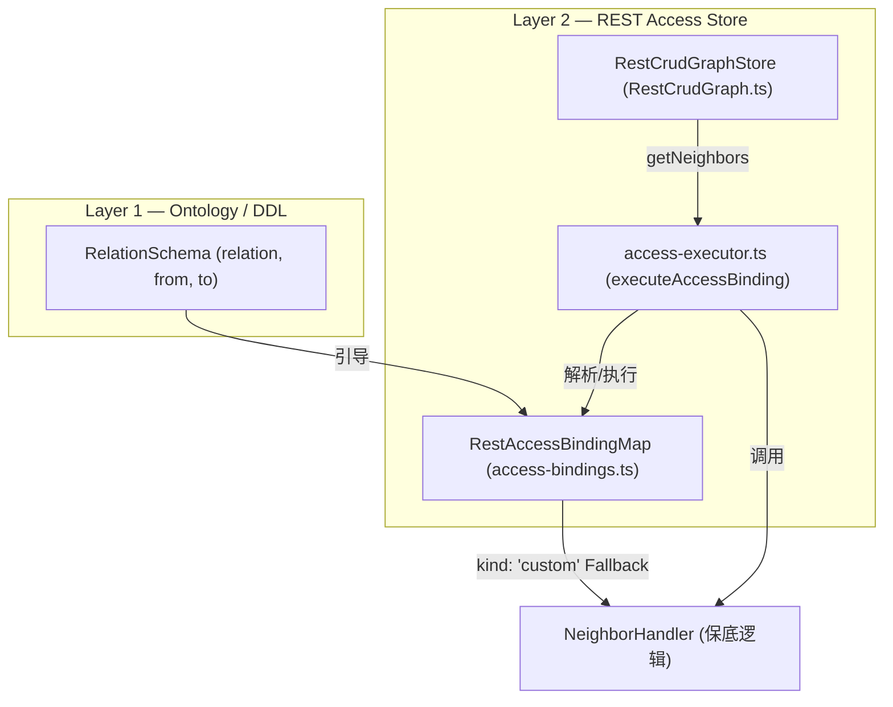

# 支付域 REST 混合 Binding (声明 + 保底) 方案

本项目是一个 demo 原型验证项目。当前 `RestCrudGraphStore` 中手写了 300+ 行命令式的关系处理代码（`buildRelationHandlers`）。为了保持架构与 DML SQL Binding 的对称美、彻底消除硬编码，并优雅支持某些“不对外提供公开 search 服务”的关系（如闭包关系），我们设计了“双层 Binding (声明 + 编程式保底)”方案。

根据用户的最新决策，我们将以**方案甲 (单向绑定)**、**ID 剥离前缀**、**编程式保底 (保留 NeighborHandler)**、**批量 Resolve 上限控制**为核心原则进行落地。

---

## 1. 核心架构设计



### 1.1 关键类型定义

在 `src/v6/tests/1-graph/restapi/access-bindings.ts` 中定义高表现力的 `RestAccessBinding`：

```typescript
import type { NodeData, GetNeighborsOpts, NeighborData } from '../../../runtime/graph-store'
import type { Paginated } from '../../../runtime/types'
import type { GraphEntityType } from './types'
import type { SearchParams } from './axios'

export type AccessContext = {
  rawId: (node: NodeData) => string
  toGlobalId: (type: GraphEntityType, rawId: string | number) => string
  apiSearch: <T extends Record<string, unknown>>(prefix: string, query?: SearchParams) => Promise<Paginated<T>>
  apiSearchSafe: <T extends Record<string, unknown>>(prefix: string, query?: SearchParams) => Promise<Paginated<T>>
  fetchOne: (type: GraphEntityType, rawId: string) => Promise<NodeData | undefined>
}

export type CustomHandler = (
  source: NodeData,
  opts: GetNeighborsOpts,
  ctx: AccessContext
) => Promise<Paginated<NeighborData>>

export type RestAccessBinding =
  | {
      kind: 'search'
      relation: string
      fromType: GraphEntityType
      toType: GraphEntityType
      direction: 'out' | 'in'
      searchOn: GraphEntityType
      params: (source: NodeData, ctx: AccessContext) => SearchParams
      optional?: boolean
    }
  | {
      kind: 'fk_lookup'
      relation: string
      fromType: GraphEntityType
      toType: GraphEntityType
      direction: 'out' | 'in'
      fkColumn: string
      optional?: boolean
    }
  | {
      kind: 'junction_resolve'
      relation: string
      fromType: GraphEntityType
      toType: GraphEntityType
      direction: 'out' | 'in'
      searchOn: GraphEntityType
      params: (source: NodeData, ctx: AccessContext) => SearchParams
      pickFromRow: string
      resolveOn: GraphEntityType
      resolveBy: 'id' | { field: string }
      optional?: boolean
    }
  | {
      kind: 'custom' // 编程式保底，用于不对外公开或需要特定编码的关系
      relation: string
      fromType: GraphEntityType
      toType: GraphEntityType
      direction: 'out' | 'in'
      handler: CustomHandler
    }

export type RestAccessBindingMap = Record<string, RestAccessBinding>
```

---

## 2. 详细改造方案

### 2.1 ID 前缀剥离规范 (AccessContext)
在 executor 提供的 `AccessContext` 中，统一提供剥离前缀的 `rawId(source)`，防止在 binding 及 handler 编写中混用全局 ID 导致请求 404：
```typescript
const ctx: AccessContext = {
  rawId: (node) => {
    const idx = node.id.indexOf(':')
    return idx === -1 ? node.id : node.id.slice(idx + 1)
  },
  toGlobalId: (type, rawId) => `${type}:${rawId}`,
  // ... apiSearch, apiSearchSafe ...
}
```

### 2.2 编程式保底逻辑
对于不公开 search 服务（或对应的 CRUD 端点）的 `agent_closure`、`agent_rel` 等。我们可以直接使用 `kind: 'custom'`，将其保底逻辑（即你想要的 `NeighborHandler` 编码）内联或声明。

例如：
```typescript
export const paymentAccessBindings: RestAccessBindingMap = {
  // Agent -> 闭包后代 (不对外直接公开查询，需要保底 handler 处理)
  'Agent:descendant_of:out': {
    kind: 'custom',
    relation: 'descendant_of',
    fromType: 'Agent',
    toType: 'Agent',
    direction: 'out',
    handler: async (source, opts, ctx) => {
      const rawAncestorId = ctx.rawId(source)
      // 特定的、不能通过直接 DTO 映射的闭包计算：
      const closures = await ctx.apiSearchSafe<AgentClosureRow>('/agent_closure', {
        'where.ancestor_id.eq': rawAncestorId,
        'where.depth.gt': 0,
        pagesize: opts.limit,
        page: opts.offset ? Math.floor(opts.offset / opts.limit) : 0,
      })
      const agentIds = closures.items.map((c) => c.descendant_id)
      return ctx.agentsByIds(agentIds, 'descendant_of', 'out', opts) // 保持高度复用
    }
  }
}
```

### 2.3 批量 Resolve 的安全上限控制
在 `junction_resolve` 执行批量查询目标节点时，设置合理的 resolve 阈值（默认最大 100 条，超出部分丢弃或分页）：
```typescript
const MAX_RESOLVE_LIMIT = 100
// 在 executor.ts 中限制
const sliceIds = targetIds.slice(0, MAX_RESOLVE_LIMIT)
```

---

## 3. 校验与防漂移单测

在 `bindings.test.ts` 中引入防漂移测试：
- 验证 `paymentAccessBindings` 中的每一个 relation 与 `ontology.ts` 声明的关系类型一致。
- 验证所有 required 关系都存在对应的 AccessBinding 规则，否则测试失败。

---

## 4. 实施路线

1. **第 1 步**: 编写 `[src/v6/tests/1-graph/restapi/access-bindings.ts](src/v6/tests/1-graph/restapi/access-bindings.ts)` 结构与 `paymentAccessBindings` 声明。
2. **第 2 步**: 编写 `[src/v6/tests/1-graph/restapi/access-executor.ts](src/v6/tests/1-graph/restapi/access-executor.ts)` 通用解析与保底执行器。
3. **第 3 步**: 重构 `[src/v6/tests/1-graph/restapi/RestCrudGraph.ts](src/v6/tests/1-graph/restapi/RestCrudGraph.ts)` 让其通过执行器分发，删除臃肿的硬编码 `buildRelationHandlers`。
4. **第 4 步**: 编写单测并更新校验机制。
