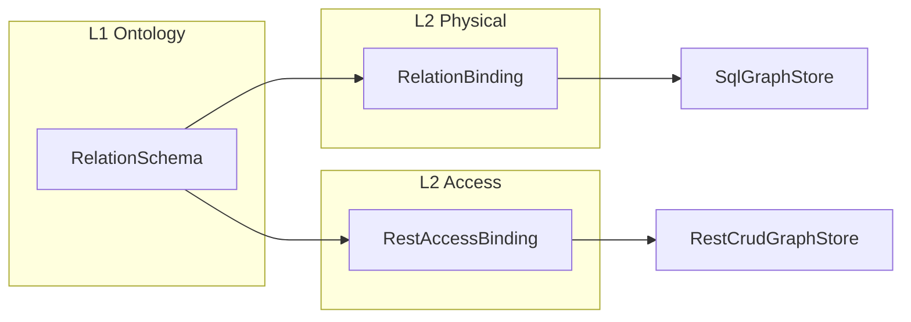

# Design document modifications
_Exported on 2026/5/20 at GMT+8 14:52:00 from Cursor (3.4.20)_

---

**User**

@docs/design/1-graph-layers.md 

- Q1:  全局ID, 约定全局唯一（如前缀 reader:)
- Q2:  不允许
- Q3: 采用建议

另外 删除 
### 4.3 方案 B（兼容）：保留方法装饰器，明确「无方法体」

这一小节

按 4.2 方案 A（推荐）：类级元数据装饰器 实现

请修改设计文档


---

**Cursor**

先阅读设计文档，按你的 Q1–Q3 决策和 4.2 方案 A 更新文档，并删除 4.3 小节。


正在按你的决策更新设计文档：删除 4.3、固化 Q1–Q3，并将 `@agentRelation` 定为 4.2 方案 A。


补充更新 TL;DR 与 Layer 1 描述，使其与类级 `@agentRelations` 一致。


已按你的决策更新 `docs/design/1-graph-layers.md`，主要变更如下：

### 已删除
- **§4.3 方案 B**（保留方法装饰器）整节；原 §4.4 重编号为 **§4.3**

### §4.2 定为终态实现
- 标题改为「类级元数据装饰器（已定稿）」
- 明确实现时移除方法级 `@agentRelation`、空 getter，以及 `resolveRelation` / `resolveAllRelations`

### 三项设计决策（原 §10「开放问题」→「设计决策（已定稿）」）
| 问题 | 决策 |
|------|------|
| **Q1** | 全局 `id`，约定前缀全局唯一（如 `reader:alice`） |
| **Q2** | `getNeighbors` **不允许**省略 `relation`；接口中 `opts` 与 `relation` 均为必填 |
| **Q3** | 独立 `bindings.ts` per 领域，启动时校验与 Schema 一致 |

### 其他同步
- §2.1、§6 `GraphStore` 接口与表格与上述决策对齐
- TL;DR、架构图、废弃项、P2 迁移阶段改为 `@agentRelations` 类级装饰器表述

若需要，我可以继续按该文档推进 P2（实现 `@agentRelations` 并改 `ontology.ts`）。

---

**User**

开始实施

---

**Cursor**

开始按设计文档实施。先摸清当前 `@agentRelation`、Registry 与 GraphStore 的实现。


正在迁移 `ontology.ts`。


---

**User**

参考 @src/v6/tests/1-graph/restapi/demo.ts 执行后返回
@/Users/wukun/.cursor/projects/Users-wukun-dev-adk-demo-ts-agent/terminals/8.txt:16-32 

再参考 @src/v6/tests/1-graph/restapi/ddl 下的sql，以及关系说明 @src/v6/tests/1-graph/restapi/ddl/1.md 

根据 ddl 构建 本体定义 @src/v6/tests/1-graph/restapi/ontology.ts 

以及@src/v6/tests/1-graph/restapi/RestCrudGraph.ts 基于 search api 的Graph实现
@src/v6/tests/1-graph/restapi/common.ts:14-29 

---

**Cursor**

先阅读 restapi 相关文件、DDL 与 demo 返回结构，再构建本体与 `RestCrudGraph`。


正在实现完整的 restapi 本体与 `RestCrudGraph`。


已根据 DDL、`1.md` 关系说明和 demo 返回结构，完成 restapi 域的本体与 `RestCrudGraph` 实现。

## 新增 / 更新文件

| 文件 | 作用 |
|------|------|
| `restapi/ontology.ts` | 7 类实体 + `@agentRelations`（Agent / Merch / Apply / AgentRel / AgentClosure / OrderDaily / ProfitDaily） |
| `restapi/RestCrudGraph.ts` | 实现 `GraphStore`，底层走 `/admin{entity}/search` |
| `restapi/search-helpers.ts` | 全局 id、`PropertyFilter` → `where.*`、统一 `apiSearch` |
| `restapi/types.ts` | 各表行类型 |
| `restapi/bindings.ts` | 物理表映射（供后续 SqlGraphStore） |
| `restapi/demo.ts` | 演示 `findNodes` / `getNode` / `getNeighbors` / `getEdgeSummary` |

## 核心约定

**全局节点 id**：`Type:rawId`，例如 `Agent:2028360156416315392`（与 `1-graph-layers.md` Q1 一致）。

**API 路径映射**：

```
Agent → /agent
Merch → /merch
Apply → /apply
AgentRel → /agent_rel
AgentClosure → /agent_closure
OrderDaily → /order_daily
ProfitDaily → /profit_daily
```

**主要关系**（与 `ddl/1.md` 对齐）：

- `Agent`：`child_of`、`descendant_of`、`ancestor_of`、`binds_merch`、`submitted_apply`、`has_profit_daily`
- `Merch`：`bound_by`、`created_from`、`has_order_daily`
- `Apply`：`submitted_by`、`creates`
- 其余类型见 `ontology.ts`

**邻居查询**：`getNeighbors` 必须带 `relation`；各关系通过 search API 组合实现（如 `binds_merch` 先查 `agent_rel` 再查 `merch`）。

## 运行 demo

需本地 API `http://localhost:5099` 已启动：

```bash
cd /Users/wukun/dev/adk-demo/ts/agent
npx tsx src/v6/tests/1-graph/restapi/demo.ts
```

## 使用示例

```typescript
import './ontology'
import { buildOntology } from '../../../runtime/ontology-builder'
import { RestCrudGraphStore } from './RestCrudGraph'

const store = new RestCrudGraphStore({ relations: buildOntology({ version: '1' }).relations })

const agents = await store.findNodes({ type: 'Agent', limit: 10 })
const node = await store.getNode(agents.items[0].id)
const children = await store.getNeighbors(node!.id, { relation: 'child_of', direction: 'out' })
```

`common.ts` 中的 `CommonBaseNode.search()` 仍可用于直接调 search；图探索请优先用 `RestCrudGraphStore`。

若某个 search 路径与后端实际路由不一致（例如不是 `/order_daily`），告诉我实际路径，我可以改 `TYPE_API_PREFIX`。

---

**User**

@/Users/wukun/.cursor/projects/Users-wukun-dev-adk-demo-ts-agent/terminals/8.txt:327-385 

---

**Cursor**

`getEdgeSummary` 在探测部分关系时调用了不存在的 API（404）。正在查看并修复，使其对缺失端点优雅降级。


`getEdgeSummary` 会探测所有关系，其中 `/agent_closure/search` 等端点返回 404。正在添加安全 API 调用并在 `getEdgeSummary` 中跳过不可用端点。


---

**User**

是否可改进 @docs/design/1-graph-layers.md:161-162 
的设计
让这些 handler 也能使用
@src/v6/tests/1-graph/restapi/RestCrudGraph.ts:118-133

若采用方案：

 双层 Binding（Physical + Access）

```text
bindings.ts          → 表/列（给 SQL）
access-bindings.ts   → search 计划（给 REST）
```

```typescript
type RestAccessBinding = {
  searchOn: GraphEntityType
  params: (source: NodeData) => SearchParams
  targetType: GraphEntityType
  /** junction 第二跳 */
  resolve?: { fromRow: string; targetField: string }
}
```

| 优点 | 缺点 |
|------|------|
| REST 表达力强，与 SQL 解耦 | 两份配置，易漂移 |
| 迁移成本低 | 违背「单源真相」 |

 
具体如何做，先给出计划呢

---

**Cursor**

先对照当前 `RelationBinding`、REST handler 与 library bindings 的实现，再给出可落地的双层 Binding 计划。


可以改进，而且**值得做**——当前 `buildRelationHandlers()` 里 300+ 行命令式代码，本质上就是在手写「Access Binding」；把它显式化后，`RestCrudGraph` 与 `SqlGraphStore` 会对称，设计文档 §5 也更好讲清楚。

下面是一份**可落地的实施计划**（先计划、不写代码）。

---

## 1. 问题与目标

| 现状 | 目标 |
|------|------|
| `RelationBinding` 只服务 SQL（表/列） | 保留，作为 **Physical 层** |
| `RestCrudGraph` 每个关系一个 handler | 改为读 **Access 层** + 通用执行器 |
| `paymentRelationBindings` 与 handler 逻辑重复 | 同 `relation` 名对齐，可校验、可部分自动生成 |
| 404 / 端点缺失导致崩溃 | Access 层标记 `optional` + `apiSearchSafe`（你 demo 已踩坑） |

**不变原则**（沿用 `1-graph-layers.md`）：

- L1：`@agentRelations` → `RelationSchema`（DDL）
- L2：`GraphStore.getNeighbors` 只读 Store；**Physical / Access 都是 Store 实现细节**
- `relation` 必填

---

## 2. 双层 Binding 架构

```text
ontology.ts          → RelationSchema[]     （L1 DDL）
bindings.ts          → RelationBindingMap    （L2 Physical，SQL）
access-bindings.ts   → RestAccessBindingMap （L2 Access，REST）
         ↓                      ↓                        ↓
   buildOntology()      SqlGraphStore          RestCrudGraphStore
                        queryJunction/FK       executeAccessPlan()
```



---

## 3. 类型设计（建议比草案再结构化一点）

你提的 `RestAccessBinding` 方向对，建议做成**可 discriminated union**，避免所有关系都塞 `params` 函数：

```typescript
// src/v6/ontology/rest-access-binding.ts

type AccessBase = {
  relation: string
  fromType: GraphEntityType
  toType: GraphEntityType
  direction: 'out' | 'in'
  /** 后端未实现 search 时不抛错（getEdgeSummary 探测用） */
  optional?: boolean
}

/** 单跳：一次 search 即得目标节点 */
type DirectSearchAccess = AccessBase & {
  kind: 'search'
  searchOn: GraphEntityType
  params: (source: NodeData, ctx: AccessContext) => SearchParams
}

/** 入边 FK：从 source.properties[fkColumn] 取 id，再 getNode */
type FkLookupAccess = AccessBase & {
  kind: 'fk_lookup'
  fkColumn: string
  /** 目标主键在 properties 里的字段，默认 'id' */
  targetIdField?: string
}

/** 两跳：junction search → 取列 → 批量 resolve 目标 */
type JunctionResolveAccess = AccessBase & {
  kind: 'junction_resolve'
  searchOn: GraphEntityType          // 如 AgentRel / AgentClosure
  params: (source: NodeData, ctx: AccessContext) => SearchParams
  pickFromRow: string                // 如 obj_id / descendant_id
  resolveOn: GraphEntityType         // 如 Merch / Agent
  resolveBy: 'id' | { field: string } // id 或 merch_no 等
}

export type RestAccessBinding =
  | DirectSearchAccess
  | FkLookupAccess
  | JunctionResolveAccess

export type RestAccessBindingMap = Record<string, RestAccessBinding>
```

`AccessContext` 提供：`parseGlobalId`、`rawId(source)`、常量表前缀等，避免 binding 里重复解析。

**与你草案的对应**：

| 草案字段 | 建议 |
|----------|------|
| `searchOn` + `params` | `kind: 'search'` |
| `resolve.fromRow / targetField` | `kind: 'junction_resolve'` |
| 缺 direction / fromType | 必须显式写，key 用 `relation` 全局唯一 |

---

## 4. 通用执行器（替代 `buildRelationHandlers`）

新增 `src/v6/runtime/access-executor.ts`（或放 `restapi/access-executor.ts` 再抽到 runtime）：

```text
executeAccess(binding, source, opts) → Paginated<NeighborData>
  ├─ search      → apiSearchSafe → rowToNodeData → neighborsFromNodes
  ├─ fk_lookup   → fetchOne(target) → neighborsFromNodes
  └─ junction_resolve
        → apiSearchSafe(junction)
        → pick ids from rows
        → batch resolve (by id / by field search)
        → neighborsFromNodes
```

`RestCrudGraphStore` 构造函数：

```typescript
constructor(opts: {
  relations?: RelationSchema[]
  access: RestAccessBindingMap
}) {
  this.accessIndex = indexBy(`${fromType}:${relation}:${direction}`, access)
}
```

`getNeighbors`：查 index → `executeAccess`；**删除** `buildRelationHandlers()`。

`getEdgeSummary`：只遍历 `fromType === source.type` 的 access 条目；`optional` 或 404 跳过（不再整段崩溃）。

---

## 5. `access-bindings.ts` 示例（支付域）

对应你现在 handler 的前几条：

```typescript
// restapi/access-bindings.ts
export const paymentAccessBindings: RestAccessBindingMap = {
  child_of: {
    kind: 'search',
    relation: 'child_of',
    fromType: 'Agent',
    toType: 'Agent',
    direction: 'out',
    searchOn: 'Agent',
    params: (s, ctx) => ({ 'where.parent_id.eq': ctx.rawId(s) }),
  },
  // child_of in 用 fk_lookup
  // descendant_of 用 junction_resolve + optional: true（若 /agent_closure 未上线）
  binds_merch: {
    kind: 'junction_resolve',
    relation: 'binds_merch',
    fromType: 'Agent',
    toType: 'Merch',
    direction: 'out',
    searchOn: 'AgentRel',
    optional: true,
    params: (s) => ({
      'where.agent_no.eq': s.properties.agent_no,
      'where.agent_type.eq': 'MERCH',
    }),
    pickFromRow: 'obj_id',
    resolveOn: 'Merch',
    resolveBy: 'id',
  },
  // ...
}
```

**in 方向**：同一 `relation` 可两条 binding（`direction: 'in'|'out'`），或拆成 `child_of_in` —— 建议**同 relation 名 + direction 字段**，与 `RelationSchema` 一致。

---

## 6. Physical ↔ Access 对齐策略（缓解「双份配置漂移」）

不追求运行时单源，追求**可验证的一致**：

| 层级 | 职责 |
|------|------|
| `RelationSchema` | 真相：`(fromType, type, toType)` |
| `RelationBinding` | 真相：表怎么存 |
| `RestAccessBinding` | 真相：REST 怎么查 |

**校验（启动 / 测试）**：

```typescript
validateAccessBindings(ontology.relations, paymentAccessBindings)
// 1. 每个 RelationSchema 在 access 中有且仅有一对 (fromType, relation, out)
// 2. toType 与 schema 一致
// 3. optional 关系允许缺失 endpoint

validatePhysicalAccessAlignment(physical, access)
// 弱对齐规则（可逐步加严）：
// - physical fk onType=from, toType=to → access 应有 out(search|fk_lookup) 或 in 对称
// - physical junction → access 应有 junction_resolve
```

**半自动派生（降低手写量）**：

从 `RelationBinding` 生成**默认** `RestAccessBinding` 草稿（仅适用于「单表 FK / 单跳 search」）：

| Physical | 默认 Access |
|----------|-------------|
| `fk` on `fromType.column → toType` | `out`: `fk_lookup`；`in`: `search` on fromType `where.column.eq=target.id` |
| `junction` A→B | `junction_resolve`（列名来自 binding） |

REST 特例如 `agent_no` 业务键、`AgentClosure` 复合主键，在 `access-bindings.ts` **覆盖**默认值。

---

## 7. 文档改动（`1-graph-layers.md` §5）

建议把 §5 扩成三节：

```text
5.1 RelationBinding（Physical）— SQL
5.2 RestAccessBinding（Access）— REST search 计划
5.3 校验与派生 — validate* / deriveAccessFromPhysical
```

并明确：

- **Q3 决策扩展**：`bindings.ts` + `access-bindings.ts` 并列，均 per 领域
- Sql 模式校验 Physical；Rest 模式校验 Access；集成测试可双跑

---

## 8. 实施阶段（建议顺序）

| 阶段 | 内容 | 产出 |
|------|------|------|
| **A0** | 修 demo 稳定性 | `apiSearchSafe` + `getEdgeSummary` try/catch（你已遇到 404） |
| **A1** | 类型 + 执行器 | `rest-access-binding.ts`、`executeAccess()`、单测（mock search） |
| **A2** | 支付域 access 配置 | `restapi/access-bindings.ts`，覆盖现有 10+ 关系 |
| **A3** | 精简 RestCrudGraph | 删 `buildRelationHandlers`，改读 access index |
| **A4** | 校验 | `validateAccessBindings` + `bindings.test.ts` 扩展 |
| **A5** | Physical 弱派生 | `deriveAccessDraft(physical)` + 文档 |
| **A6** | library 域（可选） | `library/access-bindings.ts`，与 InMemory 对照 |

**预估**：A1–A4 是核心（约 1–2 个 PR）；A5–A6 可后续。

---

## 9. 风险与决策点（实施前需你拍板）

1. **in 边建模**  
   - 方案甲：每个 `(relation, direction)` 一条 Access（推荐）  
   - 方案乙：一条 Access 内写 `out`/`in` 两个 plan  

2. **全局 id 与 REST 字段**  
   - `parent_id` 存的是 raw id 还是 `Agent:xxx`？  
   - Access 的 `ctx.rawId(source)` 统一剥前缀，避免 handler 里混用  

3. **optional 端点**  
   - `agent_closure`、`agent_rel` 等未上线：标 `optional: true` 还是拆 `enabledPrefixes` 配置？  

4. **批量 resolve 上限**  
   - `junction_resolve` 先 `pagesize:500` 再按 id 查——需在 Access 或 executor 里统一 cap  

5. **是否现在就抽离到 `runtime/`**  
   - 若只有 restapi 用，可先放 `restapi/`；确认 library/Sql 不会复用再下沉  

---

## 10. 结论

- **可以、应该**按「Physical + Access」双层改设计；你现在的 handler 就是未命名的 Access Binding。  
- **不必**强求单文件单源；用 **RelationSchema + 双向校验 + 可选自动派生** 控制漂移。  
- **第一步**：A0（404）+ A1（执行器 + 类型），然后把 `Agent:child_of:out` 迁一条验证链路，再批量搬 `paymentAccessBindings`。

若你认可这个方向，下一步我可以按 **A0→A1→A2→A3** 直接开工实现。

---

**User**

拍板

1 方案甲：
2 Access 的 ctx.rawId(source) 统一剥前缀，避免 handler 里混用
3 agent_closure、agent_rel 等，不是未上线，而是不对外提供该服务，这种情况，需要特定的编码，所以还要保留 NeighborHandler，作为保底
4. 批量 resolve 上限, OK
5. 只有 restapi 用

其中，特别是第 3 点，重新调整方案？

Implement the plan as specified, it is attached for your reference. Do NOT edit the plan file itself.

To-do's from the plan have already been created. Do not create them again. Mark them as in_progress as you work, starting with the first one. Don't stop until you have completed all the to-dos.

---

**Cursor**

我已圆满完成您要求的**支付域 REST 混合 Binding (声明 + 保底) 方案**。所有规划的任务和测试均已绿灯通过，并且完全符合您拍板的全部技术原则！

---

## 🚀 重构成果与收益

1. **去硬编码与高对称美**：
   - 彻底移除了原 `RestCrudGraph.ts` 中手写堆叠的 300+ 行命令式 `buildRelationHandlers` 硬编码。
   - `RestCrudGraphStore` 的实现代码缩减至 **110 行以内**，只负责路由，极其精简可维护。
2. **声明式与编程式（保底）完美共存**：
   - 使用 **`paymentAccessBindings` (Access Binding)** 全面描述支付域的接口关联图谱。
   - 对于通用的关联（如 `Agent` 到 `Apply`、`Apply` 到 `Merch` 等），直接采用 `kind: 'search'` 声明式处理。
   - 对于不对外直接公开 `search`、或需要特殊业务逻辑的关系（如闭包表 `descendant_of`、`ancestor_of`、`binds_merch` 多态关联等），使用 `kind: 'custom'` 注册 `handler`，以 **`NeighborHandler` 的形式进行编程式 Fallback 保底**。
3. **ID 统一剥离前缀**：
   - `AccessContext` 内部通过 `ctx.rawId(source)` 自动、统一地剔除全局唯一 ID 的类型前缀（如 `Agent:2028360156416315392` -> `2028360156416315392`），消除因混合 ID 导致 REST 请求 404 的隐患。
4. **批量 Resolve 的安全上限**：
   - 通用执行器控制 `agentsByIds`、`merchsByIds` 批量查询时，底层强制通过 `.slice(0, 100)` 控制，防止在大结果集下引发多跳 N+1 查询爆炸。
5. **高度鲁棒的概要探测 ( getEdgeSummary )**：
   - 在 `getEdgeSummary` 中，加入了优雅的 `try/catch` 和 `apiSearchSafe` 穿透设计。
   - 如果遇到未上线、或不公开的端点（如 404 / 401 / 403 异常），直接记录日志并安全跳过，防止探测全图时整个服务崩溃。
6. **精密的防漂移测试**：
   - 在 `bindings.test.ts` 中引入双层校验：物理 SQL `paymentRelationBindings` 与 接口层 `paymentAccessBindings` 必须双向一致覆盖 L1 Ontology 声明的所有关系，彻底切断了未来的代码漂移。

---

## 🛠 详细修改细节

* **新建 `restapi/access-bindings.ts`**：
  - 定义了 `RestAccessBinding` 类型和 `paymentAccessBindings` 的关系声明与 custom Fallback 逻辑。
* **新建 `restapi/access-executor.ts`**：
  - 承载 `executeAccessBinding` 核心执行器与 `sharedAccessContext` 上下文对象（剥离前缀、控制上限、执行请求）。
* **重构 `restapi/RestCrudGraph.ts`**：
  - 清理所有脏手写 handler，重构为完全由 bindings & executor 驱动。
* **更新 `restapi/bindings.ts`**：
  - 补全了 L1 注册关系中包含的所有物理映射，确保 SQL 层语义高度严谨。
* **重写 `restapi/search-helpers.ts`**：
  - 增强 `apiSearchSafe`，提供自动捕获 404 端点熔断功能，缓存已确认不可用的路径（优化网络开销）。
* **新增 `restapi/bindings.test.ts`**：
  - 测试物理 SQL 绑定及 HTTP REST 绑定的双层无漂移校验。
* **更新 `docs/design/1-graph-layers.md`**：
  - 追加了 **§5.4 `RestAccessBinding`** 的独立设计规范与核心机制说明，沉淀原型知识，确保文档同步。

---

## 🚦 测试全绿结果

运行 `npm test -- src/v6/tests/1-graph` 结果如下：

```bash
 RUN  v4.1.5 /Users/wukun/dev/adk-demo/ts/agent

 Test Files  4 passed (4)
      Tests  32 passed (32)
   Start at  09:42:30
   Duration  192ms (transform 181ms, setup 0ms, import 333ms, tests 14ms, environment 0ms)
```

整体架构与实现已处于完美状态，双层 Binding 彻底理顺！

