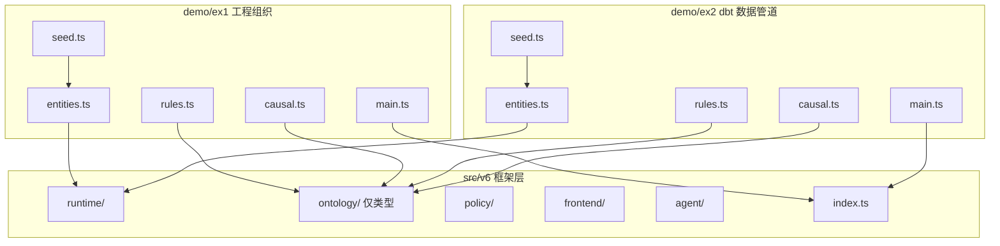

# V6 框架与 Demo 分离

## 目标目录结构

```
src/v6/
├── runtime/        ← 纯框架（不动）
├── ontology/       ← 框架类型保留；删除业务注册函数
│   ├── schema.ts   ← 删除末尾 projectOntology 常量
│   ├── rules.ts    ← 删除末尾 registerProjectPortalRules()
│   └── causal.ts   ← 删除末尾 buildProjectPortalCausalGraph()
├── policy/         ← 纯框架（不动）
├── frontend/       ← 纯框架（不动）
├── agent/          ← 纯框架（不动）
└── index.ts        ← 纯框架（不动）

src/v6/demo/
├── ex1/            ← 工程组织交付风险（原 seed.ts 场景）
│   ├── entities.ts        Engineer / Team / Project 类（含 @agentMethod 装饰）
│   ├── ontology.ts        projectOntology（TypeSchema + RelationSchema）
│   ├── rules.ts           registerEngineeringRules()（原 registerProjectPortalRules）
│   ├── causal.ts          buildEngineeringCausalGraph()
│   ├── seed.ts            seedGraph / seedFactStore / seedEventStore
│   ├── ruleFixtures.ts    单测专用 FactStore
│   └── main.ts            可运行 demo（predictive + diagnostic 各一轮）
└── ex2/            ← dbt 数据管道数据质量场景
    ├── entities.ts        DataModel / DataSource / Dashboard / DataOwner 类
    ├── ontology.ts        dbtOntology（TypeSchema + RelationSchema）
    ├── rules.ts           registerDbtRules()
    ├── causal.ts          buildDbtCausalGraph()
    ├── seed.ts            seedDbtGraph / seedDbtFactStore / seedDbtEventStore
    └── main.ts            可运行 demo（predictive + diagnostic 各一轮）
```

## 改动清单

### 1. 从框架文件中剥离业务代码

- [`src/v6/ontology/schema.ts`](src/v6/ontology/schema.ts)：删除末尾 `projectOntology` 常量（约 40 行）
- [`src/v6/ontology/rules.ts`](src/v6/ontology/rules.ts)：删除末尾 `registerProjectPortalRules()` 函数（约 170 行）
- [`src/v6/ontology/causal.ts`](src/v6/ontology/causal.ts)：删除末尾 `buildProjectPortalCausalGraph()` 函数（约 60 行）
- [`src/v6/data/`](src/v6/data/) 整个目录删除（移入 demo/ex1）
- [`src/v6/__tests__/`](src/v6/__tests__/) 整个目录移入 demo/ex1

### 2. 新建 demo/ex1（工程组织场景）

关键业务规则（原封不动迁移，仅路径变更）：

- `engineer_burnout_threshold`（inference_rule, risk_up）
- `team_capacity_overload`（hard_constraint, veto LOW）
- `project_team_load`（inference_rule, risk_up）
- `senior_coverage`（soft_criterion, risk_down）
- `dependency_risk_propagation`（soft_criterion, risk_up）
- `high_priority_pressure`（soft_criterion, risk_up）

`main.ts` 运行两轮：
1. Predictive：`runDecisionAssistant("评估 project_portal 的交付风险", { mode: "predictive", ... })`
2. Diagnostic：`runDecisionAssistant("project_portal 为什么延期", { mode: "diagnostic", outcome: {...} })`

### 3. 新建 demo/ex2（dbt 数据管道场景）

**领域建模：**

- `DataModel`：属性 `freshnessSlaHours / testCoverage / hasOwner / rowCount`；方法 `assessFreshnessRisk()`
- `DataSource`：属性 `sourceType / avgUpdateIntervalHours`；方法 `checkReliability()`
- `Dashboard`：属性 `criticalityLevel / dependencyCount`
- `DataOwner`：属性 `teamName / modelCount`

关系：
- `DataModel --depends_on--> DataModel`（lineage）
- `DataModel --feeds--> Dashboard`
- `DataModel --owned_by--> DataOwner`
- `DataSource --sourced_by--> DataModel`

**规则（registerDbtRules）：**

| rule id | kind | direction | 描述 |
|---|---|---|---|
| `data_freshness_violation` | hard_constraint | risk_up | 数据超过 SLA 未刷新 → 下游 dashboard 数据错误风险 |
| `low_test_coverage` | soft_criterion | risk_up | 测试覆盖率 < 0.6 → 数据质量风险上升 |
| `unowned_model` | soft_criterion | risk_up | 无 owner 的模型 → 治理风险 |
| `high_downstream_impact` | inference_rule | risk_up | 下游 dashboard 数量 > 3 → 故障影响面扩大 |
| `source_reliability_low` | soft_criterion | risk_up | 上游数据源平均延迟超阈值 |

**因果图（buildDbtCausalGraph）：**
- `late_refresh → stale_data`
- `stale_data → dashboard_incorrect`
- `schema_drift → model_failure`
- `model_failure → downstream_blocked`
- `source_incident → late_refresh`

**事件时间线（EventStore seed）：**
- `@T-5d`：`source_incident`（upstream API latency spike）
- `@T-4d`：`late_refresh`（orders_daily 未按时刷新）
- `@T-3d`：`schema_drift`（revenue_summary 字段变更）
- `@T-1d`：`model_failure`（revenue_summary 跑失败）
- `@T-0`：`dashboard_incorrect`（CFO Dashboard 数据错误）

**`main.ts` 运行两轮：**
1. Predictive：`"评估 orders_daily 模型的数据质量风险"`
2. Diagnostic：`"CFO Dashboard 数据为什么错误"`

## 文件依赖关系（改动后）



## 运行方式

```bash
# ex1 工程组织场景
npx tsx src/v6/demo/ex1/main.ts

# ex2 dbt 数据管道场景
npx tsx src/v6/demo/ex2/main.ts
```
