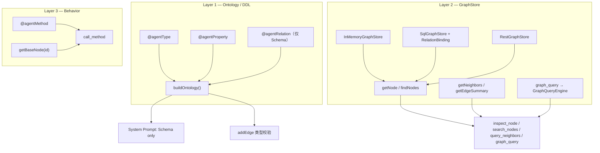

# Graph 三层模型与关系存储终态设计

> **状态**：设计草案（2026-05）  
> **背景**：GraphStore 抽象落地后，`@agentRelation` 方法体改为 `return []`、边仅由 `addEdge` 写入引发「表 + DDL」建模是否被削弱的讨论。本文给出终态 API 与迁移路径。  
> **关联**：[1-graph-design.md](./1-graph-design.md)、[1-graph-query.md](./1-graph-query.md)、[1-graph-agentRelation.md](./1-graph-agentRelation.md)

---

## 1. 核心结论（TL;DR）

| 层次 | 职责 | 类比 | 落点 |
|------|------|------|------|
| **Layer 1 — Ontology (T)** | 类型、属性、关系**类型**声明 | DDL | `@agentType` / `@agentProperty` / `@agentRelation` → Registry → `buildOntology()` |
| **Layer 2 — GraphStore (E,R)** | 节点/边的存储与查询 | DML + SELECT/JOIN | `GraphStore`：`getNode` / `findNodes` / `getNeighbors` / `getEdgeSummary` |
| **Layer 3 — Behavior** | 领域规则与方法执行 | 存储过程 / 领域服务 | `@agentMethod` on `BaseNode`；`call_method` → `getBaseNode(id)` |

**原则**：

1. **`@agentRelation` = 只声明关系 Schema（DDL）**，不在实例方法里查数据。
2. **邻居与边的事实只来自 `GraphStore`**（内存边表、SQL、REST 均可），废弃「双源合并」。
3. **`getNode` 返回 `NodeData`（DTO）** 用于 Agent 探索；**`getBaseNode` 返回实体实例** 仅用于 `call_method`。
4. 生产环境用 **`RelationBinding`** 把关系类型映射到物理表/FK/关联表，由 `SqlGraphStore` 生成查询。

---

## 2. 与「数据库表」的映射

### 2.1 实体类型 ↔ 表

| 图概念 | 关系型 DB |
|--------|-----------|
| `TypeSchema`（如 `Reader`） | 表 `reader` 或视图 |
| `NodeData`（`id` + `properties`） | `SELECT * FROM reader WHERE id = ?` 的一行 |
| `findNodes({ type: 'Book', where })` | `SELECT ... FROM book WHERE ...` |
| 全局 `id` | 主键；若分表则需约定全局唯一（如前缀 `reader:`）或 `(type, id)` 二元查询 |

`GraphStore.getNode(id)` **与表建模一致**，即按主键取单行。困难点不在 `getNode`，而在：

- 关系在 DB 中可能是 **边表**、**外键列** 或 **多态关联**；
- 查询路径不应强制返回 `BaseNode` 子类（那是 ORM 运行时，不是 Agent 事实通道）。

### 2.2 关系类型 ↔ 存储形态

| 关系示例 | 常见物理存储 | `RelationBinding.kind` |
|----------|--------------|------------------------|
| `Reader --borrows--> Book` | `borrow_record(reader_id, book_id, status)` | `junction` |
| `Reader --registered_at--> Branch` | `reader.branch_id` FK | `fk` |
| `Book --written_by--> Author` | `book.author_id` FK | `fk` |
| `Branch --partners_with--> Branch` | `branch_partner` 或 `edges` 表 | `junction` |
| Demo 全量 seed | `data.relations[]` → `addEdge()` | `memory`（测试替身） |

**本体层**只声明 `borrows: Reader → Book`；**存储层**用 `RelationBinding` 说明如何从 DB 查出邻居。

---

## 3. 架构图



---

## 4. `@agentRelation` 终态 API

### 4.1 现状问题

当前实现（过渡期）：

```typescript
@agentRelation({ type: 'borrows', toType: 'Book', description: '...' })
getBorrowedBooks(): NodeId[] {
  return []  // 仅占位；边由 seed addEdge 提供
}
```

问题：装饰器副作用依赖「假方法」；`methodName` 写入 Registry 但永不调用；与「方法 = DB 查询」的直觉冲突。

### 4.2 方案 A（推荐）：类级元数据装饰器

**不再要求实例 getter**，关系声明挂在类上：

```typescript
@agentType({ description: '图书馆读者...' })
@agentRelations([
  { type: 'borrows', toType: 'Book', description: '当前借阅（未归还）' },
  { type: 'overdue', toType: 'Book', description: '逾期未还' },
  { type: 'reserves', toType: 'Book', description: '预约中' },
  { type: 'registered_at', toType: 'Branch', description: '注册分馆' },
])
export class Reader extends BaseNode {
  // 仅 @agentProperty 与 @agentMethod
}
```

Registry 变更：

```typescript
// registry.ts — 概念草案
type RelationRegistryEntry = {
  type: string
  fromType: string
  toType: string
  description: string
  // 删除 methodName（或标记 optional deprecated）
}
```

`buildOntology()` 行为不变：仍产出 `RelationSchema[]`。

### 4.3 方案 B（兼容）：保留方法装饰器，明确「无方法体」

若需少改现有类结构，保留 `@agentRelation` on getter，但文档与类型约束声明：

- 方法**不得**包含数据访问逻辑；
- 默认实现由框架提供（或编译期检查方法体为空）；
- `BaseNode.resolveRelation` / `resolveAllRelations` **删除**（已 deprecated）。

**不推荐**长期保留方案 B。

### 4.4 与 `1-graph-agentRelation.md` 的差异

| 原设计 | 终态 |
|--------|------|
| resolver 方法体写 DB 查询 | 查询在 `GraphStore.getNeighbors`（Sql 实现） |
| 双源：静态边 + resolver | **单源**：仅 Store |
| `getOutEdges` 回退 resolver | `getNeighbors` 只读 Store |
| Q-B 推荐「静态边 + stub resolver」 | 改为「静态边（demo）或 SQL；无 stub resolver」 |

---

## 5. `RelationBinding` — 关系类型到物理存储

### 5.1 类型定义（草案）

```typescript
// src/v6/ontology/relation-binding.ts（拟新增）

export type RelationBinding =
  | JunctionBinding
  | ForeignKeyBinding
  | InverseForeignKeyBinding

/** 关联表：多对多或一对多事实表 */
export type JunctionBinding = {
  kind: 'junction'
  table: string
  fromColumn: string   // 指向源节点 id
  toColumn: string     // 指向目标节点 id
  /** 可选：限制边类型；同一表多关系时用 where 区分 */
  where?: string
}

/** 源表上的外键列 → 目标表一行 */
export type ForeignKeyBinding = {
  kind: 'fk'
  onType: string       // 持有 FK 的实体类型，如 Reader
  column: string       // 如 branch_id
  toType: string       // 如 Branch
}

/** 目标表上的外键指向源（入边懒查时用） */
export type InverseForeignKeyBinding = {
  kind: 'inverse_fk'
  onType: string       // 持有 FK 的类型，如 Book
  column: string       // 如 author_id
  fromType: string     // 如 Author
}

export type RelationBindingMap = Record<
  string,              // relation type，须与 RelationSchema.type 一致
  RelationBinding
>
```

### 5.2 图书馆示例映射

```typescript
export const libraryRelationBindings: RelationBindingMap = {
  borrows: {
    kind: 'junction',
    table: 'borrow_record',
    fromColumn: 'reader_id',
    toColumn: 'book_id',
    where: "status = 'active'",
  },
  overdue: {
    kind: 'junction',
    table: 'borrow_record',
    fromColumn: 'reader_id',
    toColumn: 'book_id',
    where: "status = 'overdue'",
  },
  reserves: {
    kind: 'junction',
    table: 'reservation',
    fromColumn: 'reader_id',
    toColumn: 'book_id',
  },
  registered_at: {
    kind: 'fk',
    onType: 'Reader',
    column: 'branch_id',
    toType: 'Branch',
  },
  written_by: {
    kind: 'fk',
    onType: 'Book',
    column: 'author_id',
    toType: 'Author',
  },
  belongs_to: {
    kind: 'fk',
    onType: 'Book',
    column: 'category_id',
    toType: 'Category',
  },
  partners_with: {
    kind: 'junction',
    table: 'branch_partner',
    fromColumn: 'branch_id',
    toColumn: 'partner_branch_id',
  },
  // available_at, part_of, specializes_in 等同理
}
```

### 5.3 `SqlGraphStore.getNeighbors` 伪代码

```typescript
async getNeighbors(nodeId: string, opts: GetNeighborsOpts): Promise<Paginated<NeighborData>> {
  const node = await this.getNode(nodeId)
  if (!node) return emptyPage()

  const rel = opts.relation
  if (!rel) throw new Error('relation required for SQL store') // 或枚举全部类型

  const binding = this.bindings[rel]
  const schema = this.relationIndex.get(rel)
  if (!binding || !schema) throw new Error(`unknown relation: ${rel}`)

  switch (binding.kind) {
    case 'junction':
      return this.queryJunction(node, binding, schema, opts)
    case 'fk':
      return this.queryFkOut(node, binding, opts)
    case 'inverse_fk':
      return this.queryInverseFkIn(node, binding, opts)
  }
}
```

**入边**：`direction: 'in'` 时对 `junction` 交换 from/to 列；对 `fk` 使用 `inverse_fk` 或反向索引。

---

## 6. `GraphStore` 接口（保持不变）

```typescript
export interface GraphStore {
  getNode(id: string): Promise<NodeData | undefined>
  findNodes(opts: FindNodesOpts): Promise<Paginated<NodeData>>
  getNeighbors(nodeId: string, opts?: GetNeighborsOpts): Promise<Paginated<NeighborData>>
  getEdgeSummary(nodeId: string): Promise<EdgeSummary[]>
}
```

| 方法 | 表建模语义 | 实现要点 |
|------|------------|----------|
| `getNode` | PK 查一行 | 返回 DTO，不构造 `BaseNode` |
| `findNodes` | 按表 + WHERE | `where` 尽量下推 SQL |
| `getNeighbors` | JOIN / 子查询 | 依赖 `RelationBinding` |
| `getEdgeSummary` | `GROUP BY relation` COUNT | 大图上避免拉全量邻居 |

**`InMemoryGraphStore` 额外能力**（不进入 `GraphStore` 接口）：

```typescript
addNode(node: BaseNode): void
addEdge(edge: Edge): void
getBaseNode(id: string): BaseNode | undefined  // 仅行为层
```

---

## 7. Demo / 测试数据约定

### 7.1 单一事实源

```typescript
// seed.ts — 保持不变的心智模型
const data = { readers: [...], books: [...], relations: [...] }

export function seedGraph(): InMemoryGraphStore {
  const g = new InMemoryGraphStore({ relations: ontology.relations })
  for (const r of data.readers) g.addNode(new Reader(r))
  // ...
  for (const rel of data.relations) g.addEdge(rel)  // = INSERT INTO 关联表
  return g
}
```

`data.relations` **即** demo 环境下的「关联表行集合」；**禁止**在 `ontology.ts` 中再次 `filter(data.relations)`。

### 7.2 待修复不一致

`Branch.findPartnerBranches` 仍直接读 `data.relations`，应改为：

```typescript
// 注入 GraphStore 或构造时传入 store
const partners = await store.getNeighbors(this.id, { relation: 'partners_with' })
```

---

## 8. Agent 工具与三层的关系

| 工具 | 使用层 |
|------|--------|
| `inspect_node` | L2 `getNode` + `getEdgeSummary`；L1 类型来自 `NodeData.type` |
| `search_nodes` | L2 `findNodes` |
| `query_neighbors` | L2 `getNeighbors` |
| `graph_query` | L2 `GraphQueryEngine` → Store |
| `call_method` | L3 `getBaseNode` + MethodRegistry |

System Prompt 仅注入 L1（`Ontology` 的 types + relations），不注入具体边。

---

## 9. 废弃与迁移

### 9.1 废弃项

| 项 | 说明 |
|----|------|
| **双源关系解析** | `edges[]` + `resolveAllRelations()` 合并 |
| **`BaseNode.resolveRelation`** | 已空实现，删除 |
| **ontology 内 `import { data } from './seed'`** | 用于 resolver 或 `findPartnerBranches` |
| **`@agentRelation` 方法体中的 DB/seed 查询** | 迁至 Store 或 Binding |

### 9.2 迁移阶段

| 阶段 | 内容 | 状态 |
|------|------|------|
| **P0** | `GraphStore` + `InMemoryGraphStore`；边仅 `addEdge`；四工具 + `graph_query` | ✅ 已完成 |
| **P1** | 文档：三层模型 + 废弃双源（本文 + 更新 `1-graph-design.md` §6.3） | 本文 |
| **P2** | `@agentRelations` 类级装饰器；移除空 getter | 待实现 |
| **P3** | `RelationBinding` 类型 + `library/bindings.ts` 示例 | 待实现 |
| **P4** | `SqlGraphStore` 骨架 + 单关系集成测试 | 待实现 |
| **P5** | 修 `Branch.findPartnerBranches`；清理 `ontology` → `seed` 依赖 | 待实现 |

---

## 10. 开放问题

### Q1: 全局 `id` 还是 `(type, id)`？

- **全局 id**：`getNode` 简单；要求写入时全局唯一。
- **复合键**：更贴近分表；`getNode` 需 `type` 或查 `nodes` 统一视图。

**建议**：demo 继续全局 id；SQL 实现可增加 `node_registry(id, type)` 或在 API 层要求 `inspect_node` 已知 type。

### Q2: `getNeighbors` 无 `relation` 时是否允许？

- 内存实现可枚举所有出边类型；
- SQL 实现成本高（多 binding 多次查询）。

**建议**：`graph_query` TRAVERSE 始终带 `relation`；`query_neighbors` 文档标明生产环境建议必填。

### Q3: `RelationBinding` 放在哪？

| 选项 | 优点 | 缺点 |
|------|------|------|
| 与 `ontology.ts` 并列 | 部署简单 | Schema 与物理存储仍分离 |
| 注解 `@agentRelation({ binding: ... })` | 单文件 | 实体类耦合 DB 表名 |
| 独立 `bindings.ts` per 领域 | 清晰 | 需校验与 Schema 一致 |

**建议**：独立 `bindings.ts` + 启动时校验 `RelationSchema.type` 均有 binding（Sql 模式）。

---

## 11. 相关文档

- [1-graph-design.md](./1-graph-design.md) — Graph 模块总体设计（§6.3 双源已标记废弃）
- [1-graph-query.md](./1-graph-query.md) — 声明式查询与 GraphStore
- [1-graph-agentRelation.md](./1-graph-agentRelation.md) — 历史方案；resolver 部分已被本文取代
