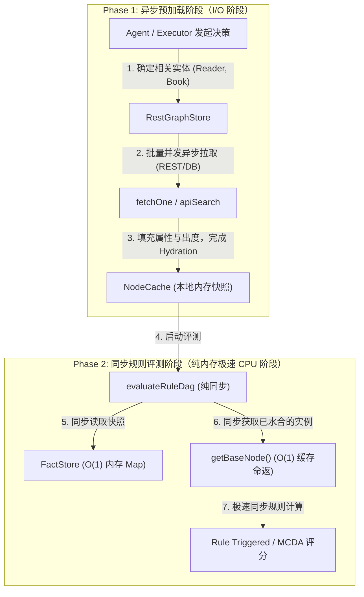

这个设计中，为啥


// ── NodeInstanceContainer ──

export interface NodeInstanceContainer {
  getBaseNode(id: string): BaseNode | undefined
}
/** 向后兼容别名 */
export type Graph = InMemoryGraphStore

1. getBaseNode 可以直接并入 GraphStore 吗？
2. 向后兼容别名 ？？？ 是否可以直接采用 GraphStore ?


---

**Cursor**

这是一个非常具有深度且切中系统设计要害的架构思考！

关于您提出的这两个核心问题，其背后蕴含着 **DTO 与领域模型分离（CQRS 思想）**，以及 **物理实现与异步渐进演进** 的经典设计考量。

以下是为您进行的深度拆解和解答：

---

### 1. 为什么 `getBaseNode` 不能直接并入 `GraphStore` 接口？

在传统的开发直觉中，既然它们都跟“图”和“节点”相关，合并在一起似乎最方便。但在 **Layer 2（存储层）** 和 **Layer 3（行为层）** 严格解耦的终态架构中，直接并入会引入严重的 **“反模式（Anti-Pattern）”**。

#### A. DTO 纯数据与领域类实例（Class Instance）的本质区别
* **`GraphStore` 的定位是纯数据 DTO 存储通道**：它所有的方法（如 `getNode(id)`）都返回 `Promise<NodeData>`。`NodeData` 是一个**纯 JSON 数据对象**（只包含属性键值对，没有任何执行方法）：
  ```typescript
  export type NodeData = {
    id: string
    type: string
    properties: Record<string, unknown>
  }
  ```
  这种设计极其轻量，使得 `GraphStore` 可以**无缝对接任何底层的异构介质**，例如数据库（`SqlGraphStore`）或 HTTP 接口（`RestCrudGraphStore`），它们只需要返回 JSON 数据即可。
* **`getBaseNode(id)` 返回的是 Layer 3 带有业务方法的充血实体实例**（如 `Reader`、`Book` 类实例）：
  这些类实例上挂载了用 `@agentMethod` 装饰的业务逻辑（比如 `Reader.getBorrowedBooks()`）。

#### B. 并入后，非内存存储实现将寸步难行
如果强行把 `getBaseNode(id): BaseNode` 塞进 `GraphStore` 接口：
* 当我们要实现一个基于数据库的 `SqlGraphStore` 时，为了实现这个方法，`SqlGraphStore` 内部必须强行集成一套极其复杂的 **“ORM 运行时（实例化、关系复水、依赖注入等）”**，否则它无法凭空在内存中 `new` 出对应的 `Reader` 实例并还原它的方法。
* 这会让本来应当极度轻量（只管查数据）的 Layer 2 存储，背负了不属于它的 Layer 3 运行时的繁重职责。

#### C. 完美的 CQRS 职责分离（读写/职责分离）
* **`GraphStore`（读/信息检索通道）**：Agent 探索图、搜索属性、获取邻居。面向纯数据，全异步，支持高并发，对 SQL/REST 友好。
* **`NodeInstanceContainer`（动作/执行通道）**：`call_method` 执行工具。只在需要真正反射执行 JS 方法时，从当前活跃的内存上下文（或通过 Instance Hydrator）定位具体的 JS 运行时对象。

在内存模式 `InMemoryGraphStore` 中，因为数据本来就存在内存的对象里，所以它同时实现了这两个接口。但在 SQL 模式中，它们会彻底分离。

---

### 2. 为什么存在向后兼容别名 `export type Graph = InMemoryGraphStore`？可以直接采用 `GraphStore` 吗？

这是一个关于**渐进式重构（Progressive Migration）** 与 **同步 vs 异步运行机制** 的妥协设计。

#### A. 历史包袱与 progressive 重构
在 V5 和 V6 早期版本中，我们只有一个具体的 `Graph` 类（纯内存 Map），它同时干了存储和反射的所有活。整个 codebase（多达 30+ 个文件，如 planners、critics、reconcilers、rules 等）中全部导入并声明了 `graph: Graph` 这一类型。

当引入 `GraphStore` 抽象接口后：
* 原来的 `Graph` 类重构改名为 `InMemoryGraphStore`。
* 为了**避免一次性大范围修改 30 多个核心源文件导致系统编译崩溃或产生隐式 Bug**，我们使用了：
  ```typescript
  export type Graph = InMemoryGraphStore
  ```
  作为别名过渡桥梁，这样既有的上层规则链路可以完全不用改动，系统保持向后兼容。

#### B. 为什么现阶段某些地方不能直接换成 `GraphStore`？
我们**确实应该（且已经在逐步）**在只读、探索的组件中直接使用 `GraphStore`（例如 `GraphQueryEngine` 和图工具层已经完全改用 `GraphStore` 了）。

但在**规则评测、决策计算（MCDA）**等核心 CPU 密集型链路上，我们仍然需要 `Graph`（即内存 Store）别名，原因在于：**同步与异步的性能和运行鸿沟**。

* **`GraphStore` 接口的方法全部是全异步的**（返回 `Promise`）：
  ```typescript
  getNode(id: string): Promise<NodeData | undefined>
  ```
* **而决策层、规则 DAG（`ruleDag.ts`、`rules.ts`）的执行目前是纯同步的**：
  评测一条规则是否满足时，如果需要查询图上的实体类型、基础配置信息等，它是高频、同步、直接在内存中计算的。
  如果把这里的 `Graph` 替换成 `GraphStore`：
  1. 整个规则引擎、所有的 rule 回调函数都必须被强制改成 `async / await`。
  2. 在一次评测数十个候选、触发数十条规则的计算循环中，大量的异步 `microtask` 调度会带来不可忽视的上下文切换和性能损耗（即使底层是内存存储）。

#### 💡 最佳演进路径（终态方案）：
1. **纯读图探索/工具层**：直接采用且**必须**采用 `GraphStore`（实现存储介质透明，支持未来一键换成 SQL 库）。
2. **规则引擎评测/高频同步计算层**：
   * **Demo / 测试期**：依赖 `Graph`（即 `InMemoryGraphStore`），直接从内存同步获取状态，享受极高计算性能。
   * **生产环境数据库期**：在进入规则评测前，先通过 Layer 2 异步图探索把相关候选人的 facts、properties 一次性“快照”预加载到 `FactStore` / `ContextMemory` 中；随后规则引擎在纯内存快照上进行**纯同步、极速的规则求值**，从而让规则评测彻底脱离对“数据库/图存储”的实时异步依赖。

### 总结
* `getBaseNode` 代表了 **有状态的行为（Layer 3）**，而 `GraphStore` 代表了 **无状态的数据 DTO（Layer 2）**，二者有本质区别，不合并是为了不绑死具体的底层驱动。
* `type Graph` 是为了向后兼容、避免大范围重构，以及照顾**规则引擎高频、同步、极速内存求值**的需求所特意保留的平滑过渡桥梁，它与纯异步的 `GraphStore` 接口形成了完美的分工。


---

# 2


**User**

但是，类似 @src/v6/provider/rest/RestGraphStore.ts:22-23 
针对 rest 接口，如何 照顾规则引擎高频、同步、极速内存求值的需求 ？？？

---

**Cursor**

针对 `RestGraphStore`（以及未来的 `SqlGraphStore`）这种底层具有 I/O 延迟、本身必须异步（`Promise`）获取数据的存储，要让**规则引擎（Rule Engine）**依然能够进行高频、同步、极速的内存求值，在 V6 的架构中是通过以下两个核心设计模式协同解决的：

---

### 🌟 核心解决方案：基于“预加载水合 (Pre-hydration)”与“上下文快照”的 CQRS 架构



#### 1. 职责解耦：`FactStore`（事实快照）作为第一求值通道
规则引擎评测规则（如 C1, C2, C3 等）时，其 `evaluator` 最优先也是最主要的取数通道是 **`FactStore`（事实库）**，而不是在 evaluator 内部去实时穿透到底层的图去查。
* **`FactStore` 是纯内存 Map**：其 `facts.getValue(entityId, property)` 存取操作是 **纯同步、O(1) 性能** 的。
* 跨实体参数（如 `branchMaxBorrowPerReader` 等）会由 Agent 在调用 Critic（规则评测）前，利用图工具查出并使用 `bind_fact` 显式写入事实库，从而**将有 I/O 延迟的动态数据转化为静态内存快照**。

#### 2. 空壳代理 (Skeleton Nodes) + 预加载水合 (Pre-hydration)
如果某些规则由于降级，必须在评测期间同步穿透读取 `ctx.graph`（例如 C2 规则没有绑定 facts 时，需要降级到统计 `overdue` 出边：`ctx.graph.getOutEdges`），就会触发 **Pre-hydration（属性/边水合）** 机制：

* **第一步：同步构建空壳（Skeleton Node）**
  当规则引擎调用 `graph.getBaseNode(id)` 时，`RestGraphStore` 同步返回一个具有正确类类型（例如 `new Reader(id)`）但属性全空的“空壳”实例：
  ```typescript
  getBaseNode(id: string): BaseNode | undefined {
    const cached = this.nodeCache.get(id)
    if (cached) return cached // 同步 O(1) 缓存命中

    const { type } = this.parseGlobalId(id)
    const NodeClass = this.nodeClassRegistry[type]
    
    const node = new NodeClass(id) // 同步 new 实例
    setNodeGraphStore(node, this)
    this.nodeCache.set(id, node)
    return node
  }
  ```
  这样 `evaluateRuleDag` 中的同步过滤器 `rule.appliesTo.includes(node.constructor.name)` 能够**同步、极速地执行类型匹配**，无需等待网络。

* **第二步：并发、批量异步预加载**
  在调用 `evaluateRuleDag`（同步评测）**之前**，决策流（Pipeline/Critic 执行器）会提前识别出当前决策任务涉及的所有实体 ID。
  随后，通过 `Promise.all` 并发、批量地调用 `populateNodeProperties`：
  ```typescript
  // 在执行评测前，批量将属性/出边数据从 REST 灌入内存实例中
  await Promise.all(
    entityIds.map(id => {
      const node = store.getBaseNode(id);
      return store.populateNodeProperties(node); // 执行异步网络/DB I/O，完成水合
    })
  );
  ```

* **第三步：无 network I/O 的极速同步求值**
  此时，内存中的 `nodeCache` 已经被彻底“灌满”了。
  接下来，当评测流程在高频 CPU 循环中调用 `evaluateRuleDag` 评测成百上千条规则时：
  * `getBaseNode(id)` 变为**纯同步且 100% 命中内存缓存**。
  * `getOutEdges(id)` 访问的全部是**在第一步预加载中就已经存入内存的本地静态边**。
  * 整个评测过程实现了 **0 网络 I/O，100% 同步执行**。

---

### 总结
这就是为什么 `RestGraphStore` 中将异步取数的设计分解为了：
1. **同步的 `getBaseNode`**：保障规则类型匹配过滤和类反射可以在同步代码中完美运行。
2. **异步的 `populateNodeProperties`**：把网络/DB的异步获取延迟**收拢在规则执行之前**，通过异步批量并发完成 Hydration（水合）。

通过这一设计，上层高频、同步、极速的 CPU 规则求值引擎，和底层异构、异步、多变的 I/O 存储驱动（SQL/REST）得以在物理边界上完美和谐地协作！
