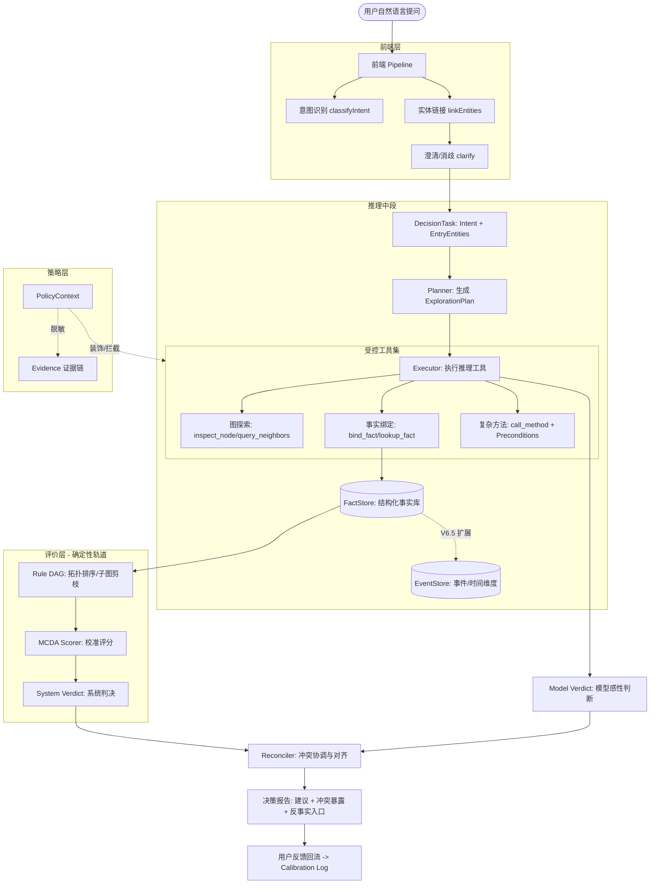

在 V6 的架构设计中，系统从“工具型 Agent”演化为**“面向用户的决策助手系统”**，其核心是通过**四层架构**（前端、中段、后端、底层支撑）来实现可工程化、可校准的决策。

以下是基于源代码和设计文档整理的 V6 依赖模块与架构图。

### 一、 V6 核心依赖模块

根据 V6 的设计哲学，系统被拆解为以下互相关联的逻辑模块：

1.  **前端管道 (Frontend Pipeline)**：
    *   **Intent Classifier**：识别用户意图（分类为风险评估、排期等）及推理模式（前向预测 vs. 后向诊断）。
    *   **Entity Linker**：将自然语言中的名词链接至图中的入口实体（Entry Entities）。
    *   **Clarifier**：处理歧义，通过结构化选择题与用户交互。

2.  **推理中段 (Reasoning Loop - PEC 架构)**：
    *   **Planner**：轻量级调用，根据意图和本体生成执行计划（Plan），预判需调查的子图。
    *   **Executor**：受控的 LLM，负责探索图、调查事实并执行 `bind_fact`。其职责被严格限定，不再负责最终打分。
    *   **Deterministic Critic**：**确定性评价器**。不使用 LLM，而是基于规则 DAG 和 MCDA 算法运行，产生“系统判决（System Verdict）”作为对照组。

3.  **事实与状态层 (Fact & State Layer)**：
    *   **FactStore / FactBinding**：结构化事实库。存储带命名空间（entityId, property）、来源（source）及有效期（validUntil）的事实。
    *   **EventStore (V6.5)**：时间维度扩展。支持“时间旅行”查询，是 FactStore 的历史流版本。

4.  **规则与评分层 (Ontology & Scoring)**：
    *   **Rule DAG**：规则有向无环图。支持拓扑排序（推理 -> 硬约束 -> 软准则）及子图剪枝。
    *   **MCDA Scorer**：多准则决策分析。基于权重（Weight）、严重程度（Severity）和方向（Direction）进行校准打分。

5.  **后端与策略层 (Backend & Policy)**：
    *   **Reconciler**：冲突协调器。对比模型与系统的判决，显式暴露冲突并分析原因（likelyCause）。
    *   **PolicyContext**：策略后端。在工具层强制执行权限过滤、敏感数据脱敏（Masking）及审计限制。
    *   **Counterfactual (What-if)**：反事实推理。允许在已绑定事实的基础上进行局部替换并重跑 Critic 结论。

---

### 二、 V6 系统架构图

该架构图展示了从用户输入到最终决策输出的全链路流转，以及各模块间的依赖关系：

### 三、 关键设计决策总结 (V6 vs V5)
*   **双轨判决 (Dual-track Verdict)**：核心是不再让 LLM 静默胜出。如果系统（确定性规则）与模型（语义判断）不一致，必须强制 surface 给用户。
*   **事实有归属 (Fact-with-binding)**：事实不再是扁平的变量名，而是必须绑定到实体及其属性，并带有可审计的来源信息。
*   **确定性 Critic**：为了对抗 LLM 的整体偏置，评价环节严禁再次调用 LLM，必须走基于本体的确定性代码逻辑。
*   **工程化本体**：将 T（类型）、R（关系）、C（准则）视为代码资产，支持版本管理、依赖检查和单元测试。