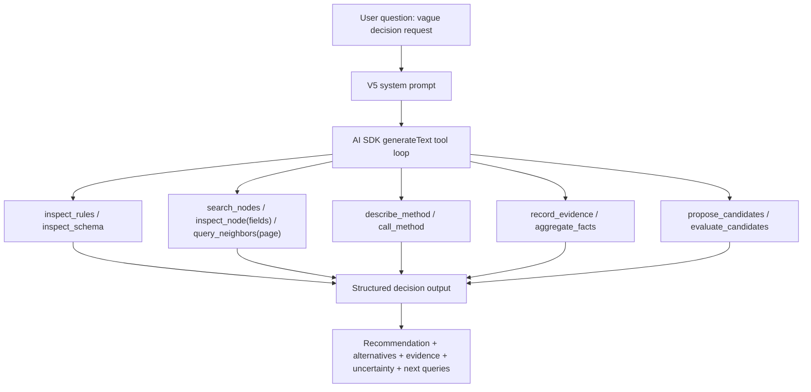

# feat: Add V5 decision support agent

## Overview

V5 adds a new versioned prototype under `src/v5` that keeps V4's AI SDK tool-calling loop while changing the product shape from graph question-answering to decision support. The new version makes ontology constraints explicit, removes the full entity directory from the system prompt, adds progressive graph discovery tools, and returns structured decision output with recommendations, alternatives, evidence, triggered rules, uncertainty, and next information to collect.

This plan treats `docs/think_v5.md` as the design reference and `docs/brainstorms/2026-04-25-v5-decision-support-agent-requirements.md` as the product source of truth.

## Problem Frame

V4 can explore a semantic graph and call node methods, but it still assumes a relatively direct path from goal to single answer. For vague decision-support questions such as "评估 project_portal 的综合交付风险", the system needs to compare plausible answers, gather just enough evidence, cite explicit decision criteria, and surface uncertainty rather than presenting a single overconfident result.

The implementation should preserve the repo's versioned-demo style: V5 should be a sibling of `src/v4`, not a rewrite of V4. Existing V4 behavior remains available as the comparison baseline.

## Requirements Trace

- R1-R4. Represent `G={E,R,T,C}` explicitly, especially `C` as queryable constraints, criteria, inference rules, conflict policies, and explanation policies.
- R5-R8. Replace full entity-directory prompt injection with entry-entity based progressive disclosure, search, filtering, field projection, pagination, and summaries for large result sets.
- R9-R12. Standardize tool results and add method description before method invocation, so the model does not learn method signatures by trial-and-error.
- R13-R16. Introduce `DecisionTask`, `CandidateAnswer`, `Evidence`, and `Uncertainty` structures for ambiguous questions and evidence-backed comparison.
- R17-R20. Produce user-readable decision output with recommendation, alternatives, evidence, triggered rules, uncertainty, and next steps.
- R21-R24. Preserve the V4 AI SDK loop and versioned runtime model while allowing phased delivery.
- R25-R27. Verify through tool contract tests, ontology/rule tests, progressive disclosure tests, and golden trace tests for `project_portal`.

## Scope Boundaries

- Do not modify `src/v4` except if a future implementation discovers shared-library extraction is clearly lower risk; default is copy-forward into `src/v5`.
- Do not restore V3's `NextAction`, hand-written executor/validator loop, or blackboard-centric runtime.
- Do not add a remote graph database, persistence, permissions, or real organization data.
- Do not introduce multi-agent execution in V5.
- Do not convert every business rule into a full DSL; only rules that need to be queried, cited, or composed become first-class constraints.
- Do not require exact natural-language output matching in tests; assert structure and critical content instead.

## Context & Research

### Relevant Code and Patterns

- `src/v4/agent/run.ts` is the runtime pattern to preserve: one `generateText` call with AI SDK tools and `stopWhen: stepCountIs(15)`.
- `src/v4/agent/tools.ts` is the tool surface to evolve: it currently exposes `inspect_node`, `query_neighbors`, and `call_method`, but returns inconsistent shapes such as `{ error }`, `{ neighbors }`, and `{ result }`.
- `src/v4/agent/prompt.ts` is the prompt surface to change: it currently loops over every node and emits a full node directory.
- `src/v4/runtime/registry.ts` and `src/v4/runtime/decorator.ts` provide the registry/decorator pattern for `@agentMethod` and `@agentProperty`.
- `src/v4/runtime/graph.ts` provides the graph shape to extend with search, filtering, field projection, and pagination.
- `src/v4/data/seed_v3.ts` contains the main `project_portal` risk scenario and should be the V5 scenario baseline.
- `package.json` has lint/typecheck scripts but no test runner. V5 tests need either a minimal Node/TypeScript test approach or a package-script addition during implementation.

### Institutional Learnings

- `docs/think_v4.md` records the core constraint: keep the AI SDK tool-calling loop and avoid recreating the failed V3 loop.
- `docs/brainstorms/2026-04-23-schema-discovery-requirements.md` is the direct predecessor to `describe_method`: the model needs method params, returns, and descriptions before calling.
- `docs/brainstorms/2026-04-23-v3-semantic-node-requirements.md` establishes the useful semantic split of properties, edges, and actions. V5 extends that split with constraints and decision artifacts.
- `docs/think_v5.md` clarifies that `DecisionTask`, `Evidence`, and `CandidateAnswer` can first be structured outputs and tool results; a mutable runtime decision state can be deferred.

### External References

No external research is needed for this plan. The feature is a local prototype evolution grounded in existing repo patterns and design documents.

## Key Technical Decisions

- Add `src/v5` as a versioned sibling of `src/v4`: This preserves the demo's version-comparison style and keeps V4 as an executable baseline.
- Use static ontology modules for V5 rules first, not decorators for every rule: `@agentMethod` and `@agentProperty` should stay decorator-based, but initial `C` rules are clearer and easier to test as static ontology data under `src/v5/ontology`. Decorator-based rule registration can be revisited after the rule shape stabilizes.
- Standardize tool results before adding new tools: Every V5 tool should return the same success/error envelope so later prompt, golden trace, and tests do not encode ad hoc tool responses.
- Implement method description as a first-class tool: `describe_method` should expose params, returns, required facts, and related rule IDs before `call_method`, closing the V4 blind-call gap.
- Keep decision artifacts structured but lightweight: `DecisionTask`, `Evidence`, `CandidateAnswer`, and `Uncertainty` should be TypeScript types and structured final output first. Avoid a mutable agent state store unless implementation proves it is needed.
- Let deterministic helpers calculate simple criteria, while the LLM frames and explains: threshold checks, aggregation, and schema validation should be deterministic; candidate framing and user-facing explanation can remain model-assisted.
- Use a lightweight per-run `DecisionWorkspace` for decision tools: `record_evidence`, `propose_candidates`, and `evaluate_candidates` need stable IDs across tool calls. The workspace should live inside the V5 tool factory for one run only, not as a persistent blackboard or cross-run store.
- Standardize V5 method invocation on object arguments: agent-accessible V5 methods should receive a single object matching their Zod params schema. This avoids V4's fragile `Object.values(parsed)` positional ABI.
- Split V5 tools by boundary: graph tools, ontology tools, method tools, and decision tools should live in separate modules and be composed by a thin factory, rather than growing one large `agent/tools.ts`.

## Open Questions

### Resolved During Planning

- Should V5 be MVP-only or full-scope? Resolved by user choice: plan for full V5 coverage while sequencing work so implementation can land in phases.
- Should V5 use V4's loop or restore a custom loop? Resolved by origin requirements and V4 lessons: keep AI SDK `generateText` and tools.
- Should V5 rewrite V4 in place? Resolved by repo convention: create `src/v5`.
- Should all business logic become a DSL? Resolved by scope boundary: no; only queryable/citable/composable rules become first-class.

### Deferred to Implementation

- Exact test command syntax: Use Node's built-in test runner with a TypeScript loader such as `tsx`, unless implementation discovers an incompatibility. The plan requires a package-level test script, but leaves the exact script string to implementation after validating local tooling.
- Exact rule evaluation weights: The demo needs stable enough scoring to compare candidates, but final weights should be tuned while implementing the `project_portal` scenario.
- Exact `generateText` structured-output strategy: Implementation should decide whether final decision output is parsed from text, generated via a dedicated tool, or returned through a structured schema based on AI SDK v6 ergonomics in the code.

## High-Level Technical Design

> This illustrates the intended approach and is directional guidance for review, not implementation specification. The implementing agent should treat it as context, not code to reproduce.

The dependency direction should be:

1. Test harness and stable contracts.
2. Ontology rules with executable contracts.
3. Graph access and method introspection.
4. Prompt and tool wiring.
5. Decision workspace, output formatting, and golden trace verification.

## Implementation Units

- [ ] **Unit 1: Create V5 version scaffold, test harness, and shared contracts**

**Goal:** Establish `src/v5` as an isolated implementation surface with a minimal test harness, unified tool-result types, and decision-support contracts.

**Requirements:** R9-R12, R13-R16, R21-R24

**Dependencies:** None

**Files:**
- Modify: `package.json`
- Create: `src/v5/runtime/types.ts`
- Create: `src/v5/runtime/registry.ts`
- Create: `src/v5/runtime/decorator.ts`
- Create: `src/v5/runtime/graph.ts`
- Create: `src/v5/ontology/decision.ts`
- Test: `src/v5/runtime/types.test.ts` or equivalent test path chosen during implementation

**Approach:**
- Copy forward the stable V4 runtime concepts into `src/v5` rather than importing directly from `src/v4`.
- Add the smallest package-level test script that can run TypeScript tests in `src/v5`; prefer Node's built-in test runner plus the existing `tsx` dependency unless implementation discovers a blocker.
- Add a generic `ToolResult` envelope with success and error variants.
- Add `PageInfo` and typed error codes for not found, invalid args, empty result, unsupported field, and internal failure.
- Add decision artifact types for `DecisionTask`, `Evidence`, `CandidateAnswer`, and `Uncertainty` under `src/v5/ontology/decision.ts`.
- Add a `DecisionWorkspace` type that stores candidates, evidence, uncertainty, and selected criteria for one agent run.
- Keep V4's `AgentMethodRegistry` and `AgentPropertyRegistry` style available; leave rule-specific registry decisions to Unit 2.

**Patterns to follow:**
- `src/v4/runtime/types.ts`
- `src/v4/runtime/registry.ts`
- `src/v4/runtime/decorator.ts`
- `src/v4/runtime/graph.ts`

**Test scenarios:**
- Happy path: constructing a success tool result preserves typed `data` and optional `meta`.
- Happy path: constructing an error tool result preserves `code`, `message`, `retryable`, and optional `expected`.
- Edge case: a paginated result can express `hasMore: false` without a known `total`.
- Integration: the new test script executes at least one V5 TypeScript test file.
- Error path: invalid field or invalid args codes are stable enum/string values that tests can assert without matching prose.

**Verification:**
- V5 runtime types compile independently and can be executed by the chosen test harness.
- Existing V4 files remain untouched and continue to serve as comparison code.

- [ ] **Unit 2: Add ontology schema and explicit constraints**

**Goal:** Make `T/R/C` queryable through static ontology data, with rules suitable for the `project_portal` risk scenario.

**Requirements:** R1-R4, R19, R26-R27

**Dependencies:** Unit 1

**Files:**
- Create: `src/v5/ontology/schema.ts`
- Create: `src/v5/ontology/constraints.ts`
- Modify: `src/v5/runtime/registry.ts`
- Test: `src/v5/ontology/constraints.test.ts` or equivalent test path

**Approach:**
- Define type schema for `Engineer`, `Team`, and `Project`.
- Define relation schema for `member_of`, `assigned_to`, `owned_by`, and `depends_on`.
- Define constraints for at least:
  - engineer burnout threshold by seniority
  - team capacity / overload
  - project team load
  - senior coverage
  - dependency risk propagation
  - high priority pressure
  - missing high-impact fact uncertainty
- Represent each constraint with stable ID, kind, applies-to types, description, required facts, optional priority/weight, and explanation guidance.
- Define an executable contract for rules that participate in demo scoring: inputs, trigger condition, deterministic output shape, evidence statement, and explanation template.
- Separate rules that are metadata-only from rules that have deterministic evaluators; both must still be queryable by stable ID.
- Prefer static declarations for rules in V5.0; planning intentionally avoids decorator-based rules until the shape is proven.

**Patterns to follow:**
- `src/v4/runtime/registry.ts` for simple in-memory lookup style.
- `docs/think_v5.md` sections "重新理解本体" and "`ontology/constraints.ts` — 显式 C".

**Test scenarios:**
- Happy path: querying project risk constraints returns the expected rule IDs.
- Happy path: filtering by rule kind returns only matching hard constraints, soft criteria, inference rules, conflict policies, or explanation policies.
- Edge case: every constraint has non-empty `id`, `kind`, `appliesTo`, `description`, and `requiredFacts`.
- Integration: the `project_portal` scenario can trigger expected rules such as high priority pressure, senior coverage, and dependency risk propagation from known facts.
- Edge case: missing required facts for a rule create uncertainty metadata rather than a false negative.
- Error path: unknown intent or entity type returns a structured empty result, not an exception or free-text error.

**Verification:**
- `C` can be inspected without calling any business method.
- Rules are specific enough for final answers to cite by ID.

- [ ] **Unit 3: Implement progressive graph access**

**Goal:** Replace V4's full prompt entity directory with tools that discover relevant entities from an entry point.

**Requirements:** R5-R8, R25-R27

**Dependencies:** Unit 1

**Files:**
- Modify: `src/v5/runtime/graph.ts`
- Create: `src/v5/agent/tools/graph.ts`
- Create or modify: `src/v5/agent/tools/index.ts`
- Test: `src/v5/runtime/graph.test.ts` or equivalent test path
- Test: `src/v5/agent/tools/graph.test.ts` or equivalent test path

**Approach:**
- Add `search_nodes` support by ID substring, type, and related entity where feasible for the in-memory graph.
- Extend `query_neighbors` with type filter, direction, relation, limit, and offset.
- Extend `inspect_node` with a `fields` input so callers can request only type, properties, in edges, out edges, or methods.
- Ensure high-cardinality results return `PageInfo`; the demo can use small data while tests create a high-degree node to prove pagination.
- Return all results through the Unit 1 `ToolResult` envelope.
- Keep graph access tools free of ontology scoring and decision workspace concerns.

**Patterns to follow:**
- `src/v4/runtime/graph.ts`
- `src/v4/agent/tools.ts`

**Test scenarios:**
- Happy path: `inspect_node(project_portal, ["type", "methods"])` returns only requested fields.
- Happy path: `query_neighbors(project_portal, depends_on, out, Project)` returns `project_api`.
- Happy path: `search_nodes({ type: "Project" })` returns project nodes with pagination metadata.
- Edge case: high-degree node returns first page and `hasMore: true`.
- Error path: unknown node returns a structured not-found error.
- Error path: unsupported field returns a structured invalid-field error.

**Verification:**
- No V5 prompt builder needs to enumerate `graph.nodes` to give the model a full entity list.

- [ ] **Unit 4: Add method introspection and safe method invocation**

**Goal:** Prevent blind `call_method({})` behavior by making method schema and required facts visible before invocation.

**Requirements:** R9-R12, R21-R24, R26-R27

**Dependencies:** Units 1 and 2

**Files:**
- Modify: `src/v5/runtime/registry.ts`
- Modify: `src/v5/runtime/decorator.ts`
- Create: `src/v5/agent/tools/method.ts`
- Create or modify: `src/v5/agent/tools/index.ts`
- Test: `src/v5/agent/tools/method.test.ts` or equivalent test path

**Approach:**
- Extend method schema metadata to include optional `requiredFacts` and `relatedRuleIds`.
- Add `describe_method(nodeId, method)` to return params schema, returns, description, required facts, and related rules.
- Keep `call_method`, but make it return structured invalid-args errors with expected schema details.
- Standardize V5 agent methods on a single object parameter matching the parsed schema. Zero-arg methods receive an empty object. This is a deliberate V5 ABI change from V4's positional call style.
- Update V5 seed methods to include required facts and related rule IDs.

**Patterns to follow:**
- `src/v4/runtime/decorator.ts`
- `src/v4/agent/tools.ts`
- `src/v4/data/seed_v3.ts`

**Test scenarios:**
- Happy path: `describe_method(project_portal, evaluateRisk)` returns `teamLoad`, `seniorCount`, return schema, required facts, and related rule IDs.
- Happy path: `call_method(project_portal, evaluateRisk, { teamLoad: 150, seniorCount: 1 })` returns a success envelope.
- Integration: a method with two params receives the named object values correctly, independent of object key insertion order.
- Error path: calling `evaluateRisk` without required args returns invalid-args with expected details.
- Error path: unknown method returns method-not-found with available method names in expected metadata.
- Integration: a golden trace can assert `describe_method` appears before successful `call_method`.

**Verification:**
- V5 no longer depends on failed method calls as the primary way for the model to discover params.

- [ ] **Unit 5: Build V5 prompt and agent runner**

**Goal:** Wire V5 tools into the AI SDK loop and produce a prompt that frames decision support without exposing all entities.

**Requirements:** R5, R13-R20, R21-R24

**Dependencies:** Units 1-4

**Files:**
- Create: `src/v5/agent/prompt.ts`
- Create: `src/v5/agent/run.ts`
- Create or modify: `src/v5/agent/tools/index.ts`
- Create: `src/v5/agent/tools/ontology.ts`
- Create: `src/v5/index.ts`
- Test: `src/v5/agent/prompt.test.ts` or equivalent test path
- Test: `src/v5/agent/tools/ontology.test.ts` or equivalent test path

**Approach:**
- Build the prompt from goal, entry entities, type schema summary, relation schema summary, rule summary, and tool strategy.
- Ensure the prompt explicitly instructs the model to generate candidate answers, gather evidence, apply constraints, and surface uncertainty.
- Ensure the prompt does not iterate over `graph.nodes` or expose all entity IDs.
- Add ontology tools such as `inspect_schema` and `inspect_rules` in their own module, returning the same `ToolResult` envelope as graph and method tools.
- Keep the run pattern close to V4's `generateText` usage, including step logging useful for demo observation.
- Add a thin `runDecisionAgent` entry point that accepts goal, graph, ontology, and entry entities.

**Patterns to follow:**
- `src/v4/agent/run.ts`
- `src/v4/agent/prompt.ts`, as a contrast for what to remove.

**Test scenarios:**
- Happy path: prompt includes `project_portal` as the entry entity.
- Happy path: prompt includes type schema, relation schema, and rules summary.
- Happy path: `inspect_rules` returns matching constraints by intent, entity type, and kind.
- Edge case: prompt does not contain unrelated seed node IDs such as `alice`, `bob`, `carol`, `dave`, or `eve` unless they are entry entities.
- Error path: missing entry entity produces either a structured setup error or an explicit low-confidence clarification path.

**Verification:**
- V5 can be run from `src/v5/index.ts` without changing V4.
- Prompt inspection proves progressive disclosure is enforced at startup.

- [ ] **Unit 6: Add decision-support tools and output formatter**

**Goal:** Make candidate answers, evidence, criteria evaluation, uncertainty, and final answer structure first-class demo outputs.

**Requirements:** R13-R20, R25-R27

**Dependencies:** Units 1, 2, 4, and 5

**Files:**
- Create: `src/v5/agent/output.ts`
- Create: `src/v5/agent/tools/decision.ts`
- Create or modify: `src/v5/agent/tools/index.ts`
- Modify: `src/v5/ontology/decision.ts`
- Test: `src/v5/agent/tools/decision.test.ts` or equivalent test path
- Test: `src/v5/agent/output.test.ts` or equivalent test path

**Approach:**
- Add or emulate tools for `propose_candidates`, `record_evidence`, `aggregate_facts`, and `evaluate_candidates`.
- Use a per-run `DecisionWorkspace` captured by the decision-tools factory so `record_evidence` and candidate IDs remain stable across tool calls. The workspace must not leak across runs and must not replace AI SDK conversation history.
- Implement deterministic aggregation helpers for `sum(workload)`, `count(seniority=senior)`, and team member count in the demo scenario.
- Implement candidate evaluation using explicit criteria IDs and a deterministic enough scoring model for the demo. The score does not need to be universal; it must be stable and explainable.
- Add a formatter that turns structured decision output into concise Chinese prose with audit metadata available in debug mode.

**Patterns to follow:**
- `docs/think_v5.md` full decision-chain example.
- `src/v4/data/seed_v3.ts` project risk scenario.

**Test scenarios:**
- Happy path: candidate proposal for risk assessment includes HIGH, MEDIUM, and INSUFFICIENT_DATA or equivalent alternatives.
- Happy path: `record_evidence` preserves source type, entity IDs, related rule IDs, and confidence.
- Happy path: `aggregate_facts` can compute portal team load and senior count from `alice` and `bob`.
- Integration: `evaluate_candidates` only references candidate IDs and evidence IDs that exist in the per-run workspace.
- Integration: the final recommendation is one of the candidate answers and its supporting evidence IDs resolve to recorded evidence.
- Edge case: missing dependency project risk creates an uncertainty entry rather than a fake conclusion.
- Edge case: each uncertainty item produces a corresponding next information query.
- Edge case: close candidate scores produce lower recommendation confidence or explicit ambiguity.
- Error path: aggregation over unknown property returns structured invalid-metric or missing-fact error.

**Verification:**
- Final V5 output contains recommendation, alternatives, evidence, triggered constraints, uncertainty, and next information to collect.

- [ ] **Unit 7: Seed V5 demo scenario and compare against V4**

**Goal:** Provide a runnable `project_portal` scenario that demonstrates V5's behavior against V4's single-answer baseline.

**Requirements:** R17-R27

**Dependencies:** Units 1-6

**Files:**
- Create: `src/v5/data/seed.ts`
- Modify: `src/v5/index.ts`
- Optional Modify: `package.json` if adding a `v5` script is useful and consistent
- Test: `src/v5/data/seed.test.ts` or equivalent test path

**Approach:**
- Copy the V4 `Engineer`, `Team`, and `Project` scenario into V5, then annotate methods with required facts and related rules.
- Keep `project_portal`, `project_api`, `team_frontend`, `team_backend`, and engineers as the core graph.
- Add enough data to exercise dependency risk, missing facts, and candidate comparison without making the demo noisy.
- Add an index entry that runs "评估 project_portal 的综合交付风险" with `project_portal` as the entry entity.
- Optionally add a package script such as `v5` only after verifying existing script conventions and avoiding broken `src/demo` assumptions.

**Patterns to follow:**
- `src/v4/data/seed_v3.ts`
- `src/v4/index.ts`

**Test scenarios:**
- Happy path: seed graph contains expected node IDs and relation types.
- Happy path: `project_portal` is high priority, depends on `project_api`, and has assigned engineers.
- Integration: V5 run setup uses `project_portal` as entry entity and does not require all node IDs in prompt.
- Comparison: documented demo output differs from V4 by including alternatives and uncertainty.

**Verification:**
- A developer can run the V5 scenario locally in the same style as V4.

- [ ] **Unit 8: Add verification coverage and documentation updates**

**Goal:** Make V5 behavior reviewable through structure-first tests and update docs for how to run and interpret the demo.

**Requirements:** R25-R27 and all success criteria

**Dependencies:** Units 1-7

**Files:**
- Create or modify: V5 test files under `src/v5/**/*.test.ts` or chosen test location
- Modify: `package.json` if adding a test script
- Modify: `docs/think_v5.md` if implementation reveals design clarifications
- Optional Create: `docs/v5_run.md` or equivalent short run note

**Approach:**
- Add tool contract tests that do not depend on a real LLM.
- Add ontology tests for constraints and method metadata.
- Add prompt tests to prove no full entity directory is injected.
- Add progressive disclosure tests for fields and pagination.
- Add decision output schema tests for recommendation, alternatives, evidence, triggered rules, uncertainty, and next queries.
- Add a golden trace style test around the `project_portal` flow if the chosen test approach can inspect tool calls deterministically; otherwise assert structured output from deterministic helper layers and document LLM-run expectations.
- Fix the minimum golden trace as categories rather than exact text: inspect rules/schema, propose candidates, inspect entry entity, discover neighbors, describe method before call, aggregate facts, record evidence, evaluate candidates, produce structured decision output.
- Add a tool contract matrix in the test file or docs that covers each V5 tool's success path plus applicable not-found, invalid-args, empty-result, pagination/meta, unsupported-field, and workspace-missing cases.
- Update run documentation only after implementation confirms actual scripts and command shape.

**Patterns to follow:**
- Existing `package.json` scripts for `lint` and `typecheck`.
- `docs/think_v5.md` testing strategy.

**Test scenarios:**
- Tool contract: success and every major error path use the unified envelope.
- Ontology: every rule has required metadata and can be filtered.
- Prompt: no full node directory appears in initial V5 prompt.
- Progressive disclosure: high-degree graph returns paginated results.
- Method schema: `describe_method` precedes valid `call_method` in the planned flow.
- Golden flow: `project_portal` risk assessment produces structure with recommendation, alternatives, evidence, rules, uncertainty, and next queries.
- Decision output integrity: every recommendation references an existing candidate; every evidence reference resolves; triggered rule IDs exist in `C`; uncertainty entries produce next-best queries.
- Ambiguity: vague questions do not collapse to one unsupported answer.

**Verification:**
- `typecheck` and lint pass after V5 implementation.
- Test coverage gives reviewers confidence without relying on exact LLM prose.

## System-Wide Impact

- **Interaction graph:** V5 adds a separate versioned entry point and should not change V4 behavior. Shared `src/lib/model.ts` remains the model provider.
- **Error propagation:** Tool errors should become structured `ToolResult` failures instead of free-text objects, allowing model recovery and test assertions.
- **State lifecycle risks:** Decision artifacts live in a per-run `DecisionWorkspace` owned by the V5 tool factory. This gives decision tools stable IDs without recreating V3's persistent blackboard or leaking data across runs.
- **API surface parity:** V4's `inspect_node`, `query_neighbors`, and `call_method` semantics should remain recognizable in V5 while adding schema, rule, and decision tools.
- **Integration coverage:** The critical cross-layer path is prompt -> tools -> graph/ontology -> method call -> decision output.
- **Unchanged invariants:** AI SDK owns the loop; methods must remain explicitly agent-accessible; unannotated properties remain hidden unless exposed by V5 schema/rules intentionally.

## Risks & Dependencies

- **Risk: Full V5 scope is large for a demo.** Mitigation: land units in dependency order and keep V5 versioned; each unit should compile and test independently.
- **Risk: Rule modeling becomes an accidental DSL project.** Mitigation: use static rule metadata and small deterministic helpers; defer full DSL or decorators for rules.
- **Risk: Candidate scoring appears more precise than it is.** Mitigation: expose confidence, uncertainty, and alternatives; document scores as decision aids, not objective truth.
- **Risk: LLM behavior makes golden trace brittle.** Mitigation: assert structure, required tool categories, and decision schema; avoid exact natural-language matching.
- **Risk: Tool count becomes confusing.** Mitigation: split tool modules by ontology query, graph access, method invocation, and decision support, then compose them through a thin factory and describe the groups in the prompt.
- **Dependency: Test harness.** The repo has no test script today; Unit 1 must add the minimal V5 test harness before feature-bearing units depend on it.

## Documentation / Operational Notes

- Update `docs/think_v5.md` only if implementation changes a design decision or clarifies a deferred question.
- Add a concise run note after the actual command is known; existing `package.json` scripts reference `src/demo`, which does not match the current versioned `src/v4` layout.
- Keep the V5 requirements document linked as the origin for future reviews.

## Sources & References

- Origin document: `docs/brainstorms/2026-04-25-v5-decision-support-agent-requirements.md`
- Design reference: `docs/think_v5.md`
- V4 design reference: `docs/think_v4.md`
- Schema discovery origin: `docs/brainstorms/2026-04-23-schema-discovery-requirements.md`
- V3 semantic node origin: `docs/brainstorms/2026-04-23-v3-semantic-node-requirements.md`
- Key code patterns: `src/v4/agent/run.ts`, `src/v4/agent/tools.ts`, `src/v4/agent/prompt.ts`, `src/v4/runtime/graph.ts`, `src/v4/runtime/registry.ts`, `src/v4/runtime/decorator.ts`, `src/v4/data/seed_v3.ts`
