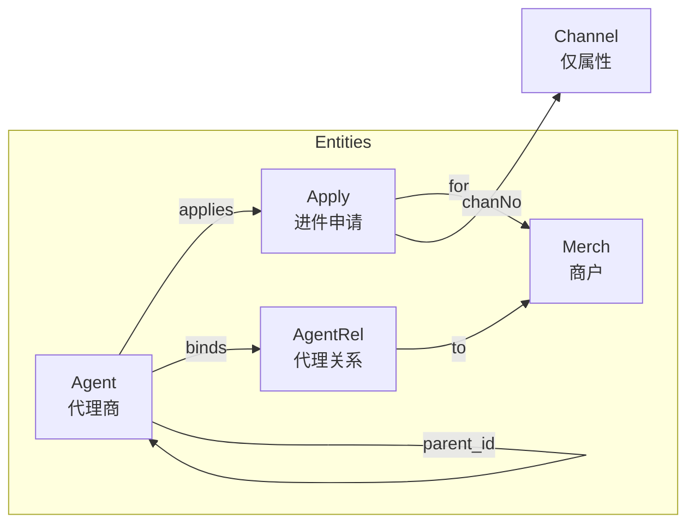

# Ex3 代理商-商户进件体系 Demo 实现

## Overview

将 v6 决策支持框架扩展到代理商-商户进件业务领域，实现 Predictive（进件风险评估）和 Diagnostic（进件失败诊断）两种决策场景，并集成查询统计能力。

## Problem Frame

现有 v6 框架已在 ex2（dbt 数据管道）中验证了决策分析模式。需要将其应用于代理商-商户进件流程，验证框架跨领域适用性，同时探索查询统计能力的集成方式。

## Requirements Trace

- R1. 实现 Predictive 场景："评估代理商 A001 进件商户的风险"
- R2. 实现 Diagnostic 场景："商户 M001 的进件申请为什么失败"
- R3. 定义实体类：Agent、Merch、Apply、AgentRel（Channel 仅作 Apply 关联属性）
- R4. 定义关系：Agent --applies--> Merch、Agent --binds--> Merch、Merch --uses--> Channel
- R5. 支持代理商层级关系查询
- R6. 定义进件基础条件校验规则（代理商禁用、商户信息完整性）
- R7. 定义进件失败因果链条（商户信息问题 → 通道拒绝 → 进件失败）
- R8. 实现单实体查询
- R9. 实现层级关系查询
- R10. 实现关系聚合查询
- R11. 实现时间范围统计查询（SQL 伪函数）

## Scope Boundaries

- 不定义 Channel 实体类（仅作为 Apply 的 chanNo 属性）
- 不实现分润计算逻辑（仅支持分润数据查询接口）
- 不实现费率校验复杂规则
- SQL 伪函数仅定义接口和 mock 返回，用户后续实现

## Context & Research

### Relevant Code and Patterns

- **ex2 实现结构**：`src/v6/demo/ex2/` — entities.ts → ontology.ts → rules.ts → causal.ts → seed.ts → main.ts
- **实体装饰器**：`@agentProperty`、`@agentMethod` 在 `src/v6/runtime/decorator.ts`
- **规则注册**：`registerRule()` 在 `src/v6/ontology/rules.ts`
- **因果图**：`CausalGraph` + `CausalEdge` 在 `src/v6/ontology/causal.ts`
- **Graph/FactStore/EventStore**：`src/v6/runtime/graph.ts`、`src/v6/runtime/eventStore.ts`

### Institutional Learnings

无相关 learnings（docs/solutions/ 目录不存在相关文档）

### External References

无（本地 ex2 模式已足够）

## Key Technical Decisions

- **Channel 仅作 Apply 属性**：遵循 intro.md 约定，降低建模复杂度 (see origin: Key Decisions)
- **查询函数独立 query.ts**：保持结构与 ex2 一致，查询能力单独模块化
- **SQL 伪函数 mock 返回**：接口先行，用户后续实现执行器 (see origin: Key Decisions)

## Open Questions

### Resolved During Planning

- **Channel 实体定义**：仅作为 Apply 的 chanNo 属性，不定义独立实体类
- **查询函数位置**：创建独立的 `src/v6/demo/ex3/query.ts` 文件

### Deferred to Implementation

- 无（需求已明确，模式可复用）

## High-Level Technical Design

> *此图展示实体关系结构，是方向性设计指导，非实现规范。*

## Implementation Units

- [x] **Unit 1: 定义实体类**

**Goal：** 创建 entities.ts，定义 Agent、Merch、Apply、AgentRel 实体类

**Requirements：** R3, R4

**Dependencies：** 无

**Files：**
- Create: `src/v6/demo/ex3/entities.ts`

**Approach：**
- Agent 实体：id、agentNo、name、disabled、parentId 属性
- Merch 实体：id、merchNo、name、rate 属性
- Apply 实体：id、applyNo、agentNo、merchNo、status、chanNo 属性
- AgentRel 实体：id、agentNo、objNo、agentType、rate 属性
- 使用 `@agentProperty` 装饰器标记 agentVisible 属性

**Patterns to follow：**
- `src/v6/demo/ex2/entities.ts` — DataModel、DataSource、Dashboard 实体定义模式

**Test scenarios：**
- Happy path：实体实例化后属性可访问
- Edge case：Agent 无 parentId（顶级代理商）
- Edge case：Apply 无 chanNo（进件未完成）

**Verification：**
- 实体类可被实例化，`getCapabilities()` 返回空数组（无方法）

---

- [ ] **Unit 2: 定义 Ontology Schema**

**Goal：** 创建 ontology.ts，定义实体类型 schema 和关系 schema

**Requirements：** R4, R5

**Dependencies：** Unit 1

**Files：**
- Create: `src/v6/demo/ex3/ontology.ts`

**Approach：**
- 定义 4 个 type：Agent、Merch、Apply、AgentRel
- 定义关系：
  - `applies`：Agent → Apply（代理商进件）
  - `binds`：Agent → AgentRel → Merch（代理绑定）
  - `has_parent`：Agent → Agent（层级关系）
- 每个属性标记 agentVisible

**Patterns to follow：**
- `src/v6/demo/ex2/ontology.ts` — dbtOntology 结构

**Test scenarios：**
- Happy path：Ontology 可被 runDecisionAssistant 正确加载
- Integration：关系定义与 seed.ts 中 addEdge 调用一致

**Verification：**
- ontology 导出后可被 main.ts 导入使用

---

- [ ] **Unit 3: 定义规则**

**Goal：** 创建 rules.ts，定义进件基础条件校验规则

**Requirements：** R6

**Dependencies：** Unit 1, Unit 2

**Files：**
- Create: `src/v6/demo/ex3/rules.ts`

**Approach：**
- 规则 1：`agent_disabled`（hard_constraint）— 代理商禁用状态检测
- 规则 2：`merch_info_incomplete`（soft_criterion）— 商户信息完整性检测
- 每个规则定义 requiredFacts、evaluator、explanation

**Patterns to follow：**
- `src/v6/demo/ex2/rules.ts` — registerDbtRules 模式

**Test scenarios：**
- Happy path：agent_disabled 规则检测禁用代理商返回 triggered=true
- Happy path：merch_info_incomplete 规则检测信息完整商户返回 triggered=false
- Edge case：FactStore 无对应 fact 时返回 missingFacts

**Verification：**
- 规则注册后可通过 `list_rules` agent tool 查询

---

- [ ] **Unit 4: 定义因果图**

**Goal：** 创建 causal.ts，定义进件失败因果链条

**Requirements：** R7

**Dependencies：** Unit 3（规则 ID 关联）

**Files：**
- Create: `src/v6/demo/ex3/causal.ts`

**Approach：**
- 定义 CausalEdge：
  - `merch_info_missing → channel_reject`（商户信息缺失 → 通道拒绝）
  - `channel_reject → apply_fail`（通道拒绝 → 进件失败）
  - `agent_disabled → apply_block`（代理商禁用 → 进件阻断）
- 每个 edge 定义 mechanism、strength、relatedRuleIds

**Patterns to follow：**
- `src/v6/demo/ex2/causal.ts` — buildDbtCausalGraph 模式

**Test scenarios：**
- Happy path：因果图可通过 `causal_backward_chain` 反向追溯
- Integration：CausalEdge.relatedRuleIds 与 rules.ts 中定义一致

**Verification：**
- causal graph 可被 runDecisionAssistant 加载用于 Diagnostic 模式

---

- [ ] **Unit 5: 定义测试数据 Seed**

**Goal：** 创建 seed.ts，生成 Graph、FactStore、EventStore 测试数据

**Requirements：** R1, R2（为两轮场景准备数据）

**Dependencies：** Unit 1, Unit 2, Unit 3, Unit 4

**Files：**
- Create: `src/v6/demo/ex3/seed.ts`

**Approach：**
- Graph seed：创建 Agent A001（禁用）、A002（正常）、Merch M001、Apply AP001（失败）、Apply AP002（进行中）
- FactStore seed：绑定 agent.disabled=true/false、apply.status=FAIL/PENDING 等
- EventStore seed：
  - @T-3d：merch_info_missing 事件（商户 M001 信息缺失）
  - @T-2d：channel_reject 事件（通道拒绝）
  - @T-1d：apply_fail 事件（进件失败）
- setupAgentMerchScenario()：组合函数，清除规则、注册规则、返回所有 stores

**Patterns to follow：**
- `src/v6/demo/ex2/seed.ts` — seedDbtGraph、seedDbtFactStore、seedDbtEventStore 模式

**Test scenarios：**
- Happy path：setupAgentMerchScenario() 返回完整的 { graph, factStore, eventStore, causalGraph }
- Integration：FactStore bindings 与 EventStore events 时间对齐

**Verification：**
- seed 数据可被 main.ts 使用运行两轮决策

---

- [ ] **Unit 6: 定义查询统计接口**

**Goal：** 创建 query.ts，定义查询统计函数接口和 mock 返回

**Requirements：** R8, R9, R10, R11

**Dependencies：** Unit 1, Unit 2

**Files：**
- Create: `src/v6/demo/ex3/query.ts`

**Approach：**
- 单实体查询：`queryAgent(agentNo)`、`queryMerch(merchNo)`、`queryApply(applyNo)`
- 层级查询：`queryAgentChildren(agentNo)`、`queryAgentDescendants(agentNo)`
- 关系聚合：`queryMerchBoundAgents(merchNo)`
- 时间统计：`executeSql(sql: string)` 伪函数 — 返回 mock 数据

**Patterns to follow：**
- 无直接参考（新增能力），遵循 TypeScript/Zod 函数定义风格

**Test scenarios：**
- Happy path：queryAgent 返回 Agent 对象 mock
- Happy path：executeSql 返回 { rows: [...], rowCount: N } mock
- Edge case：查询不存在实体返回 null

**Verification：**
- query 函数可被 main.ts 调用并返回预期结构

---

- [ ] **Unit 7: 实现 Demo 主程序**

**Goal：** 创建 main.ts，运行 Predictive + Diagnostic 两轮并调用查询示例

**Requirements：** R1, R2, Success Criteria

**Dependencies：** Unit 1-6

**Files：**
- Create: `src/v6/demo/ex3/main.ts`

**Approach：**
- Round 1（Predictive）：调用 `runDecisionAssistant`，userQuery="评估代理商 A001 进件商户的风险"
- Round 2（Diagnostic）：调用 `runDecisionAssistant`，userQuery="商户 M001 的进件申请为什么失败"，传入 outcome
- 输出 SystemVerdict、ModelVerdict、Reconciliation、Evidence
- 调用 query.ts 函数展示查询能力

**Patterns to follow：**
- `src/v6/demo/ex2/main.ts` — 两轮执行 + 输出格式

**Test scenarios：**
- Happy path：Predictive 返回 HIGH/MEDIUM/LOW 风险评级
- Happy path：Diagnostic 返回 rankedAttributions（merch_info_missing、channel_reject）
- Integration：Reconciliation.agree 为 true（系统与模型一致）

**Verification：**
- `npx tsx src/v6/demo/ex3/main.ts` 执行成功，输出有意义结论

---

- [ ] **Unit 8: 创建 README**

**Goal：** 创建 README.md，说明 ex3 的业务背景和运行方式

**Requirements：** Success Criteria（结构一致）

**Dependencies：** Unit 1-7

**Files：**
- Create: `src/v6/demo/ex3/README.md`

**Approach：**
- 业务背景：代理商-商户进件体系概述
- 实体和关系说明
- 规则和因果图说明
- 运行命令和预期输出

**Patterns to follow：**
- `src/v6/demo/ex2/README.md` — dbt demo 说明格式

**Test scenarios：**
- 无（文档类）

**Verification：**
- README 内容与实际实现一致

## System-Wide Impact

- **Interaction graph：** 新增实体类型不影响现有 v6 框架核心组件
- **Error propagation：** 查询函数错误通过 mock 返回模拟
- **State lifecycle risks：** 无（demo 不涉及持久化）
- **API surface parity：** 新增 query.ts 接口，与现有 agent tools 独立
- **Integration coverage：** main.ts 验证框架跨领域可复用性
- **Unchanged invariants：** v6 框架核心 API（runDecisionAssistant、Graph、FactStore）保持不变

## Risks & Dependencies

| Risk | Mitigation |
|------|------------|
| SQL 伪函数接口设计不完整 | 参考 profit_daily.sql 表结构定义返回 schema |
|因果链条不够真实 | 参考 spec.md 中进件流程描述增强 mechanism 说明 |

## Documentation / Operational Notes

- 运行命令：`npx tsx src/v6/demo/ex3/main.ts`
- SQL 伪函数实现：用户后续在 query.ts 中提供真实执行器

## Sources & References

- **Origin document：** docs/brainstorms/2026-04-28-ex3-agent-merch-demo-requirements.md
- **Pattern reference：** src/v6/demo/ex2/ — entities.ts, ontology.ts, rules.ts, causal.ts, seed.ts, main.ts
- **DDL reference：** src/v6/demo/ex3/ddl/*.sql — 表结构定义
- **Spec reference：** src/v6/demo/ex3/ddl/spec.md — agent_rel 业务规则