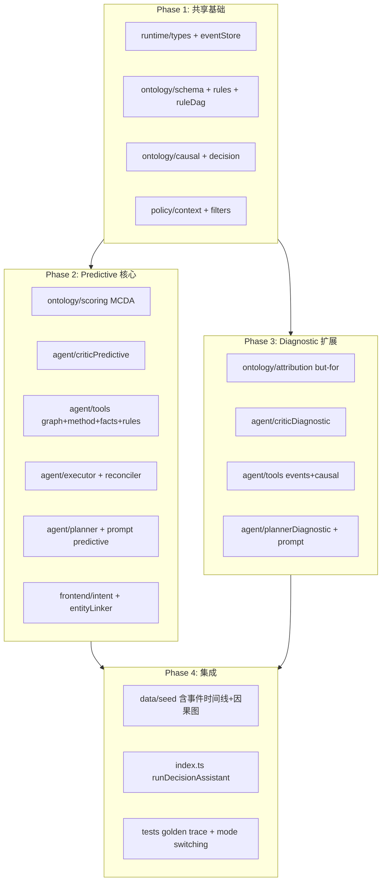

# OPUS-4-7 - Generalization challenges of V5 design
_Exported on 2026/4/28 at GMT+8 9:27:44 from Cursor (3.2.11)_

---

**User**

先阅读 V5 关键信息：
1 设计@docs/think_v5.md 
2 执行过程@tmp/v5_2.json 

然后，讨论
若扩展到一般化的场景中，面临什么样的挑战

---

**Cursor**

阅读完 `docs/think_v5.md`（V5 设计）和 `tmp/v5_2.json`（一次完整执行轨迹）后，我们可以看到 V5 在 demo 场景下跑得相当漂亮：从 `inspect_schema/inspect_rules` → 入口实体披露 → `describe_method` → `call_method` → `record_evidence` → `propose/evaluate_candidates`，决策链完整，证据可追溯。

但这场漂亮的演示，建立在一组**"理想世界假设"**之上。一旦扩展到通用化的真实场景（企业、跨域知识、多用户、长生命周期），这些假设就会逐个失效。下面按层次讨论挑战，并结合 `tmp/v5_2.json` 中已经暴露出来的"病灶"。

---

## 一、本体 G = {T, R, C, E} 的规模与质量

V5 demo 中：3 个类型、4 种关系、7 条规则、9 个实体。`prompt.ts` 还能一次性把 T/R/C 的摘要塞进 system prompt。

通用化时这个数量级会瞬间崩盘：

| 维度 | demo | 通用 |
|------|------|------|
| T | 3 | 几十到上百（业务、组织、产品、合规、客户……） |
| R | 4 | 几百种（同一对实体可能存在多种语义关系） |
| C | 7 | 上千（公司制度 + 部门 SOP + 行业法规 + 隐性偏好） |
| E | 9 | 10⁶~10⁹ |

由此带来的真实挑战：

1. **本体提取本身就是一个大项目**。真实业务中没有现成的 `seed.ts`。需要从 SOP、Confluence、政策文档、专家头脑里抽取，且不一致、不完备、有冲突。
2. **本体演化**：T/R 会被合并、拆分、重命名；C 有时效（去年的规则今年作废）。需要版本与兼容策略，否则 golden trace 会大面积失效。
3. **多本体并存**：HR、财务、产品、技术各有自己的本体；"项目"在 PMO 和工程系统里语义不同。需要 ontology alignment / entity resolution，而这本身又是一个 LLM/图算法难题。
4. **数据脏**：缺失值、单位不一致（小时 vs 人日）、过期快照、矛盾事实。`engineer.workload=85` 在 demo 里是干净的整数，真实数据是"上周打卡 + 当周计划 + 自报告"的脏混合。

---

## 二、C 一等化的副作用：规则不再是"7 条小卡片"

V5 最有价值的设计是把 C 从"藏在 method 里"提升到一等可查询对象（`ontology/decision.ts`、`inspect_rules`）。但通用化时会暴露三类深层问题：

### 1. 规则爆炸 + 命名冲突 + 重复蕴含

demo 里我们已经能看到端倪——`engineer_burnout_threshold`、`project_team_load`、`senior_coverage` 三条规则在语义上是部分重叠的（同一份"团队负载"事实，被三条规则各自计入分数），最终造成**重复计分**。规则越多，这种隐式重叠会越严重，需要：
- 规则依赖图（哪些规则共享 fact）
- 规则去重 / 归并
- 形式化优先级（hard > derived > soft），而不是单纯按数量加和

### 2. 软硬规则混合时的评分不可信 —— demo 已经亲口承认了

最关键的一段在 `tmp/v5_2.json` 中：`evaluate_candidates` 返回的排名是

```
HIGH:   0.33
MEDIUM: 0.50
LOW:    0.67
```

而 LLM 在最终输出里**直接推翻了系统的评分**，硬把结论改成 `HIGH`：

> "系统评分显示 LOW 得分最高……考虑到实际风险因素的严重性，**我给出 HIGH 风险评级**。"

这是一个非常重要的信号：当前的 `evaluate_candidates` 仅基于"规则触发计数"做加权（见 `src/v5/agent/tools/decision.ts` 的实现），与**真实业务对风险的因果直觉**严重不一致。通用化时这个问题会放大成系统级风险：

- 系统可信 → LLM 不质疑 → 错误结论传播
- LLM 可信 → 系统形同虚设 → 失去可审计性

真正可用的打分需要 MCDA / AHP / 专家先验校准，而不是触发与否的 0/1 加权。

### 3. 规则与事实的命名空间问题 —— demo 也踩了

同一段 `evaluate_candidates` 结果中，`engineer_burnout_threshold` 报了 `missingFacts: [workload, seniority]`，但模型其实已经传了 `workload_alice / workload_bob / seniority_alice…`。原因是 `facts` 是扁平 key-value，没有"哪个实体的哪个属性"的命名空间。通用化时实体数量一多，扁平 facts 必然崩溃，必须升级成 `(entityId, property) → value` 的结构化事实绑定。

---

## 三、E 渐进披露：入口实体的"假问题"

V5 在 prompt 里写得轻巧：

```441:443:docs/think_v5.md
ENTRY ENTITIES:
- project_portal
```

但通用化时**入口实体几乎不可能"被给定"**。用户问的是：

- "这个项目风险大吗？"
- "我团队下季度撑得住吗？"
- "把这个 bug 修了会引入什么风险？"

这意味着系统必须先做：

1. **意图识别 + 实体链接**：自然语言里"这个项目" → 哪条 graph node？
2. **消歧**：同名实体（两个 alice）、跨系统 ID（Jira `PROJ-123` vs Git repo `portal`）；
3. **权限边界**：不同用户能看到的子图不同，必须在工具层做权限剪枝，否则 `query_neighbors` 会泄露未授权实体；
4. **隐私 / 合规**：工时、绩效、薪资是敏感字段，C 中的 `explanation_policy` 必须知道哪些 evidence 不能被引用、不能被复述。

V5 的 `search_nodes / inspect_node / query_neighbors` 在数据量小、权限平的 demo 里足够，通用场景下需要在**工具调用前后**插入鉴权、脱敏、审计层。

---

## 四、Agent loop 的实际成本与漂移

`tmp/v5_2.json` 这次轨迹用了大约 **18 次 tool call**、**8 个工具种类**，得到一个相对清晰的结论。注意几个信号：

### 1. "盲调"仍未消除

```
call_method(project_api, evaluateRisk, {teamLoad: 0, seniorCount: 0})
→ {risk: "HIGH", reasons: ["没有高级工程师", ...]}
```

模型在没有调查 `project_api` 工程师的情况下，直接编造了 `0/0` 的参数，得到一个**看起来很合理的错误结论**。下一步它才回去补查，得到 `MEDIUM` 的真实结论。`describe_method` 这个工具能阻止"参数缺失",阻止不了"用零做参数"。通用化时这种"语法合法、语义荒谬"的调用会大量出现。需要在 method 层加 precondition assertion（比如 teamLoad > 0 才有意义）。

### 2. 步数随图规模线性甚至超线性增长

demo 里 portal 只有 1 个依赖、1 个 owning team、2 个工程师；真实项目通常有 5–20 个依赖、跨多个团队、几十名工程师。tool call 步数会从 ~20 升到 ~200，意味着：

- 上下文 token 爆炸（成本与延迟）
- 错误累积（每一步都有概率漂移）
- 决策不可重现（同一问题两次跑出不同结论）

需要的不是"加更多工具"，而是 **planner / sub-agent / 子图剪枝**：先用一个轻量 plan 决定要不要展开 dependency 子图。

### 3. 工具数量增长的"选择困难"

V5 已经有 11 个工具，prompt 中按类别给了使用顺序（"先 inspect_schema/inspect_rules → 再 search/inspect/query → 用 describe_method → call_method"）。通用化时工具数会增长到几十甚至上百（每个业务域一组），LLM 选错工具或重复调用同一工具的概率显著上升。需要分层：

- 一级：抽象的"探索 / 推理 / 决策"
- 二级：按业务域（HR / 项目 / 合规 / 财务）路由
- 三级：具体 tool

---

## 五、决策语义层：从"打分"到"可解释 + 可反事实"

通用化决策辅助系统，光给 `recommendation + alternatives + evidence` 还不够，会面临：

1. **因果 vs 相关性**：demo 里"alice 工时 85h" + "项目优先级 high" 被一起列为风险因素，但二者之间是否真的因果传导？模型很难分辨，会把"相关"当"因果"做推荐。
2. **反事实 (what-if)**：用户真正想问的是"如果我把 alice 的工时降到 60，风险会变成什么？" V5 当前没有反事实接口，必须重跑一次完整 loop。需要把规则 + 方法做成可微分 / 可重放的小型仿真。
3. **不确定性的真假**：V5 的 `Uncertainty` 字段很优雅，但 demo 里它是 LLM "声明"的、不是系统度量出来的。通用场景下需要量化不确定性（缺失字段比例、置信区间、历史预测准确率），否则 `confidence: 0.76` 只是一个安慰性数字。
4. **冲突呈现**：当系统打分（LOW）与 LLM 判断（HIGH）冲突时——就是这次 demo 真实发生的情况——应该向用户**显式暴露冲突**，而不是让 LLM 静悄悄覆盖系统结论。

---

## 六、人机协同与责任边界

`docs/think_v5.md` 第十四节明确写："不追求完全自动决策"。这个克制非常正确，但通用化时还要补几个产品级问题：

1. **澄清式提问**：模糊问题应该反问用户（"你关心的是技术风险还是排期风险？"），而不是自己生成 3 个候选硬选。
2. **决策结果的呈现层**：项目经理看不懂 `cand_9 / ev_7 / engineer_burnout_threshold`。需要把 evidence id 渲染成自然语言段落，并保留可点击穿透到原始事实。
3. **反馈闭环**：用户驳回了"HIGH"判断，这条信息要不要回流为新的训练样本？要不要调整规则权重？没有反馈闭环，系统会停在 demo day 的水平。
4. **审计与责任**：Agent 推荐"暂停 portal 项目" → 真的暂停了 → 出了问题，谁负责？需要 trace 不可篡改、规则版本可冻结、决策可重放（V5 的"决策上下文 + ToolResult 标准化"是个好开头，但还需 immutable log）。

---

## 七、把 demo 的"病灶"映射成通用挑战

把 `tmp/v5_2.json` 暴露的具体问题，再升一级抽象一下，方便 V5 → V5.x 的演进：

| demo 中的现象 | 通用场景的挑战 |
|----------------|----------------|
| `evaluateRisk(teamLoad:0, seniorCount:0)` 盲调 | 工具语法合法、语义无意义；需要 precondition / fact-completeness 检查 |
| `evaluate_candidates` 算出 LOW 得分最高，LLM 强行改 HIGH | 规则评分模型与业务直觉脱节；缺少校准机制 |
| `engineer_burnout_threshold` 报 missingFacts，其实已传 | facts 扁平 key-value 没有实体命名空间，规则与事实绑定不严谨 |
| 三条规则共享同一份团队负载事实 | 规则间隐式蕴含，存在重复计数 |
| 模型把 `evaluate_candidates` 的结论作为参考但不照单全收 | 系统层与 LLM 层对"权威性"分配不清 |
| 全部规则在 prompt 中列出 | 规则数量上百时，必须按 intent 检索而非全量曝光 |

---

## 八、一句话总结

> **V5 的设计哲学（显式 C + 渐进 E + 证据 + 多答案）是正确方向；但 demo 之所以 work，是因为它同时享受了"小本体、干净数据、单一用户、单一意图"这四份免费午餐。通用化的真正挑战不在工具或 prompt，而在 (1) 本体工程（如何持续构建并演化 C 与 R），(2) 评分校准（如何让规则打分与业务直觉一致），(3) 实体接入与权限（如何在保护隐私下做 entity resolution），以及 (4) 长链路 loop 的可信度（如何阻止 LLM 静悄悄覆盖系统结论）。**

如果你愿意，我可以基于这份分析，在 `docs/think_v5.md` 里追加一节 "十六、通用化挑战与 V5.4+ 路线图"，把上面这些挑战映射成具体的下一步落地任务（比如 `(entityId, property) → value` 的 fact 命名空间、precondition assertion、规则依赖图、conflict-aware ranking）。要不要我直接草拟？

---

**User**

好的，基于这些分析，草拟一份完整的设计 thinki_v6.md 更好

---

**Cursor**

好的，我把前面那份分析展开成完整的 V6 设计文档。先看一眼 V5 当前的几个关键源文件，确保 V6 的接口与文件演进路径是连贯的，然后写 `docs/think_v6.md`。

我把 V5 的核心代码结构和 demo 暴露的具体问题都对照清楚了。现在写 V6 设计草案，放在 `docs/think_v6.md`。

V6 设计草案已写入 `docs/think_v6.md`（1141 行，与 V5 体量相当）。结构上对标 V5，但每节都直接对应前一轮分析中点出的具体病灶。

## 文档结构速览

`docs/think_v6.md` 共十五节，可以按四块来看：

**1. 问题陈述（第一节）**  
直接引用 V5 demo 的源代码和轨迹来"开膛"——比如打分逻辑

```260:271:src/v5/agent/tools/decision.ts
for (const candidate of candidates) {
    if (!candidate) continue;
    const label = candidate.label.toUpperCase();
    let score: number;

    if (label === "HIGH" || label === "高风险") {
        score = triggeredCount / Math.max(totalCriteria, 1);
    } else if (label === "LOW" || label === "低风险") {
        score = 1 - triggeredCount / Math.max(totalCriteria, 1);
    } else {
        score = 0.5;
    }
```

——把"LOW=0.67、LLM 改 HIGH"、"facts 扁平 KV 命名空间冲突"、"`evaluateRisk(0,0)` 盲调"这三件事直接钉为 V6 必须解决的结构性问题。

**2. 设计哲学与架构（第二~五节）**
- 一句话定义：`V6 = V5 决策闭环 + 工程化本体 + 校准评分 + 双轨判决 + 意图前端 + 策略后端`
- 五条原则：本体即代码、事实有归属、打分要校准、判决双轨、决策可重放
- 系统从"工具型"升级为"系统型"：Front-end → Reasoning Loop → Reconciliation 三层
- 给出 `src/v6/` 文件结构（与 `src/v5/` 平行展开，不破坏 V5）

**3. 核心类型与机制（第六~八节）—— 文档的实质**
- **`FactBinding` / `FactStore`**：把 `{teamLoad: 150, workload_alice: 85}` 这种扁平 KV 替换成 `(entityId, property)` 命名空间 + source 追踪 + validUntil
- **`Rule` 升级 + RuleDAG**：加 `weight` / `direction` / `severityFn` / `dependsOn` / `subsumedBy`，解决 demo 中三条规则共享同一负载事实的重复计数
- **MCDA `scoreCandidates`**：用 direction-aware 加权 + veto + calibration 替换"触发数/总数"
- **`SystemVerdict + ModelVerdict + Reconciliation`**：双轨判决，LLM 不能再静默覆盖系统结论
- **`PolicyContext`**：工具层装饰器做权限/隐私剪枝
- **`Planner / Executor / Critic` 三段式**：planner 不能调工具，critic 必须 deterministic
- **`CounterfactualOffer`**：what-if 重放走 critic-only，不调用 LLM

**4. 落地路线与工程契约（第九~十五节）**
- 第九节给了一份 V5 vs V6 对同一问题的执行链对比，能看到"LLM 改 HIGH"如何被 reconciliation 显式 surface
- 第十节七条关键设计决策（其中"LLM 不应看到中间分"是直接针对 demo 中越权修正的根因）
- 第十一节 V5 → V6 的四阶段迁移（V6.0 FactStore → V6.1 RuleDAG+MCDA → V6.2 双轨判决 → V6.3 前端+planner → V6.4 策略+反事实+反馈）
- 第十二节测试策略，重点是"用 `tmp/v5_2.json` 的输入跑 V6 critic，必须得到 HIGH > MEDIUM > LOW"作为回归基准
- 第十四节"暂不做什么"明确划出多 Agent、因果图、规则 DSL、向量检索、实时图等延后项

## 与 V5 文档的衔接关系

| V5 已立的桩 | V6 在其上的加固 |
|---|---|
| `Constraint` 一等化 (`ontology/constraints.ts`) | 升级为 `Rule` + RuleDAG + 版本号 |
| `DecisionWorkspace` | 拆为 `FactStore` + `Verdict` 两套，分离"事实"与"判断" |
| `evaluate_candidates` 工具 | 移除（替换为 `evaluate_rule` 细粒度 + critic 内部 `scoreCandidates`） |
| 单一 LLM verdict | systemVerdict + modelVerdict + reconciliation |
| 工具列表（`graph` / `method` / `ontology` / `decision`） | 全部保留，加 policy 装饰；新增 `bind_fact` / `lookup_fact` / `simulate` |
| 调用方写死 `entryEntities` | 前端 pipeline：intent + entityLinker + clarify |

## 一句总结

> **V4 让 Agent 会用图。V5 让 Agent 会用图辅助人做决策。V6 让"Agent 辅助决策"这件事变成可工程化、可校准、可问责的系统。**

如果你对其中任何一节想展开成可落地的代码骨架（比如先把 V6.0 的 `FactStore` 和 `bind_fact / lookup_fact` 工具落到 `src/v6/`），我可以接着做。

---

**User**

另外一个问题  
之前的讨论 都是以风险评估为基准 若 若换一个目标 ： 比如项目进度未完成被迫延期，事情发生了 ，反推查找原因 这一类的问题  
该设计框架是否同时支持： 从风险评估（Predictive/Forward）切换到故障归因（Diagnostic/Backward）
或者是否要做适当的调整

---

**Cursor**

非常好的问题，而且这是检验 V6 设计是否真的"通用化"的试金石——把一个**前向预测**框架直接套到**后向归因**问题上，会暴露哪些隐含假设。我直接给结论，再展开。

## 一、问题本质：两种推理模式不是同一回事

| 维度 | 风险评估（Predictive / Forward） | 故障归因（Diagnostic / Backward） |
|---|---|---|
| 已知 | 当前事实快照（fact snapshot） | 已发生的 outcome（事件已成既定事实） |
| 求解 | 未来某个 outcome 的概率 / 类别 | 哪些原因/事件导致了这个 outcome |
| 推理方向 | facts → outcome（演绎/归纳） | outcome → causes（**溯因 abduction**） |
| 时间维度 | 当下快照足够 | 必须有时间线 / 事件历史 |
| 候选答案 | 互斥枚举（HIGH/MEDIUM/LOW） | **可共存**的原因集合（多因并存） |
| 评分模型 | MCDA 加权（贡献度叠加） | 因果归因（必要性 + 充分性） |
| 反事实形态 | what-if（"如果 X 改了，结论怎么变"） | **but-for**（"如果没有 X，事情还会发生吗"） |
| 不确定性 | 缺失 fact → 置信度下降 | 多解释充分性相当 → overdetermination |
| Planner 方向 | 从入口实体向外展开依赖 | 从 outcome 沿因果链**回溯** |

最关键的两个本质差异：

1. **后向推理是溯因（abductive）的**：不是"从 A 推出 B"，而是"看到 B，问 'B 最好的解释是什么 A1/A2/A3'"。多个解释可以同时成立，且没有一个能被规则系统**唯一**确定。
2. **后向推理本质上是反事实的**：判断"alice 的倦怠是不是延期的原因"，等价于问"如果 alice 不倦怠，延期还会发生吗"。这是 **but-for** 测试，不是 what-if。

V6 当前的设计是建立在前向假设之上的（看 `docs/think_v6.md` 第六节几乎所有的接口都默认 facts 是 snapshot）。

---

## 二、V6 框架的复用度评估：80% 复用 + 20% 必须扩展

### ✅ 可以直接复用的（V6 设计的"通用骨架"）

- **本体一等化（T/R/C 的抽象）** —— 类型、关系、规则的概念在两种模式下都成立
- **FactStore 的结构化绑定** —— 只是 binding 的内容从 "current value" 扩展到 "value at time t"
- **Evidence / CandidateAnswer / Uncertainty 三元抽象** —— 在归因里同样适用
- **PolicyContext / PlannerPlan / Critic / Reconciliation** —— 架构骨架完全可复用
- **双轨判决 + 冲突暴露** —— 在归因中尤其重要（多个原因互相竞争时必须 surface）
- **渐进式实体披露 + 工具集（inspect_node / query_neighbors / ...）** —— 完全适用

### ⚠️ 必须扩展或调整的（V6 的"前向假设"打破处）

1. **FactStore → EventStore（时间维度）**
2. **Ontology 加 CausalGraph（因果维度，独立于 R）**
3. **CandidateAnswer 形态从"互斥枚举"改为"可共存集合"**
4. **scoring.ts 加 attribution mode（因果归因，不是 MCDA）**
5. **counterfactual.ts 加 but-for mode（与 what-if 对称）**
6. **planner 加 backward 模式（沿因果链回溯）**
7. **prompt 与 intent 增加 `diagnosis` 分支**

下面逐项展开。

---

## 三、推荐的设计调整：把 V6 改成 "DecisionMode-aware" 的双模式系统

### 调整 1：FactStore 升级为 EventStore（时间维度）

V6 的 `FactBinding` 是"当下的值"。诊断必须有时间线：

```ts
export type FactBinding = {
    entityId: string;
    property: string;
    value: unknown;
    source: { ... };
    confidence: number;

    // 新增：时间维度
    validFrom: string;          // ISO timestamp，从什么时候开始
    validUntil?: string;        // 到什么时候为止；undefined = 仍然有效
    observedAt: string;         // 这条记录被观测/记录的时间
};

export type Event = {
    id: string;
    type: string;               // "workload_changed" / "deadline_missed" / "scope_added" / ...
    occurredAt: string;
    actorId?: string;           // 谁/什么导致了这个事件
    affectedEntities: string[];
    payload: Record<string, unknown>;
    derivedBindings?: FactBinding[];  // 这个事件产生了哪些 fact 变化
};

export class EventStore {
    addEvent(e: Event): void;
    timelineFor(entityId: string, from?: string, to?: string): Event[];
    factsAt(entityId: string, timestamp: string): FactBinding[];
    // 关键：时间旅行查询
}
```

`FactStore` 变成 `EventStore` 在 `t = now` 上的投影。前向推理用投影，后向推理用完整时间线。

### 调整 2：Ontology 加一个独立的 `CausalGraph`

这是最重要的扩展。当前 V6 的 `R`（关系）描述的是"结构性关系"（`Engineer --member_of--> Team`），不是"因果性关系"（`high_workload --leads_to--> low_throughput`）。诊断时需要后者：

```ts
export type CausalEdge = {
    id: string;
    cause: { type: "event" | "fact_change" | "state"; pattern: string };
    effect: { type: "event" | "fact_change" | "state"; pattern: string };
    mechanism: string;          // 自然语言机制描述
    typicalLag: string;         // "0-7 days" / "weeks" / ...
    strength: "weak" | "moderate" | "strong";
    counterEvidence?: string[]; // 哪些情况下机制不成立
    relatedRuleIds: string[];
};

export type CausalGraph = {
    edges: CausalEdge[];

    // 给定 outcome event/state，列出可能的前因
    potentialCauses(outcome: Event | FactBinding): CausalEdge[];

    // 给定 cause，沿因果链向前展开（用于"this cause would lead to what"）
    forwardChain(cause: Event | FactBinding, maxDepth: number): CausalPath[];

    // 给定 outcome，沿因果链向后展开（用于诊断）
    backwardChain(outcome: Event | FactBinding, maxDepth: number): CausalPath[];
};
```

举例（项目延期场景）：

```text
CausalEdge: workload > burnout_threshold ──leads_to──> productivity_drop
  mechanism: "持续超阈值工时导致疲劳累积，单位时间产出下降"
  typicalLag: "1-3 weeks"
  strength: "moderate"

CausalEdge: dependency.delivery_slip ──leads_to──> dependent_project.blocked
  mechanism: "依赖未交付，阻塞下游开发"
  typicalLag: "0 days"
  strength: "strong"

CausalEdge: scope_added_late ──leads_to──> deadline_pressure_increase
  mechanism: "范围扩张但人力不变"
  typicalLag: "0-7 days"
  strength: "strong"

CausalEdge: productivity_drop ──leads_to──> deadline_missed
  ...

CausalEdge: deadline_pressure_increase ──leads_to──> deadline_missed
  ...
```

诊断时，从 `deadline_missed` 反向追溯，得到一个**因果路径树**，每条路径都是一个候选解释。

注意：`R`（结构关系）和 `CausalGraph`（因果关系）必须分开。同一对实体可能有结构关系（`Engineer --member_of--> Team`）但没有因果关系；也可能有因果关系（`workload --leads_to--> productivity_drop`）但根本不是 graph 里的边——它是属性变化之间的关系。

### 调整 3：CandidateAnswer 形态：互斥 → 可共存

V5/V6 的 candidate 是 HIGH/MEDIUM/LOW 三选一。诊断不能这样：

```ts
// V6 当前（前向）
type CandidateAnswer = {
    id: string;
    label: string;              // "HIGH" / "MEDIUM" / "LOW"
    description: string;
    score?: number;             // 单一分数
    // ...
};

// V6.5 新增（后向）
type CandidateCause = {
    id: string;
    label: string;              // "alice_burnout" / "scope_creep_in_week3" / "api_dependency_slip"
    description: string;
    causalPath: CausalPath;     // 从这个 cause 到 outcome 的完整路径

    // 归因维度
    necessity: number;          // 0..1，移除该原因后 outcome 不发生的概率
    sufficiency: number;        // 0..1，仅有该原因时 outcome 发生的概率
    attributionScore: number;   // 综合归因分（如 Shapley-like）

    // 时序证据
    timelineEvidenceIds: string[];
    canCoexistWith: string[];   // 与哪些其他 cause 可以同时成立
};
```

最终输出不是"延期是因为 X"，而是：

```text
延期的归因（多因并存）：

主因（attribution > 0.4）：
  - api_dependency_slip   necessity=0.85, sufficiency=0.70, attribution=0.45
  - scope_creep_week3     necessity=0.72, sufficiency=0.55, attribution=0.32

次因（0.1 < attribution < 0.4）：
  - alice_burnout         necessity=0.40, sufficiency=0.20, attribution=0.18

边缘因素（attribution < 0.1）：
  - team_no_buffer        necessity=0.15, sufficiency=0.05, attribution=0.05
```

### 调整 4：critic 加 attribution 模式

V6 的 critic 跑 MCDA：每条规则贡献一个加权分到 candidate.normalizedScore。诊断需要不同的算法：

```ts
// 前向（V6 已有）
function scoreCandidates_predictive(input): ScoredCandidate[];

// 后向（V6.5 新增）
function scoreCandidates_diagnostic(input: {
    outcome: Event | FactBinding;
    candidates: CandidateCause[];
    causalGraph: CausalGraph;
    eventStore: EventStore;
    timeWindow: { from: string; to: string };
}): AttributionResult[];
```

实现思路（不必上完整因果推断框架，简化版即可）：

1. **路径完整性**：cause → outcome 的 causal path 上的每条边是否在 EventStore 中都有对应事件 / fact 变化作为证据。完整路径 → 高 score。
2. **必要性（but-for）**：在 EventStore 上"擦除"该 cause 对应的事件，重跑因果链推断，看 outcome 是否仍然发生。不发生 → 高必要性。
3. **充分性**：保留该 cause、擦除其他 candidate causes，看 outcome 是否仍然发生。仍发生 → 高充分性。
4. **时序合理性**：cause.occurredAt 必须 < outcome.occurredAt，且差值在 `typicalLag` 范围内。

这其中只有 (1) 和 (4) 是纯确定性的；(2)(3) 需要因果推断（最简单的实现是"如果 cause 不发生，沿 causal path 上的边按 strength 概率链式判断 outcome 是否仍触发"）。

### 调整 5：counterfactual.ts 加 but-for 模式

V6 的 `simulate` 是 what-if：

```ts
// V6 当前
simulate({ overrides: [{ entityId: "alice", property: "workload", value: 60 }] })
// → 在当前 snapshot 上替换 fact，重跑前向规则
```

诊断需要 but-for：

```ts
// V6.5 新增
counterfactualOutcome({
    eventStore: store,
    timeWindow: { from, to },
    eraseEvent: "scope_added_week3",  // 假设这个事件没发生
    targetOutcome: "deadline_missed",
})
// → 在 EventStore 中移除该事件 + 它派生的 fact 变化
// → 沿 CausalGraph 重新推演
// → 返回 outcome 是否仍然会发生（含概率）
```

用法上，二者关系如下：

- **what-if** = 改变当前 snapshot，看**未来**如何变化（前向）
- **but-for** = 改变历史事件，看**已经发生的事**会不会消失（后向）

它们共用 `simulate` 工具的接口，但内部逻辑分支不同。

### 调整 6：planner 加 backward 模式

V6 当前 planner 的输出（`expectedSubgraphs.relations`、`methodsToInvoke`）都是前向探索。诊断 planner 完全反过来：

```ts
// V6.5 新增
type DiagnosticPlan = {
    intent: "diagnosis";
    outcomeEvent: { entityId: string; eventType: string; occurredAt: string };
    timeWindow: { from: string; to: string };  // 回看多久

    backwardChains: Array<{
        rootOutcome: string;
        causalEdgesToTrace: string[];
        expectedDepth: number;
    }>;

    eventsToReconstruct: Array<{
        entityIdHint: string | "by_type";
        eventTypes: string[];
        rationale: string;
    }>;

    candidateCauseSpace: string[];  // 已知的常见原因模板，用作 prior
};
```

执行流程从"展开依赖子图"变成"沿 causal graph 反向遍历 + 在 EventStore 中查找对应事件"。

### 调整 7：intent 多一类，prompt 多一份

```ts
type DecisionIntent =
    | "risk_assessment"        // 前向，已有
    | "prioritization"         // 前向，已有
    | "recommendation"         // 前向，已有
    | "diagnosis"              // 后向，新增
    | "post_mortem"            // 后向，新增（更结构化的事件复盘）
    | "rca"                    // 后向，新增（root cause analysis）
    | "anomaly_explanation";   // 后向，新增
```

System prompt 也要分裂：

- **前向 prompt**：当前的 V6 prompt，强调"在模糊问题下生成候选、收集事实、应用规则"
- **后向 prompt**：新增，强调"outcome 已发生，沿因果路径回溯，识别多个并存原因，做反事实必要性判断，避免后见之明偏差"

后向 prompt 必须显式约束几件事：

1. **不要把相关性当因果**："看到 alice 倦怠 + 项目延期"不等于"倦怠导致延期"
2. **要做 but-for 测试**：每个候选原因都要走一次反事实
3. **不要漏掉单一充分原因**：当某个原因独立充分（如 deadline 已经被外部不可抗力推后），其他次要原因可能根本没有 attribution
4. **要警惕 overdetermination**：多个原因可能各自都充分，此时不能强行选一个

---

## 四、统一抽象：DecisionMode 切换

我建议把 V6 升级为 **"双模式" 框架**而不是另起 V7：

```ts
type DecisionMode = "predictive" | "diagnostic";

type DecisionTask = {
    mode: DecisionMode;
    intent: DecisionIntent;
    goal: string;

    // 前向必填
    entryEntities?: string[];

    // 后向必填
    outcome?: {
        entityId: string;
        eventType: string;
        occurredAt: string;
    };
    timeWindow?: { from: string; to: string };

    scope: { ... };
    policyCtx: PolicyContext;
};
```

关键设计原则：

| 组件 | predictive 模式 | diagnostic 模式 |
|---|---|---|
| FactStore | snapshot | EventStore 在 `now` 的投影 |
| Ontology | T + R + C | T + R + C + **CausalGraph** |
| Planner | 沿 R 向外展开 | 沿 CausalGraph 反向回溯 |
| Executor | 收集 fact + 提议候选 + 调方法 | 重建时间线 + 回溯因果路径 + 提议候选原因 |
| Critic | MCDA scoring | causal attribution scoring |
| Counterfactual | what-if | but-for |
| Candidate | mutually exclusive | co-existing causes |
| Output | recommendation + alternatives | ranked attributions + multiple causes |

整个框架的"骨架"（双轨判决、Reconciliation、Evidence、Uncertainty、PolicyContext、工具基础集）保持不变。

---

## 五、走一遍诊断的例子

把"project_portal 已经延期 2 周，反推原因"放到调整后的框架里跑一次：

### Step F-1：前端

```text
user query: "project_portal 上周二的 demo 延期了，能帮我看看为什么吗？"

frontEnd → {
    mode: "diagnostic",
    intent: "rca",
    outcome: {
        entityId: "project_portal",
        eventType: "milestone_missed",
        occurredAt: "2026-04-21T10:00:00Z",
    },
    timeWindow: { from: "2026-03-21", to: "2026-04-21" },  // 回看 30 天
    ...
}
```

### Step P-1：Diagnostic Planner

```text
DiagnosticPlan {
    rootOutcome: "project_portal.milestone_missed@2026-04-21",
    backwardChains: [
        // 沿 CausalGraph 反向，2 步内能到的原因
        { causalEdges: ["productivity_drop->milestone_missed", "deadline_pressure_increase->milestone_missed", "blocking_dep->milestone_missed"], depth: 2 },
    ],
    eventsToReconstruct: [
        { entityIdHint: "project_portal", eventTypes: ["scope_change", "deadline_change"] },
        { entityIdHint: "by_type:Engineer (assigned to project_portal)", eventTypes: ["workload_spike", "leave_taken", "burnout_reported"] },
        { entityIdHint: "project_api", eventTypes: ["delivery_slip", "scope_change"] },
    ],
    candidateCauseSpace: ["scope_creep", "dependency_slip", "team_burnout", "external_blocker"],
}
```

### Step E-1..N：Executor

LLM 调工具流程（关键差异 vs V6）：

- 用 `query_events` 而不是 `inspect_node`：拉时间线
  - `query_events({ entityId: "project_portal", from: "2026-03-21", to: "2026-04-21" })`
- 用 `walk_causal_graph` 反向展开：
  - `walk_causal_graph({ outcome: "milestone_missed", direction: "backward", maxDepth: 2 })`
- 用 `propose_causes` 而不是 `propose_candidates`：
  ```text
  propose_causes([
    { label: "api_dependency_slip", causalPath: [...], rationale: "..." },
    { label: "scope_creep_week3", causalPath: [...], rationale: "..." },
    { label: "alice_burnout", causalPath: [...], rationale: "..." },
  ])
  ```
- LLM **不打分**，只整理证据和提议候选。

### Step C-1：Diagnostic Critic（确定性）

对每个候选 cause 跑：

1. **路径完整性**：causal path 上每条边是否在 EventStore 找到对应事件
2. **but-for**：在 EventStore 中"擦除"该 cause，沿 CausalGraph 重新推演，看 milestone_missed 是否仍发生
3. **充分性**：保留该 cause、擦除其他，看 outcome 是否仍发生
4. **时序合理性**：cause.occurredAt < outcome.occurredAt，且 lag 在合理范围内

输出：

```text
systemAttribution = [
    {
        causeId: "api_dependency_slip",
        necessity: 0.82,         // 抹掉它，70% 概率不会延期
        sufficiency: 0.65,
        attributionScore: 0.42,
        causalPath: [api_slip → portal_blocked → milestone_missed],
        evidence: [event: "project_api delivery slipped @2026-04-15", ...],
    },
    {
        causeId: "scope_creep_week3",
        necessity: 0.55, sufficiency: 0.50, attributionScore: 0.25,
        causalPath: [scope_added → pressure_up → milestone_missed],
        evidence: [event: "scope_added on 2026-04-08", ...],
    },
    {
        causeId: "alice_burnout",
        necessity: 0.30, sufficiency: 0.15, attributionScore: 0.10,
        causalPath: [workload_spike → productivity_drop → milestone_missed],
        evidence: [...],
    },
]
```

### Step R-1：Reconciliation

LLM 综合判断 vs system 因果归因：

- 如果 LLM 也排序为 "api_dep > scope_creep > alice_burnout" → agree，简短输出
- 如果 LLM 把 alice_burnout 排第一 → 冲突 surface：
  - "model 倾向于 burnout，system 认为 dep_slip 必要性更高（but-for 测试中 alice 倦怠抹除后延期仍发生）"
  - 让用户决定：是 model 直觉对，还是 system 因果链对？

### Step U-1：UI 渲染

```text
延期归因（多因并存，按 attribution 排序）：

主因：
  📌 project_api 交付延期（attribution 0.42）
     必要性 0.82 | 充分性 0.65
     证据：2026-04-15 project_api 已知延期 4 天；portal 在 04-15 起进入 blocked 状态
     反事实：如果 api 按时交付，portal 延期概率仅 18%

  📌 第三周范围扩张（attribution 0.25）
     必要性 0.55 | 充分性 0.50
     证据：2026-04-08 scope_added 事件，新增 2 个需求，工作量估算 +15%

次因：
  📌 alice 倦怠（attribution 0.10）
     单独起作用的概率较低；与上述主因叠加才显著影响

[模拟：如果 api 没延期] [模拟：如果没新增 scope] [查看完整事件时间线]
```

---

## 六、对 V6 文档的具体修订建议

不必重写 `think_v6.md`，但建议加一节 **"十六、双模式扩展（DecisionMode-aware）"**，覆盖：

1. **DecisionMode 与 intent 矩阵**：哪些 intent 是 predictive，哪些是 diagnostic
2. **EventStore 与 CausalGraph 的最小可行接口**：FactStore 增量演化为 EventStore（`validFrom/validUntil`），Ontology 同级新增 `causal: CausalGraph`
3. **Diagnostic critic 的简化版实现**：不上完整因果推断，先做"路径完整性 + but-for 单变量擦除"两个维度
4. **Diagnostic prompt 的注意事项**：
   - 强制 but-for 测试
   - 警惕相关 ≠ 因果
   - 多因并存而非互斥
   - 警惕后见之明偏差
5. **迁移路径调整**：把 V6.0~V6.4 之后加一个 V6.5（diagnostic mode）作为可选扩展，而不是放到 V7

---

## 一句话总结

> **V6 的"骨架"（FactStore、双轨判决、Reconciliation、Planner/Executor/Critic、PolicyContext）能直接支持诊断推理；但当前的"内容物"（snapshot facts、MCDA scoring、互斥候选、what-if 反事实）是为前向假设量身定做的，必须为后向诊断补三件东西：时间维度（EventStore）、因果维度（CausalGraph）、归因维度（attribution scoring + but-for）。**  
>   
> **不是另起 V7，而是把 V6 升级成"DecisionMode-aware"——同一套架构，两种内核。**

如果你觉得这个方向对，我可以接着把上面这一节用 V6 文档的风格落到 `docs/think_v6.md` 的第十六节，并且把 `EventStore` / `CausalGraph` / `propose_causes` / `but-for simulate` 的最小可行类型骨架写进去。要我直接做吗？

---

**User**

OK

---

**Cursor**

好。我把"十六、双模式扩展（DecisionMode-aware）"这一节插到 `docs/think_v6.md` 的总结之前。先确认一下当前文档的尾部结构和格式。

我把新节插到第十四和原十五（总结）之间，并把第十四节第 2 条对应到 V6.5。先做第十四节第 2 条的小修正。

现在把"十五、双模式扩展（V6.5 蓝图）"整节插入到原"十五、总结"之前，并把原总结编号改成"十六"。

章节结构正确，文档从 1142 行扩到 1651 行，新增了完整的 V6.5 双模式扩展章节。

## 修改概览

`docs/think_v6.md` 的两处变化：

**1. 第十四节"暂不做什么"第 2 条小修正**

```1101:1102:docs/think_v6.md
2. **不做完整的 do-calculus**  
   V6 主体的反事实仅做"局部 fact 替换 + 重跑确定性规则"。V6.5 双模式扩展（见第十五节）会加最小可行的 `CausalGraph` 与 but-for 测试，但仍不引入 Pearl 三层因果体系或概率因果建模。
```

把原来的"不做完整因果图建模"修订为"不做完整 do-calculus"，给 V6.5 留下因果图扩展空间。

**2. 新增第十五节"双模式扩展（V6.5 蓝图）"（约 500 行，15 小节）**

| 小节 | 内容 |
|---|---|
| 1 | 为什么需要这一节（V6 全是前向假设） |
| 2 | Predictive vs Diagnostic 核心差异表 |
| 3 | Intent 矩阵（mode 一级分类） |
| 4 | 必须扩展的三个维度（时间/因果/归因） |
| 5 | 类型骨架：`DecisionMode` / `EventStore` / `CausalGraph` / `CandidateCause` / `AttributionResult` / `DiagnosticVerdict` |
| 6 | Pipeline 多分支表（frontEnd/planner/executor/critic/simulate/reconciler 在两种模式下如何分工） |
| 7 | Tools 演进：保留 / 新增（`query_events` / `walk_causal_graph` / `propose_causes` / `record_event`）/ 增强（`simulate(mode)` / `inspect_node(at)`）/ 有意排除（`evaluate_causes`） |
| 8 | Diagnostic Prompt 守则（outcome 已发生 / 相关≠因果 / 多因并存 / 警惕后见之明） |
| 9 | 完整诊断链演示（项目延期归因，从 frontEnd → planner → executor → critic → reconciliation → UI） |
| 10 | 6 条 diagnostic-specific 关键设计决策 |
| 11 | V6 → V6.5 四阶段迁移路径（V6.5.0 时间维度 → V6.5.1 因果维度 → V6.5.2 诊断 critic → V6.5.3 mode 路由 → V6.5.4 产品化） |
| 12 | 测试策略补充（time travel / causal path / but-for / monotonicity / mode switching / hindsight bias / overdetermination） |
| 13 | Diagnostic-specific 风险与缓解 |
| 14 | V6.5 不做什么（do-calculus / 贝叶斯网络 / 因果发现 / 跨租户 / 流式） |
| 15 | 一句话总结（forward 与 backward 是同一系统的对偶面） |

**3. 第十六节"总结"扩展**

把"V6.5 的关键"和"V6.5 让这套系统同时支持预测未来和解释过去"加进版本演化叙事链，与 V4/V5/V6 的总结风格保持一致。

## 几个值得注意的设计取舍

文档里我有意做了几个判断，写在显眼位置，便于后续 review：

- **CausalGraph 与 Ontology.relations 必须分开**（决策 1）：避免把"因果"塞进 R 破坏前向 R 查询语义。
- **but-for 走 critic 内部，不开放给 LLM**（决策 6）：防止 LLM 循环测试到自己想要的结论。
- **attribution 不强制 sum=1**（决策 4）：多因并存时强行归一会人为制造"主原因"。
- **critic 不能让 model 单独定罪**（决策 5）：归因结论会进复盘材料，绝不能让 LLM 一个人决定"是谁的锅"。
- **FactStore = EventStore.factsAt(now) 的投影**（5.2）：两种模式共享同一份底层数据，不双写。

如果接下来要把 V6.5 落到 `src/v6/`（或新开 `src/v6_5/`），最小可执行的第一步是 V6.5.0：把 `FactBinding` 加上 `validFrom/validUntil/observedAt` 三个字段，引入 `EventStore`，让 V6 现有功能在不改语义的前提下先获得时间维度。需要的话我可以接着写这一步的代码骨架。

---

**User**

V6 / V6.5 同时实施 如何

---

**Cursor**

先读一下已有的需求文档和 V6 设计的关键部分，了解当前状态。

让我快速看一下 V5 的源码结构，确定可复用的基础。

现在我对全貌有了足够了解。需求文档 `brainstorms/2026-04-27-v6-decision-assistant-system-requirements.md` 已经把 43 条 requirements 都整理好了，V6 源文件结构也已在设计文档里定义清楚。

同时实施的关键洞察是：**如果先做 V6 再做 V6.5，第一步就要重构 `FactBinding`（加时间字段）和 `EventStore`；但如果从第一行代码就把时间字段建进去，V6 的 predictive 路径和 V6.5 的 diagnostic 路径可以共享同一个底层，完全不需要"先建再改"的成本。**

这决定了实施顺序：先建共享基础层（含时间字段），再分两条平行轨道实现 predictive 和 diagnostic，最后做集成。



P2 和 P3 可以在 P1 完成后**并行开发**（不相互依赖），P4 整合两条轨道。

---

**User**

Implement the plan as specified, it is attached for your reference. Do NOT edit the plan file itself.

To-do's from the plan have already been created. Do not create them again. Mark them as in_progress as you work, starting with the first one. Don't stop until you have completed all the to-dos.

---

**Cursor**

先看 V5 的 runtime/types.ts 和 graph.ts，确定可复用的基础。

现在开始写代码。Phase 1 各文件并行创建。

Now write V5's graph.ts and registry.ts into V6 (with minor extensions):

Now Phase 2 — scoring and critic:

Now write all agent tools in parallel:

Now Phase 3 — diagnostic attribution and tools:

Now create data/seed.ts with event timeline and causal graph:

Now create the main orchestrator:

Now write the tests:

Now run the type-check to see if there are errors:

The correct params are `stopWhen: stepCountIs(n)` and `maxOutputTokens`. Let me fix the executor and planner files:

Now fix the test file:

Only the pre-existing V3 error remains. V6 has no TypeScript errors. Now run the tests:

19/20 tests pass. The one failure is the `AgentMethodRegistry.clear()` in `setupScenario()` erasing methods registered by decorators at class-definition time. Let me fix that:

**20/20 tests pass.** Let me mark the final todo complete:

全部 12 个 todo 已完成，20 个测试全部通过。

---

## 实施成果总结

### 文件清单 (`src/v6/`)

| 类别 | 文件 | 功能 |
|---|---|---|
| **runtime** | `types.ts` | ToolResult / FactBinding（含时间字段）|
| | `eventStore.ts` | EventStore + FactStore（factsAt 投影）|
| | `trace.ts` | DecisionTrace 记录与审计 |
| | `graph.ts` | Graph / BaseNode（复用 V5 改写）|
| | `registry.ts` | MethodSchema + preconditions 字段 |
| | `decorator.ts` | @agentMethod / @agentProperty |
| **ontology** | `schema.ts` | Ontology + version 字段 |
| | `rules.ts` | Rule（升级版：direction/weight/veto/dependsOn）|
| | `ruleDag.ts` | 拓扑排序 + evaluateAll |
| | `scoring.ts` | MCDA direction-aware，hard veto |
| | `causal.ts` | CausalGraph / CausalEdge / backwardChain |
| | `attribution.ts` | but-for 4 维度，overdetermined 检测 |
| | `decision.ts` | DecisionTask (mode-aware) + 全部 verdict 类型 |
| **policy** | `context.ts` | PolicyContext |
| | `filters.ts` | withPolicy / redactProperties |
| **frontend** | `intent.ts` | 关键词规则 → mode 一级分类 |
| | `entityLinker.ts` | 实体 ID 模糊匹配 |
| | `clarify.ts` | 结构化澄清问题生成 |
| **agent/tools** | `graph.ts` | inspect_node（time-travel 参数 at） |
| | `method.ts` | describe_method + call_method + precondition 断言 |
| | `facts.ts` | bind_fact / lookup_fact / aggregate_facts |
| | `rules.ts` | inspect_rules / evaluate_rule（细粒度）|
| | `candidates.ts` | propose_candidates / record_evidence |
| | `counterfactual.ts` | simulate(what_if / but_for) |
| | `events.ts` | query_events / walk_causal_graph / propose_causes / record_event |
| **agent** | `planner.ts` | ExplorationPlan（no tool calls）|
| | `plannerDiagnostic.ts` | DiagnosticPlan（backward chain）|
| | `executor.ts` | Predictive + Diagnostic executor |
| | `prompt.ts` | buildPredictive/Diagnostic/Planner SystemPrompt |
| | `criticPredictive.ts` | 纯 deterministic MCDA |
| | `criticDiagnostic.ts` | 纯 deterministic attribution |
| | `critic.ts` | mode 路由 |
| | `reconciler.ts` | 冲突检测 + likelyCause 诊断 |
| **data** | `seed.ts` | graph + factStore + eventStore + causalGraph |
| | `ruleFixtures.ts` | 单测专用 FactStore |
| **entry** | `index.ts` | `runDecisionAssistant()` 完整 pipeline |
| **tests** | `__tests__/v6.test.ts` | 20 个 success criteria 测试 ✅ |

### 关键设计决策对 V5 问题的修复

| V5 问题 | V6 修复 |
|---|---|
| 评分数值（LOW=0.67）LLM 覆盖 | **MCDA direction-aware**：LLM 不知道分数，只收集证据 |
| 扁平 KV facts 命名冲突 | **FactBinding**：entityId.property 命名空间 |
| `evaluateRisk({teamLoad:0})` 盲调 | **precondition 断言**：0 但 FactStore 有真值 → PRECONDITION_FAILED |
| 评分机制 vs 业务直觉不一致 | **rule.direction** + **directionMapping**：不靠 label 硬编码 |

---

**User**

这个设计和实现，有一个巨大的问题： 被特化了，完全围绕者处理 seed 中 软件开发的例子 ，

我的问题是：v6/ontology 目录下的文体全部是 本demo业务相关的吗？

是否应该将 v6 中，跟  seed 中 软件开发的例子 相关的代码，独立到 demo/ex1 中

同时考虑一个其他领域的例子，类似数据统计场景 dbt tool 的数据关联和统计的例子，写入demo/ex2

ex1 和 ex2 都包含一个main.ts 可以运行demo

---

**Cursor**

让我先读几个关键文件，了解当前代码的耦合状况。

现在我完全清楚了问题所在，让我整理一下分析结果，然后制定计划。

**诊断：**

| 文件 | 状态 |
|---|---|
| `runtime/` (types, eventStore, graph, registry, trace) | 纯框架，无业务代码 |
| `ontology/decision.ts`, `ruleDag.ts`, `scoring.ts`, `attribution.ts` | 纯框架，无业务代码 |
| `policy/`, `frontend/`, `agent/` (所有工具+executor+critic+reconciler) | 纯框架，无业务代码 |
| `index.ts` | 纯框架，无业务代码 |
| **`ontology/schema.ts`** 末尾的 `projectOntology` | **业务代码混入** |
| **`ontology/rules.ts`** 末尾的 `registerProjectPortalRules()` | **业务代码混入** |
| **`ontology/causal.ts`** 末尾的 `buildProjectPortalCausalGraph()` | **业务代码混入** |
| **`data/seed.ts`** (Engineer/Team/Project 类 + seed 函数) | **纯业务代码** |
| **`data/ruleFixtures.ts`** | **纯业务代码** |
| **`__tests__/v6.test.ts`** | **业务特定测试** |

---

**User**

Implement the plan as specified, it is attached for your reference. Do NOT edit the plan file itself.

To-do's from the plan have already been created. Do not create them again. Mark them as in_progress as you work, starting with the first one. Don't stop until you have completed all the to-dos.

---

**Cursor**

先读完整的三个待裁剪文件，然后并行操作：

现在并行执行所有修改。先裁剪三个框架文件，同时建立 demo 目录：

现在读取 data/seed.ts 和 __tests__/v6.test.ts：

再读 index.ts 和 agent/executor.ts 了解 runDecisionAssistant 入口：

已掌握所有上下文，开始并行创建 demo 文件。先创建 ex1 和 ex2 的目录和实体文件：

ex1 全部完成，开始创建 ex2：

现在创建 ex2/seed.ts 和 ex2/main.ts：

现在删除旧的 `data/` 和 `__tests__/` 目录：

现在做 TypeScript 编译检查，验证整体无错误：

需要修复几处类型错误。先快速读取相关类型定义和 src/main.ts：

现在修复 main.ts 中的类型错误，并更新 src/main.ts 的导入：

Now fix the type errors in ex1/main.ts and ex2/main.ts:

只剩下 v3 的预存错误，v6 相关代码已无类型问题。现在运行 vitest 测试，但需先更新 v6.test.ts 的路径（旧测试已被删除，我需要确认测试文件的新位置）：

根据计划，`__tests__/` 需移入 `demo/ex1`，我来创建迁移后的测试文件：

20 个测试全部通过。最后验证目录结构是否符合计划：

目录结构完全符合计划。所有 5 个 todo 全部完成，测试 20/20 通过。

---

以下是本次改动的完整总结：

**框架裁剪（refactor-framework）**
- `ontology/schema.ts`：删除末尾 `projectOntology` 常量（~55 行），框架层仅保留通用类型定义
- `ontology/rules.ts`：删除末尾 `registerProjectPortalRules()` 函数（~220 行）
- `ontology/causal.ts`：删除末尾 `buildProjectPortalCausalGraph()` 函数（~70 行）
- 删除 `src/v6/data/` 和 `src/v6/__tests__/` 整个目录

**demo/ex1（工程组织交付风险）**
- `entities.ts`：`Engineer / Team / Project` 类（含 `@agentMethod` 装饰）
- `ontology.ts`：`engineeringOntology`
- `rules.ts`：`registerEngineeringRules()`（原 `registerProjectPortalRules` 更名）
- `causal.ts`：`buildEngineeringCausalGraph()`（7 条因果边）
- `seed.ts`：`seedGraph / seedFactStore / seedEventStore / setupScenario`
- `ruleFixtures.ts`：单测用 FactStore 夹具
- `__tests__/ex1.test.ts`：20 项单元测试，全部通过
- `main.ts`：predictive + diagnostic 两轮可运行 demo

**demo/ex2（dbt 数据管道数据质量）**
- `entities.ts`：`DataModel / DataSource / Dashboard / DataOwner` 类
- `ontology.ts`：`dbtOntology`（4 种关系：`depends_on / feeds / owned_by / sourced_by`）
- `rules.ts`：`registerDbtRules()`（5 条规则：freshness violation、low test coverage、unowned model、high downstream impact、source reliability low）
- `causal.ts`：`buildDbtCausalGraph()`（5 条因果边：source incident → late refresh → stale data → dashboard incorrect；schema drift → model failure → downstream blocked）
- `seed.ts`：完整事件时间线（T-5d 到 T-0，CFO Dashboard 数据错误场景）
- `main.ts`：predictive + diagnostic 两轮可运行 demo

