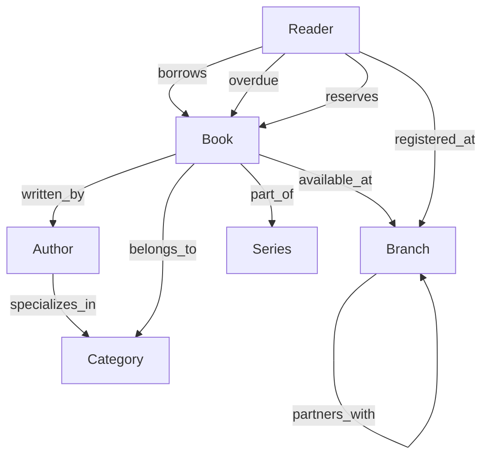
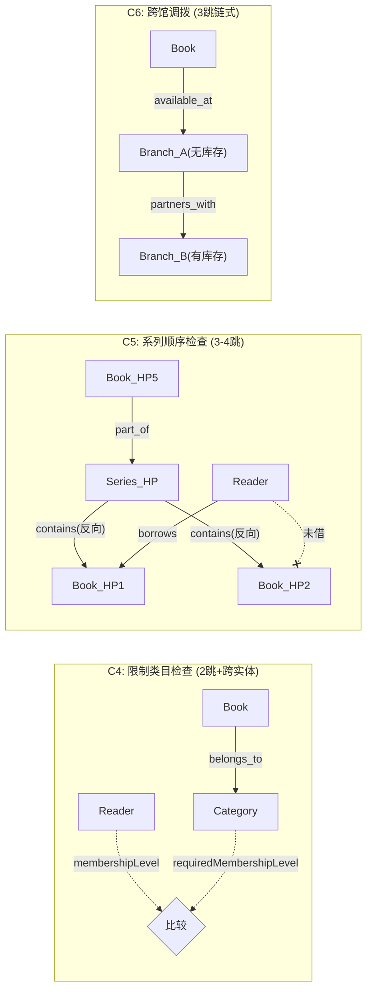

 Test coverage expansion for llm-agent
_Exported on 2026/5/10 at GMT+8 9:20:03 from Cursor (3.2.21)_

# 重构图书馆的案例

see data: https://gemini.google.com/share/52ca9f8713f6

好思路！保持图书馆领域的直觉性，但大幅提升图结构的复杂度。让我重新设计一个"增强版图书馆"模型。

---

当前模型的问题诊断：

| 不足 | 原因 |
|------|------|
| 所有约束都是"自身属性可判"的 | Reader.hasOverdueBook 是布尔值，不需要遍历 overdue 边 |
| 没有跨实体参数依赖 | checkBorrowEligibility 只看自己的 3 和 hasOverdueBook |
| Library 只是个配置容器 | 没有真正的图结构参与 |
| 不需要多跳 | Reader → Book 就是终点，没有更深的路径 |

我的提案：**增强版图书馆 — 6 类型 / 10 关系 / 8 约束**

## Types & Properties（6 类型）

**Reader**（读者）
- `membershipLevel`: 'gold' | 'silver' | 'basic'（会员等级，决定是否可借限制类目）
- `currentBorrowCount`: number
- `registeredDays`: number（注册天数）
- `methods`: `checkBorrowEligibility(branchMaxBorrow)` — 需要先从 Branch 拿到上限

**Book**（书籍）
- `title`, `isbn`, `daysOnShelf`, `totalCopies`, `availableCopies`
- `methods`: `checkAvailability()` → 返回是否可借及在哪些分馆有库存

**Author**（作者）
- `name`, `nationality`, `activeBookCount`
- `methods`: `getPopularityScore()` — 需要聚合其所有书的被借次数

**Category**（类目）
- `name`, `isRestricted`（是否限制借阅）, `requiredMembershipLevel`: 'gold' | 'silver' | 'basic'
- 关键：**借阅限制从 Category 级别控制，而非 Book 级别**

**Series**（系列丛书，如"哈利波特 1-7"）
- `name`, `totalVolumes`
- `methods`: `checkReaderProgress(readerId)` — 需要遍历系列内所有书 + Reader 的借阅记录

**Branch**（分馆）
- `name`, `maxBorrowPerReader`, `newBookProtectionDays`, `allowInterLibraryLoan`
- `methods`: `findAvailableCopyAt(bookId)` — 搜索本馆及合作馆库存

## Constraints（8 条规则）

| ID | 规则 | 推理路径 | 跳数 |
|----|------|---------|------|
| C1 | 借阅上限：Reader.currentBorrowCount >= **Branch**.maxBorrowPerReader | Reader → registered_at → Branch | **2 跳** |
| C2 | 逾期阻断：Reader 有 overdue 边连接到任意 Book | Reader → overdue → Book（需遍历边） | 1 跳 |
| C3 | 新书保护：Book.daysOnShelf < **Branch**.newBookProtectionDays | Book → available_at → Branch | **2 跳** |
| C4 | 限制类目：Book.Category.isRestricted && Reader.membershipLevel < Category.requiredMembershipLevel | Book → belongs_to → Category **+** Reader 属性 | **2 跳 + 跨实体比较** |
| C5 | 系列顺序：Reader 未借完 Series 中前序 Book → 只能预约不能借 | Book → part_of → Series → contains(反向) → Books → Reader.borrows | **3-4 跳 + 集合比较** |
| C6 | 跨馆调拨：本馆无库存但合作馆有 → 建议馆际互借 | Book → available_at → Branch → partners_with → Branch | **3 跳链式** |
| C7 | 热门作者加权：Author 所有书的平均借阅量 > 阈值 → 优先放行 | Book → written_by → Author → (反向)written_by → Books → 聚合 | **2 跳 + 聚合** |
| C8 | 预约上限：Book 当前 reserves 关系数 > 5 → 拒绝新预约 | Book → (反向)reserves → Readers → count | **反向聚合** |

## 关键推理路径图示

## 与当前模型的改进对比

| 维度 | 当前（3T/4R/3C） | 增强版（6T/10R/8C） |
|------|-----------------|-------------------|
| 最长推理路径 | 1 跳 | 3-4 跳（C5 系列顺序） |
| 自引用关系 | 无 | Branch → partners_with → Branch |
| 跨实体属性比较 | 无 | C4: Reader.level vs Category.required |
| 聚合推理 | 无 | C7: Author 下所有 Book 的借阅量 avg, C8: 预约计数 |
| 反向遍历 | 无 | C5/C7/C8 都需要反向查询 |
| 方法前置条件跨实体 | 无 | checkBorrowEligibility 需要先从 Branch 获取 maxBorrow |

**增强版图书馆方案确认**

> **这个增强版图书馆方案（6类型/10关系/8约束）的复杂度是否合适？有需要调整的地方吗？**
> - 方向对了，可以直接出实施计划 ✔
> - 有点多，砍掉 Series 和 Author，聚焦 4 类型就好
> - 整体OK，但我有一些修改意见（让我说明）
> - 还不够，我想要更多类型或更深的路径

---

